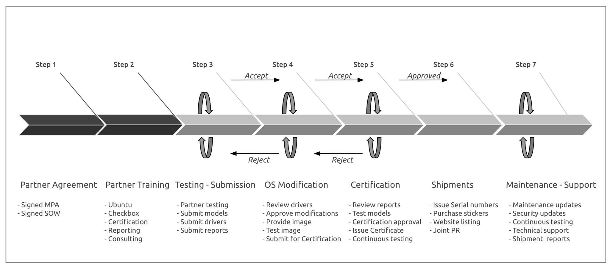
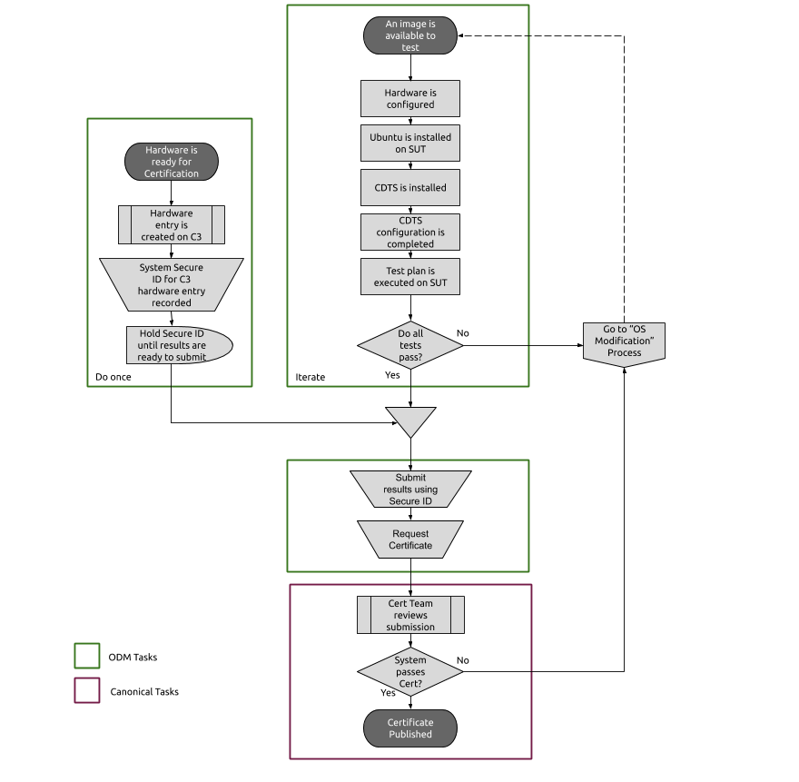
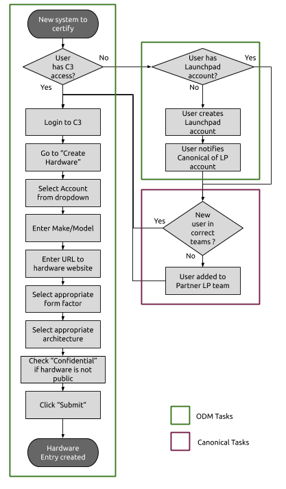

=====================================================
 Ubuntu Certified Hardware ODM Self-Testing Guide 
=====================================================

.. header:: |ubuntu_logo|

.. |ubuntu_logo| image:: images/logo-ubuntu_su-white_orange-hex.png
   :scale: 20%

.. footer:: |canonical_logo|

.. |canonical_logo| image:: images/logo-canonical_no-tm-white-hex.png
   :scale: 10%

.. raw:: pdf

   PageBreak oneColumn

.. contents::

.. raw:: pdf

   PageBreak

Introduction
============

The aim of this document is to provide the information needed for Original
Design Manufacturers (ODMs) to test their Internet of Things (IoT) and
Industrial applications on-site using the Canonical Driver Test Suite (CDTS)
and submit the results to Canonical to meet the requirements for IoT Hardware
Certification.

.. raw:: pdf

   PageBreak

Glossary
========

The following definitions apply to terms used in this document.

ACL
  Access Control List

C3
  Shorthand for https://certification.canonical.com/. The website hosting all
  Canonical Certification programmes.

CDTS
  Canonical Driver Test Suite - Tool for testing device compatibility with the
  Ubuntu releases.

IoT
  Internet of Things

ODM
  Original Design Manufacturer

SUT
  System Under Test — The machine you are testing for certification.

.. raw:: pdf

   PageBreak

Understanding the Certification Process
=======================================

The overall process that leads to a device being certified as part of the ODM
Partner programme has a number of stages, some of which may need to be repeated
in an iterative manner to allow a device to reach the required standard. An
overview of the entire programme is depicted below.

Key to the process, and listed under steps 3, 4 and 5, is the need for the ODM
to carry out testing of the System Under Test (SUT) with the results submitted
to Canonical. This is referred to by Canonical as “Self Testing” and this
document describes the necessary steps to complete a round of this testing.

An overview of the Self Test process is shown below.

.. raw:: pdf

   PageBreak

Working with C3
===============

The Canonical Certification website https://certitication.canonical.com/ (C3)
is used to manage the certification process. Each system to be certified must
have a Hardware Entry created on C3. A user requires a C3 account in order to
create Hardware Entries on C3. This is shown in the following flowchart:

Creating an Account on C3
-------------------------

The Certification Tests can be run without submitting them to C3. However, for
the device to be certified a C3 account is required.

If you do not have an account for your company on C3, or if you do not have
access to your company's account, please contact your Project Manager, who will
work with the Certification Team to create the account.

Additionally, anyone who needs to access the account on C3 will need an account
on launchpad.net. The Launchpad account will need to be added to the Access
Control List for the company account.  You can create a Launchpad Account at:

.. class:: center

http://launchpad.net/+login

If, after the Launchpad account is created and you have been added to the ACL,
you still can not see the Account Information on C3 try logging out of C3,
clearing your browser cache and cookies and logging back into C3.

Creating a Hardware Entry on C3
-------------------------------

In order to upload test results to C3, you need to create a Hardware Entry for
the system which you will be certifying.  If you don’t plan to submit the
results, you do not need to create the C3 Hardware Entry.  To create an entry,
you can go directly to:

.. class:: center

https://certification.canonical.com/hardware/create-system

If you have problems accessing this site, please contact your PM.

The “Create new system page” will request the following details to successfully
create a Hardware Entry:

===============  ===================
Account          Select the name of your account from the list. If the account name is incorrect or is not present in the list please contact your PM. This name is not published and is used for internal tracking only.
Make             The manufacturer of the device as it should appear on public facing pages of the certification website e.g. Dell, Advantech, ADLink. If the make is not available please contact your PM.
Model name       The name of the device itself as it should appear on public facing pages of the certification website e.g. UNO-1110
Codename         This is for your internal reference and identifies the internal code name associated with the SUT. This data is never published and is visible only to you and to Canonical.
Canonical label  Internal identifier that will be assigned by Canonical.
SKU              Optional hardware SKU
Aliases          Any aliases for the system that should be displayed publicly.
Website          Optional field to link to system information on the manufacturer’s website. This field is not currently published publicly.
Comment          Optional field to hold any comment about the hardware e.g. tester name, test location. These comments are never made public, they are for internal use only.
Form factor      Select an appropriate form factor for the device. This will determine under which section of the certification website the device will appear. Typical IoT form factors include IoT Gateway, Smart NIC , Development Board. IoT form factors should inherit from Ubuntu Core.
Architecture     The architecture of the system e.g. amd64, arm64, armhf
Condidential     This should be checked to make sure that the entry remains confidential until publishing.
===============  ===================

Submit the form to present the page detailing the new Hardware Entry.

**Make a note of the value of “Secure ID for testing purposes”. You’ll need this
when submitting the test results and is unique for each system that will be
tested.**

.. raw:: pdf

   PageBreak

Preparing for Testing
=====================

The Test Environment and Peripheral Hardware
--------------------------------------------

To perform a complete test run there are some requirements on the environment
in which the SUT is operating. The exact list of requirements is dependent on
the functions supported by the SUT. If the function described in the list below
is supported by the SUT ensure that the corresponding requirements are met.

Audio
^^^^^

If the system includes audio ports of the specified type make sure the
following hardware is available:

===========================  =================================================
Port                         Required hardware
===========================  =================================================
Line out / headphone socket  Have available a speaker of headphones for testing output on the port.
Line in / microphone socket  Have available an audio cable to connect line out to line in.
===========================  =================================================

USB
^^^

If the system includes ports of the specified type make sure at least one of
each type of  hardware is available:

===========================  =================================================
Port                         Required hardware
===========================  =================================================
USB2 Type-A Ports            Insert a writable USB 2 compatible storage device containing a single FAT formatted partition of at least 256MB. Note that a USB stick with multiple partitions may cause problems, so if necessary you should repartition your device to have a single partition.
USB3 Type-A Ports            Insert a writable USB 3 compatible storage device containing a single FAT formatted partition of at least 256MB. Note that a USB stick with multiple partitions may cause problems, so if necessary you should repartition your device to have a single partition.
USB3 Type-C Ports            Insert a writable USB 3 compatible storage device containing a single FAT formatted partition of at least 256MB. Note that a USB stick with multiple partitions may cause problems, so if necessary you should repartition your device to have a single partition.
===========================  =================================================

Mediacards
^^^^^^^^^^

If the system includes slots of the specified type make sure they are fitted
with the hardware as described below:

===========================  =================================================
Slot                         Required hardware
===========================  =================================================
SD Card                      An SD Card containing a single FAT formatted partition of at least 256MB. Note that a card with multiple partitions may cause problems, so if necessary you should repartition your device to have a single partition.
SDHC Card                    An SDHC Card containing a single FAT formatted partition of at least 256MB. Note that a card with multiple partitions may cause problems, so if necessary you should repartition your device to have a single partition.
===========================  =================================================

Thunderbolt
^^^^^^^^^^^

If the system includes at least one Thunderbolt port ensure a storage device
containing a single FAT formatted partition of at least 256MB is attached.
Note that a device with multiple partitions may cause problems, so if necessary
you should repartition your device to have a single partition.

Disk
^^^^

All disk devices (HDDs, SSDs, NVMes, etc.) must be partitioned and mounted
prior to testing. Each disk beyond the first one should ideally be configured
with a single partition that spans the entire disk and that uses the ext4
filesystem.

Ethernet
^^^^^^^^

All ethernet ports should be connected to Local Area Network with a DHCP server
providing address and gateway assignment.

Wi-Fi
^^^^^

For devices with Wi-Fi radios, connectivity tests will be run for each protocol
that the device reports as supported. Wi-Fi access points  will be needed for
each of protocol and security combinations listed below:

===============  ========  =========================================
802.11 Protocol  Security  Required Wi-Fi AP
===============  ========  =========================================
B/G              Open      An access point with dedicated SSID configured for this protocol and no security e.g. ssid-bg-open
N                Open      An access point with dedicated SSID configured for this protocol and no security e.g. ssid-n-open
AC               Open      An access point with dedicated SSID configured for this protocol and no security e.g. ssid-ac-open
AX               Open      An access point with dedicated SSID configured for this protocol and no security e.g. ssid-ax-open
B/G              WPA+PSK   An access point with dedicated SSID configured for this protocol and security combination e.g. ssid-bg-wpa
N                WPA+PSK   An access point with dedicated SSID configured for this protocol and security combination e.g. ssid-n-wpa
AC               WPA+PSK   An access point with dedicated SSID configured for this protocol and security combination e.g. ssid-ac-wpa
AX               WPA+PSK   An access point with dedicated SSID configured for this protocol and security combination e.g. ssid-ax-wpa
===============  ========  =========================================

The SSIDs and pre-shared keys setup above will be needed when configuring the
checkbox test tool later.

Bluetooth
^^^^^^^^^

If the system features a Bluetooth radio then ability to connect using the
following profiles will be tested.

============================  =================================================
Supported Profile             Required hardware
============================  =================================================
Eddystone Profile             Eddystone is a Bluetooth Low Energy beacon profile released by Google. Beacon devices are available from many manufacturers. A beacon should be placed within range of the SUT that broadcasts a valid URL.
HID Over GATT Profile (HOGP)  A Low-Energy keyboard and mouse  with basic functionality.
============================  =================================================

Cellular (WWAN)
^^^^^^^^^^^^^^^

If the system includes a cellular radio, connectivity will be tested:

===============  =================================================
Connection Type  Required hardware
===============  =================================================
Data Connection  A SIM card should be present that allows for registering on an available network and data connectivity can be tested.
===============  =================================================

.. raw:: pdf

   PageBreak

