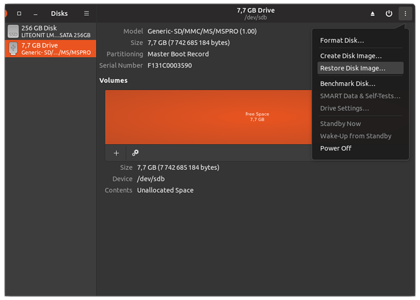
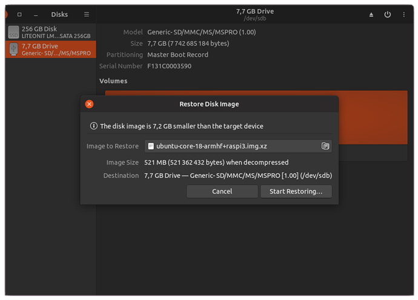
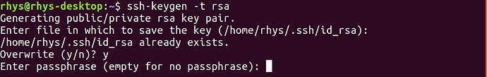
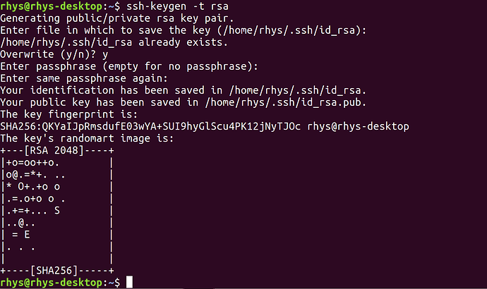

Installing the Ubuntu Core image
================================

The instructions for writing an Ubuntu Core image to the SUT will depend on
whether the target storage device is a fixed internal medium (for example an
internal Solid State Storage Disk, eMMC or Hard Disk Drive) or a removable
medium like an SD Card. Follow the appropriate section for the target device.

Writing the image to an internal storage device
-----------------------------------------------

Hardware and software requirements
^^^^^^^^^^^^^^^^^^^^^^^^^^^^^^^^^^

- Two USB 2.0 or USB 3.0 flash drives (8GB min)
- Ubuntu desktop image 18.04 or later
- The target device (SUT)
- USB keyboard & mouse
- Monitor and HDMI/DP cable
- Network connection with Internet access (for system update)

Create Ubuntu desktop USB installer
^^^^^^^^^^^^^^^^^^^^^^^^^^^^^^^^^^^

1. Download the Ubuntu desktop image from the website:

.. class:: center

http://cdimage.ubuntu.com/focal/daily-live/current/

#. Create a bootable USB stick on Ubuntu / Windows:

.. class:: center

https://tutorials.ubuntu.com/tutorial/tutorial-create-a-usb-stick-on-ubuntu or
https://tutorials.ubuntu.com/tutorial/tutorial-create-a-usb-stick-on-windows

#. Download the Ubuntu Core image and copy the file into a normal mountable
   partition on the second USB stick. The latest images can be found at one of
   the following locations depending on the chosen release:

.. class:: center

http://cdimage.ubuntu.com/ubuntu-core/18/stable/current/
http://cdimage.ubuntu.com/ubuntu-core/20/ 

Write Ubuntu Core to Device
^^^^^^^^^^^^^^^^^^^^^^^^^^^

1. Insert the bootable USB stick into the device and power on the system
#. Press the function key (e.g. F12 for Dell machine) to enter the Boot menu,
   and select the correct boot option to make system boot from the USB stick
#. Select the top entry ‘Try Ubuntu without installing’ in the GRUB menu.
   Warning: if Ubuntu 20.04 is used as a bootable USB stick, the extra boot
   parameter will need to be added due to casper from 20.04 tries to mount a
   writable partition from internal storage if there exists a disk label
   matching ``writable``. Please edit the entry ``Try Ubuntu without installing``
   by pressing ``e`` and add ``nopersistent`` boot option as below::

     linux    /casper/vmlinuz$casper_flavour  file=/cdrom/preseed/ubuntu.seed quiet splash nopersistent ---
     initrd   /casper/initrd$casper_flavour

#. Once the Ubuntu session has started, insert the second USB stick containing
   Ubuntu Core image file.
#. Open a terminal and use the following command to find out the target storage
   to install::

     $ lsblk

Note: Usually the storage device’s name could be ‘sda’ or ‘mmcblk0’

#. Run the following command, where <disk label> is the label of the second USB
   stick::

     $ xzcat /media/ubuntu/<disk label>/ubuntu-core-18-amd64.img.xz | sudo dd of=/dev/<target disk device> bs=32M status=progress; sync

#. Reboot the system and remove the flash drives when prompted. It will then
   boot from the internal storage where the Ubuntu Core image has been flashed.

Writing the image to removable media
------------------------------------

Hardware and software requirements
^^^^^^^^^^^^^^^^^^^^^^^^^^^^^^^^^^

1. The removable media e.g. SD Card (4GB minimum, 8GB recommended)
#. A computer with means to mount the media, instructions assume Ubuntu OS
#. Customer’s target device
#. USB keyboard & mouse
#. Monitor and HDMI/DP cable
#. Network connection with Internet access (for system update)

Write Ubuntu Core to media
^^^^^^^^^^^^^^^^^^^^^^^^^^

1. Download the Ubuntu image for your device in your Downloads folder
#. Insert the SD card
#. Open the “Disks” application and select your SD card

#. In the menu, select “Restore Disk Image…”
#. Then in the “Image to Restore” box, select the Ubuntu image file you have
   downloaded, ending with an .xz file extension

#. Then select the “Start Restoring…” button
#. When it has finished writing the image, you can eject your removable drive

Completing the installation
---------------------------

Create an Ubuntu SSO account with stored SSH keys
^^^^^^^^^^^^^^^^^^^^^^^^^^^^^^^^^^^^^^^^^^^^^^^^^

An Ubuntu SSO (Single Sign-On) account allows you to store SSH public keys and
tie them to an email address. This allows your Ubuntu Core devices to authorize
SSH connections only from devices with public keys matching the ones in your SSO
account. If you already have an Ubuntu SSO account setup you can proceed to the
next section.

If you do not have an SSO account go to the Ubuntu SSO login site 
(https://login.ubuntu.com/), select that you don’t have an account and fill in
your details.

Next you will need to generate an SSH key pair for use with the account. For
this, you need to open a terminal on your computer and run the following
commands::

  $ mkdir ~/.ssh
  $ chmod 700 ~/.ssh
  $ ssh-keygen -t rsa

This will generate a 2048-bit RSA key pair. After entering the command, you
should see the following output:

Press ENTER to save the key pair into the .ssh/ directory in your home directory
or specify an alternate path.

If you had previously generated an SSH key pair, you may see the following
prompt: “If you choose to overwrite the key on disk, you will not be able to
authenticate using the previous key anymore.” Be very careful when selecting
“yes”, as this is cannot be reversed and your existing key will be overwritten.

You should then see the following prompt:

Here, you enter a secure passphrase. A passphrase adds an additional layer of
security to prevent unauthorized users from logging in.

You should then see something like the following output:

The public part of the generated now needs to be added to your SSO account. Go
to the ssh-keys page (https://login.ubuntu.com/ssh-keys) and enter the contents
of the id_rsa.pub file.

Completing first boot setup
^^^^^^^^^^^^^^^^^^^^^^^^^^^

1. Insert the flashed SD card into the SUT
#. Attach the monitor and keyboard. 
#. Ensure the device is connected to via Ethernet to a network with Internet
   access.
#. Power on the SUT. 

The first boot will be carried out including installation of the default snaps.
This could take a number of minutes depending on the hardware used. Eventually a
message will be displayed on the monitor asking you to complete configuration:

1. Press enter to configure
#. Press OK to configure the network and setup an admin account on this all-snap
   Ubuntu Core system
#. Select “Done” and the network config will progress.
#. Enter the email address that is connected to your SSO account (see previous
   section if you do not have an account)

The device will use the SSO information to create the admin user account on the
device and then display some information about how you can connect to the device
using SSH.

Install network-manager snap
^^^^^^^^^^^^^^^^^^^^^^^^^^^^

If the SUT includes Wi-Fi radios then an additional package called
network-manager is required. It can be installed by running::

  # If certifying a device for Ubuntu Core 20
  $ sudo snap install network-manager --channel=20/stable

  # If certifying a device for Ubuntu Core 18
  $ sudo snap install network-manager --channel=1.10/stable

Install modem-manager snap
^^^^^^^^^^^^^^^^^^^^^^^^^^

If the SUT includes Cellular (WWAN) radios then an additional package called
modem-manager is required. It can be installed by running::

  # If certifying a device for Ubuntu Core 20
  $ sudo snap install modem-manager --channel=20/stable

  # If certifying a device for Ubuntu Core 18
  $ sudo snap install modem-manager --channel=1.10/stable

Install bluez snap
^^^^^^^^^^^^^^^^^^

If the SUT includes Bluetooth radios then an additional package called bluez is
required. It can be installed by running::

  # If certifying a device for Ubuntu Core 20
  $ sudo snap install bluez --channel=20/stable

  # If certifying a device for Ubuntu Core 18
  $ sudo snap install bluez --channel=latest/stable

Setup watchdog
^^^^^^^^^^^^^^

If the SUT includes watchdog, additional setup is required. The file 
`/etc/systemd/system.conf` should be edited. Modify the setting of 
`RuntimeWatchdogSec` according to watchdog spec and user scenario. For example::

  RuntimeWatchdogSec=30

.. raw:: pdf

   PageBreak

