Running the Certification Tests
===============================

With the environment ready and the test image installed on the Certification
Tests can be run. The following sections describe how to install the test runner
and run the test suite.

Introduction to CDTS tool
-------------------------

The software tool used to certify devices is called CDTS. The tool runs in two
parts; a master side that is run on a normal Ubuntu PC that controls the test
process, and a slave that runs on the SUT.

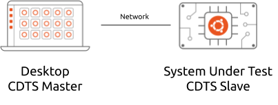

Both the master and slave tools can be installed from the Snap Store. Please
take note that in the following terminal snippets the prompt will contain
`user@master`` to indicate when the commands should be run on the master, and
`user@sut`` will be used to indicate the command should be run on the SUT. To
install the master, on the desktop PC run::

    # If running the master on a 20.04 desktop
    user@master$ sudo snap install checkbox20
    user@master$ sudo snap install cdts --classic --channel=20.04/stable

    # If running the master on a 18.04 desktop
    user@master$ sudo snap install checkbox18
    user@master$ sudo snap install cdts --classic --channel=18.04/stable

To install the slave, in a terminal on the SUT run::

  # If certifying a device for 20.04
  user@sut$ sudo snap install checkbox20
  user@sut$ sudo snap install cdts --classic --channel=20.04/stable

  # If certifying a device for 18.04
  user@sut$ sudo snap install checkbox18
  user@sut$ sudo snap install cdts --classic --channel=18.04/stable

Configuring CDTS
----------------

Before running the test suite, it is necessary to configure some settings that
inform the test runner about the environment you have set up. This is achieved
by using the configure command on the SUT. Running the `-l` option will list the
current configuration (including default values shipped as part of the snap)::

  user@sut$ sudo cdts.configure -l
  ALSADEVICE=hw:CARD=bytrt5660,DEV=0
  NET_DEVICE_INFO=ven_rsi_sdio ven_rsi_91x
  OBEX_TARGET=00:02:72:C5:F9:1F
  OPEN_AC_SSID=ubuntu-cert-ac-open
  OPEN_BG_SSID=ubuntu-cert-bg-open
  OPEN_N_SSID=ubuntu-cert-n-open
  STRESS_BOOT_ITERATIONS=100
  STRESS_BOOT_WAIT_DELAY=120
  STRESS_BOOT_WAKEUP_DELAY=60
  STRESS_S3_ITERATIONS=100
  STRESS_S3_SLEEP_DELAY=60
  STRESS_S3_WAIT_DELAY=120
  STRESS_S4_ITERATIONS=100
  STRESS_S4_SLEEP_DELAY=60
  STRESS_S4_WAIT_DELAY=120
  TEST_TARGET_IPERF=10.101.47.93
  WATCHDOG_KERNEL_MOD=iTCO_wdt
  WIFI_AP_SETUPTIME=30
  WIFI_INTERFACE=mlan0
  WPA_AC_PSK=insecure
  WPA_AC_SSID=ubuntu-cert-ac-wpa
  WPA_BG_PSK=insecure
  WPA_BG_SSID=ubuntu-cert-bg-wpa
  WPA_N_PSK=insecure
  WPA_N_SSID=ubuntu-cert-n-wpa
  WWAN_APN=internet
  WWAN_CONTROL_IF=ttyACM3
  WWAN_NET_IF=ppp0
  WWAN_SETUPTIME=30

The value assigned to each key can be modified use the following format::

  user@sut$ sudo cdts.configure WPA_N_SSID=my-wireless-n-network

Defer Snap Updates
------------------

For the duration of the test session any snaps on the system should not be
updated. To achieve this apply a refresh hold that defers the next check for a
sufficiently long period of time::

  user@sut$ sudo snap set system refresh.hold=$(date --date="+ 50 day" +%Y-%m-%dT%H:%M:%S%:z)

Running the Test Suite
----------------------

To begin running the test suite, run the following command on the master::

  user@master$ cdts.odm-certification <IP-OF-SUT>

The test suite for each Ubuntu release is broken into two parts:

1. Manual tests; this part includes tests that require human interaction and
   therefore the operator carrying out the tests will need to oversee the
   complete test run.
#. Automated tests; this part includes tests that do not require human
   interaction and the test session will run to conclusion without operator
   input.

Both parts of the test suite must be completed and submitted to Canonical for
review. Therefore, the following steps will need to be followed twice, one for
each part. On the first screen select the part of the test suite that needs to
be run:

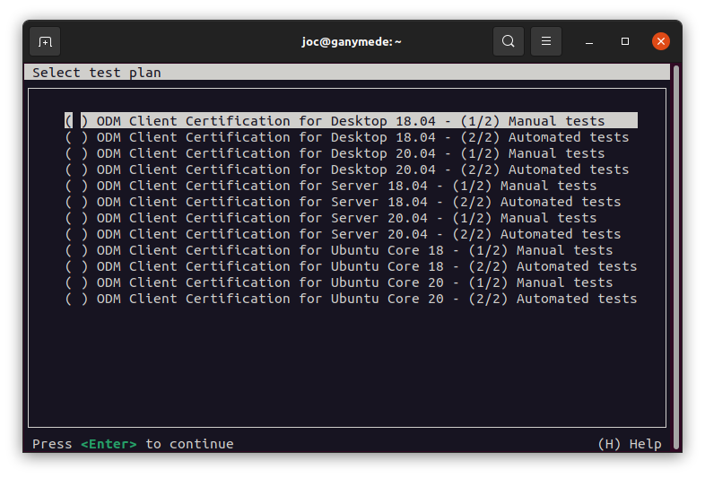

Move the selection with the arrow keys, select with space and confirm your
choice by moving the selection to <OK> and press Enter. You should select the
test plan that matches the type of image you are installing on the SUT.

The next screen will allow you to fine tune the tests you want to run:

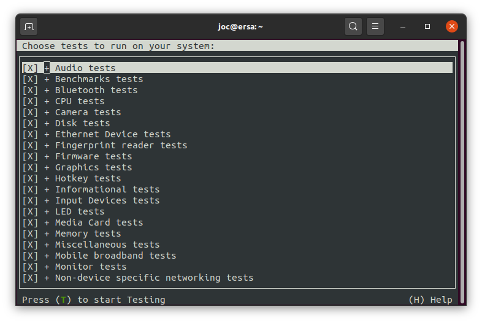

**If you are completing a test run to make a submission for certification all
tests must be run.**

If however you want to assess whether a particular feature would pass tests
prior to making a submission then the job selection can be modified. Tests are
grouped by categories and job list can be modified use the following keyboard
shortcuts:

======  ============
Key     Action
======  ============
Enter   Expand/Collapse a category
Space   Select/Deselect a category or job
s       Select all jobs
d       Deselect all jobs
t       Start the test run
h       Display help dialog
======  ============

The next screen that will be presented is the System Manifest form. The purpose
of this form is to allow the user to specify significant features about the SUT
or the environment that will help the test suite to identify if all the
significant hardware components are operating correctly. The first time the
tool is run the answers on the form will be empty and require completing before
the test run can begin. On subsequent runs the previous answers will be
remembered and pre-populated.

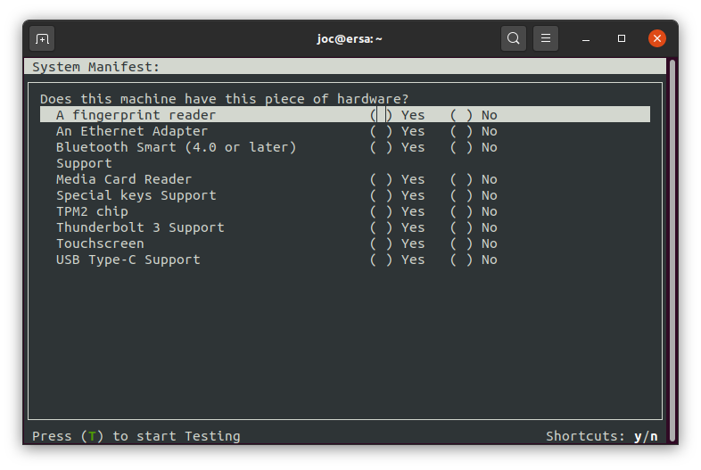

CDTS is a test runner able to process fully automated tests/commands and tests
requiring user interaction (whether to setup or plug something to the device,
e.g. USB insertion or to confirm that the device acts as expected, e.g. a LED
blinks).

A fully automated test will stream stdout/stderr to your terminal allowing you
to immediately look at the I/O logs (if the session is run interactively).
Attachments jobs are treated differently as they could generate lots of I/O.
Therefore their outputs are hidden by default.

Interactive jobs will pause the test runner and detail the steps to complete
the test:

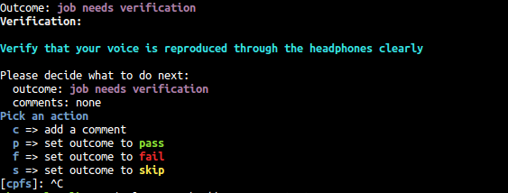

During the run there may be tests performed that need to reboot the device. If
this is the case you will see output like the following:

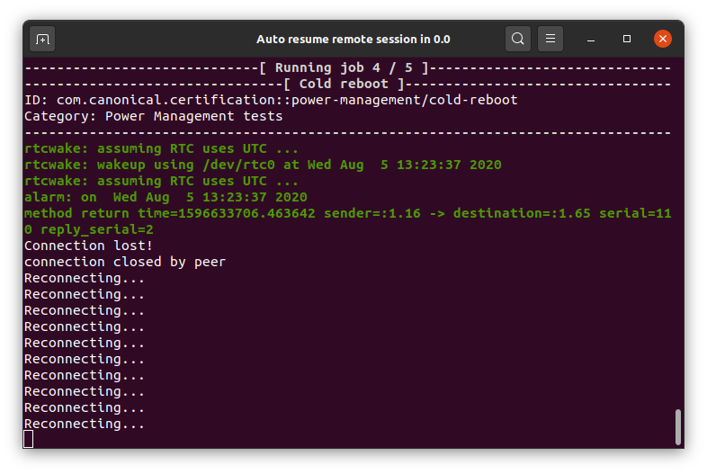

The SUT has carried out a shutdown and the master has lost the connection to
it. The master will attempt to reconnect regularly until it is able to contact
the SUT again. At this point a countdown will be displayed before the session
is automatically resumed:

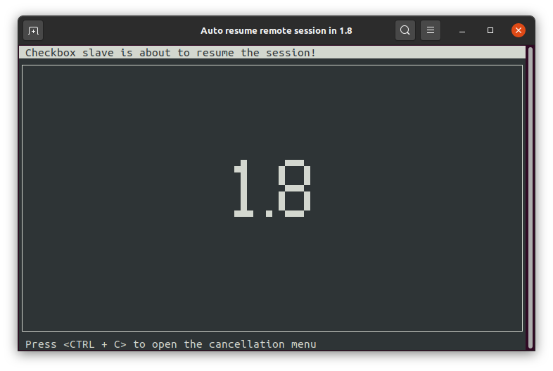

Getting Results
---------------

When the complete testing session has finished running, the first displayed
screen will allow you to re-run failed jobs (e.g. the wireless access point was
not properly configured):

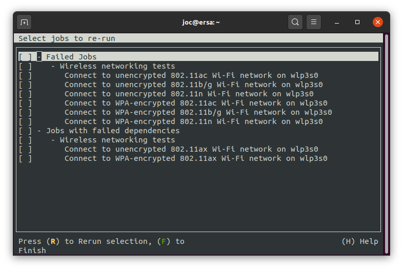

Commands to select the tests to re-run are the same used to select tests in the
first selection screen. Here you can re-run your selection with R or finish the
session by pressing `F`.

Checkbox will then print the test results in the terminal and save them in
different formats locally on the device (and print their respective filenames):

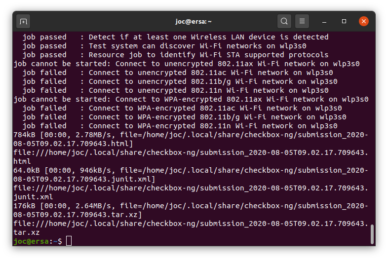

Reviewing the test results
--------------------------

If Checkbox indicates all tests passed then you may consider skipping this
section and immediately move to submitting the results to Canonical for review.
In the case that some tests fail or there is a desire to review the output, the
HTML formatted report can be opened in any web browser.  In the results above
you can see that the HTML  file is listed in the following format::

  file:///home/<USER>/.local/share/checkbox-ng/submission_<DATE-OF-TEST>.html

This enables failed tests to be quickly identified as they are highlighted in
red with a “failed” notation in the Result column, whereas passed tests acquire
a green color, with the word “passed”.

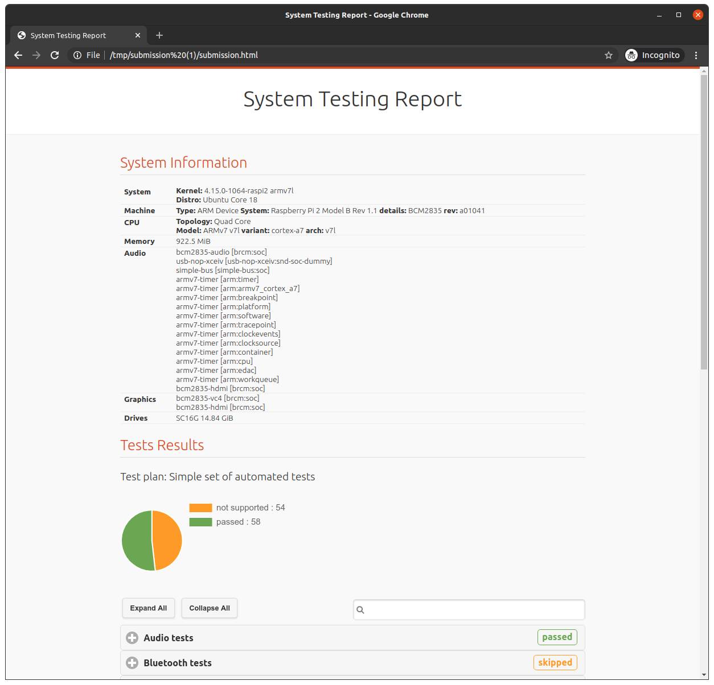

It is kindly requested that as many failed test cases are resolved by the ODM
prior to submitting results to Canonical as possible. Particular care should be
taken in confirming correct setup of the test environment and that the Checkbox
configuration variables are set appropriately.

Submitting the results
----------------------

When the results are ready to be sent to Canonical for review they should be
submitted using the following procedure. In the section titled “Creating a
Hardware Entry on C3”, you were asked to make note of the Secure ID of the SUT.
This is used along with one of the reports from the test run in the following
command::

  user@master$ cdts.checkbox-cli submit <SECURE_ID> ~/.local/share/checkbox-ng/submission_<DATE>.tar.xz

In the case that you do not have record of the Secure ID, it can be found on
your system’s page on the certification web site
(http://certification.canonical.com) by looking next to “Secure ID for testing
purposes”:

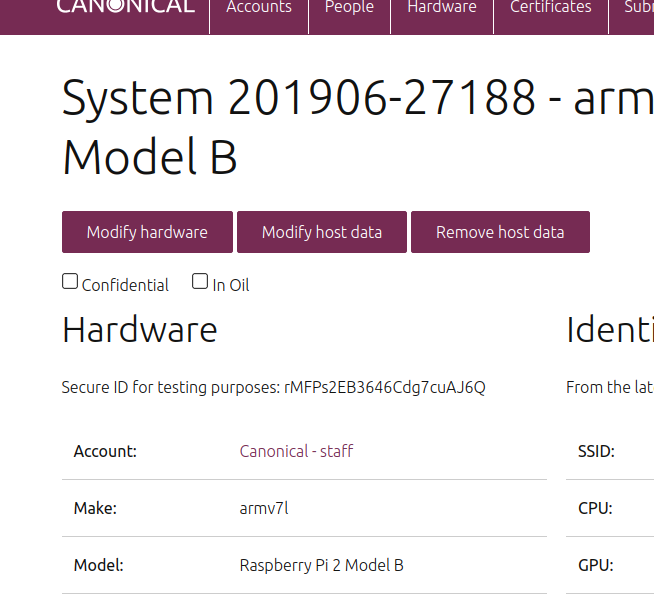

You should see output similar to the following for a successful submission::

  user@master$ cdts.checkbox-cli submit a00D000000XndQJIAZ \ ~/.local/share/checkbox_ng/submission_2016-03-23T19\:06\:18.244727.tar.xz
  Successfully sent, submission status at https://certification.canonical.com/submissions/status/28d85e09-11d4 

Once results submission is complete, use the provided link in the output to
review the results and confirm that they are correct.

.. raw:: pdf

   PageBreak

