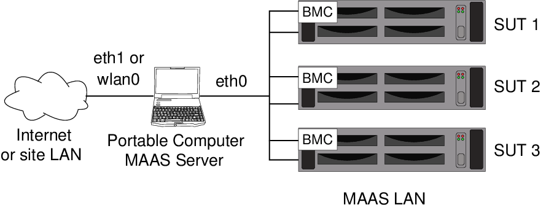

====================================================
 MAAS 2 Advanced NUC Installation and Configuration
====================================================
-----------------------
 (The MANIAC Document)
-----------------------

.. include:: <isonum.txt>

.. header:: |ubuntu_logo|

.. |ubuntu_logo| image:: images/logo-ubuntu_su-white_orange-hex.png
   :scale: 20%

.. footer:: |canonical_logo|

.. |canonical_logo| image:: images/logo-canonical_no-tm-white-hex.png
   :scale: 10%

.. raw:: pdf

   PageBreak oneColumn

.. contents::

.. raw:: pdf

   PageBreak

Purpose
=======

This document describes how to install MAAS on a portable computer (such as
an Intel NUC or laptop) so that you can deploy systems in a test
environment as well as install the certification tools and perform
certification testing. Consult the Ubuntu Certified Hardware Self-Testing
Guide (available from https://certification.canonical.com) for detailed
information on running the certification tests themselves.

In this document, the MAAS server is referred to generically as a "portable
computer" because the intent is that the MAAS server (such as an Intel NUC
or laptop) be portable for field technicians; however, you can deploy a
desktop computer or server in exactly the same way.

Note that this document is based on using the Ubuntu Desktop image for
ease of use, and thus some bits, the Network Manager bits especially,
may not apply if you're using Server without a desktop environment.

A computer configured
as described here is not intended for general Internet use. Some
settings relax security in the interest of ease of use, so you should
limit use of the portable computer on the Internet at large.

This document begins with information on the required hardware and then
moves on to details about Ubuntu's network configuration and then the
procedures for installing MAAS. (This document assumes that you know how
to install Ubuntu.) Because the purpose of this document is to help you
bring up a MAAS server for certification purposes, it then describes how
to install additional software and configure MAAS to automatically
install the certification packages on the system under test (SUT).

Figure 1 illustrates the overall configuration that this document will
help you create. This document describes configuration of the Portable
Computer device in the figure. It presupposes the existence of a local
LAN that the portable computer can use for external connections, as well
as the availability of at least one SUT for testing at the end of the
process. (Note that the Internet connection is required for initial
setup, but a properly-configured MAAS server does not need this
connection to bring up SUTs.) Once configured, you will be able to move
the portable computer from one site to another, repopulating the MAAS
LAN at each site.

         subnet and connects to a wider network on another interface.
   :width: 100%

   Figure 1: Network structure in which the portable computer will reside

**WARNING:** The configuration described in this document leaves several
server programs running on the portable computer, including a proxy server,
a web server (that can control MAAS), and an SSH server. Thus, it is unwise
to expose the portable computer directly to the Internet. You should either
secure it with strict local firewall rules or place it behind a strong
firewall running on a router between it and the Internet.

Hardware Required
=================

Before beginning, you should ensure that you have the following
hardware:

*  Portable computer

   -  Ensure that the portable computer has two network interfaces. A
      laptop with both Ethernet and wi-fi should suffice; or you can use a
      USB network dongle to provide a second interface.

   -  Because testing sessions can last for hours, ensure that you have a
      power brick; you should *not* run on battery power!

   -  You can install on a virtual machine in a more general-purpose
      computer, but you'll have to pay careful attention to the network and
      disk settings.

*  System Under Test (SUT) that provides one of the power control types
   MAAS supports:

   - American Power Conversion (APC) PDU
   - Cisco UCS Manager 
   - Digital Loggers, Inc. PDU
   - Facebook's Wedge
   - HP Moonshot - iLO Chassis Manager
   - HP Moonshot - iLO (IPMI)
   - IBM Hardware Management Console (HMC)
   - IPMI
   - Intel AMT
   - Microsoft OCS - Chassis Manager
   - OpenStack nova
   - SeaMicro 15000
   - Sentry Switch CDU
   - VMWare
   - Virsh (virtual systems)

*  Gigabit or faster switch (we recommend 8 ports minimum)

   -  For laptop with Wi-Fi: one Ethernet cable

   -  For NUC or laptop with dongle: two Ethernet cables

   -  For each SUT: one Ethernet cable for each NIC port including the BMC

   -  Please see the Self-Test Guide for further information on network
      requirements for certification testing.

*  Monitor and keyboard for SUT (helpful, but not strictly required)

*  Monitor, keyboard, and mouse for the MAAS system (a laptop's built-in
   devices should be sufficient)

*  At least 1 TB of disk space with which to mirror the Ubuntu archives,
   if desired. (An external USB3 hard disk may be used for this, if
   necessary.)

Note that these hardware requirements are geared toward a typical
testing environment. You may need to expand this list in some cases. For
instance, if you test multiple servers simultaneously, you may need
additional Ethernet ports.

Installing and Configuring Ubuntu
=================================

Once you've assembled the basic hardware for your portable system, you can
begin preparing it. The initial steps involve installing Ubuntu and setting
up its most basic network settings:

#. Install Ubuntu 16.04 (Xenial Xerus) to the portable system

   -  The Desktop version of Ubuntu is recommended because it enables you
      to easily access the MAAS web UI locally without needing a third
      system.

   -  If you choose to use the Server version, you will probably want to
      install the X server and a desktop environment on top of that as it
      simplifies MAAS access.

   -  This guide assumes the use of Ubuntu 16.04. Although another version
      may work, some details will differ. Older versions of Ubuntu use
      MAAS 1.9, which is different from MAAS 2.0 described here.

#. Boot the portable computer and log in.

4. Configure your *external* network port:

   -  On a laptop, you can use the Wi-Fi (usually ``wlan0``) port as the
      external port.

   -  If you need to use both a built-in Ethernet port and an Ethernet
      dongle, it's best to use the latter as your external port.

   -  In most cases, no explicit configuration of the external port is
      necessary because the Ubuntu Desktop system will have set it up to
      use DHCP, which is appropriate. You can adjust it if necessary,
      though.

   -  You can configure the external network either via
      ``/etc/network/interfaces`` or by using the Desktop's Network Manager
      tool.

#. Configure your portable computer's *internal* port.

   -  This guide assumes use of ``eth0`` and a static IP address of
      172.16.0.1/22 on this port; however, your actual port name is likely
      to be ``enp0s1``, ``p4p1``, or something else.

   -  If possible, configure the computer's built-in Ethernet port, rather
      than a plug-in dongle, as the internal port.

   -  You can either edit ``/etc/network/interfaces`` or use the GUI
      Network tool in the System Settings panel to configure the internal
      port. An example ``/etc/network/interfaces`` configuration resembles
      the following::

         auto eth0
         iface eth0 inet static
             address 192.168.0.2
             broadcast 192.168.255.255
             netmask 255.255.0.0
             dns-nameservers 192.168.0.2
             dns-search example.org

      The final two lines are necessary if you want to use the names that
      MAAS assigns to the SUTs on the command line (for instance, when
      using ``ssh`` to log in to them). You must adjust the values for your
      network, of course.

   -  If necessary or desired, you may use a different IP address on the
      *internal* port.

   -  Do not specify a gateway for the private internal LAN; doing so will
      create confusion when trying to access the Internet via the external
      port.

   -  If you have issues installing packages, check ``route -n`` and make
      sure you don't have a gateway route to the private LAN.

   -  Once you've finished configuring this network port, be sure to
      activate it. If you configured it by editing
      ``/etc/network/interfaces``, type ``sudo ifup eth0`` to activate it.
      (Depending on your starting configuration, you might need to type
      ``sudo ifdown eth0`` or bring it down via your GUI tools before
      bringing it up with its changed configuration.)

.. _`Installing and Configuring MAAS`:

Installing and Configuring MAAS
===============================

Installing MAAS on the computer is quite straightforward; you simply use
APT. Configuring MAAS, though, takes more effort, because you must
customize it for your environment. You must also download Ubuntu images
that MAAS will ultimately deliver to your SUTs. For the network to function
as desired, you must also set up NAT on your MAAS server. In many cases,
you may need to mirror the Ubuntu archives, which is a time-consuming
process. If you do this, you must also tweak you Apache configuration
appropriately.  The following procedure is therefore rather lengthy.

Installing MAAS
---------------

Configuring MAAS is described in generic terms at
`http://maas.ubuntu.com/docs/install.html <http://maas.ubuntu.com/docs/install.html>`_.
The more specific procedure for using MAAS in certification testing is:

#. Install the MAAS stable PPA
   (`https://launchpad.net/~maas/+archive/ubuntu/stable <https://launchpad.net/~maas/+archive/ubuntu/stable>`_)::

      $ sudo add-apt-repository ppa:maas/stable

   Currently (late August, 2016), Ubuntu 16.04 installs MAAS 2.0 RC 4 by default.
   This PPA holds the release version of MAAS 2, which is recommended for
   certification testing.

#. Several scripts and configuration files are available in the
   ``maas-cert-server`` package in the hardware certification PPA. You can
   install the scripts and configuration files as follows::

      $ sudo apt-add-repository ppa:hardware-certification/public
      $ sudo apt-get update
      $ sudo apt-get install maas-cert-server

   The ``maas-cert-server`` package includes a
   dependency on MAAS, so installing ``maas-cert-server`` will also install
   MAAS, as well as all of MAAS's dependencies.

   Most of the ``maas-cert-server`` files will be installed in
   subdirectories of  ``/usr/share/maas-cert-server``, although a few
   appear outside of that directory tree. (Subsequent steps describe how to
   use these files.)

#. Verify that you've installed MAAS 2.0 from the PPA, rather than
   some other version::

      $ dpkg -s maas | grep Version

   If the wrong version is installed, fixing the problem (presumably a
   misconfigured PPA) and upgrading may work. If you upgrade from an
   earlier version of MAAS, be sure to select the option to upgrade all the
   configuration files when the package manager asks about this.

#. Reconfigure the region controller with the IP address of ``eth0``::

      $ sudo dpkg-reconfigure maas-region-controller

   Give it the static IP for ``eth0``, e.g. 192.168.0.2. Note that Apache
   may complain that it "could not reliably determine the server's fully
   qualified domain name." You can safely ignore this message, both here
   and in the next step.

#. Reconfigure the rack controller with the URL for MAAS::

      $ sudo dpkg-reconfigure maas-rack-controller

   Give it the URL (in the prompt) with the IP of ``eth0``, with
   ``:5240/MAAS`` appended -- (e.g. \http://192.168.0.2:5240/MAAS).

#. Create the MAAS superuser::

      $ sudo maas-region createsuperuser

   You can use any name you like for the superuser. Your login name is
   likely to be easy to remember.

Configure SSH
-------------

Installing ``maas-cert-server`` should also install the ``openssh-client``
and ``openssh-server`` packages. You should make some configuration changes
for these packages, though:

#. Edit ``/etc/ssh/ssh_config``:

   -  Uncomment the line reading ``StrictHostKeyChecking ask`` and change
      ``ask`` to ``no``.

   -  This change eliminates the issues with reinstalling a SUT multiple
      times and having to deal with the ``Incorrect Host Key`` warning
      messages. You'll still see the message if there's a conflicting key
      in ``~/.ssh/known_hosts`` but SSH will ignore that.

   -  This change is *very* insecure, but since this is a test machine and
      not something meant to sit on the Internet or connect to much outside
      via SSH, it's an acceptable compromise.

   -  If you want to completely eliminate the issue, add this to the
      ``ssh_config`` file::

         UserKnownHostsFile /dev/null/

      Note that this is *very very* insecure

#. Create an SSH key for MAAS::

      $ ssh-keygen

   Leave the filename as-is for the ID file or change it. If you change the
   filename (say, to ``maas.id_rsa``), you can have both non-MAAS and
   MAAS-only keys.

Setting Up NAT and Routing
--------------------------

The Ubuntu configuration at this point is a good start, but it won't
provide your SUTs with access to the Internet. To correct this problem, you
can use the ``startnat.sh`` script, which is installed as part of the
``maas-cert-server`` package, in the ``/usr/sbin`` directory.

As the name implies, ``startnat.sh`` will start NAT on the portable
computer, which will enable the SUTs to access the Internet. (This is
required for submitting certification results directly from the SUTs and is
also necessary to fully install and upgrade the SUTs *if* the portable
computer lacks a full Ubuntu archive mirror.)

Note that this script reads ``/etc/maas-cert-server/config`` to determine
which network ports connect to the internal and external networks. By
default, ``eth0`` is assumed to be the *internal* port and ``eth1`` the
*external* port. If these are not the correct assignments, edit
``/etc/maas-cert-server/config`` appropriately.

You can launch ``startnat.sh`` automatically when you boot by adding a
reference to it to the ``/etc/rc.local`` startup script; or you can launch
it manually on an as-needed basis. (If local security policies forbid use
of NAT, you'll have to disable this script, use a local archive mirror, and
bring server test suite results out via sneakernet.)

If you need to disable NAT, the ``flushnat.sh`` script should do the job.

On some networks, you may need to perform additional configuration
steps. Keep this fact in mind when moving your portable computer between
networks; you may need to reconfigure it to meet the needs of specific
networks.

Mirroring the Ubuntu Archives
-----------------------------

Mirroring the Ubuntu archives is *optional*. It is helpful as a means to
reduce network traffic and speed up installations and updates,
particularly at sites with slow Internet connections. It is required
only if you must run certifications at sites that are completely
disconnected from the Internet. If you want or need to create a local
mirror for these purposes, follow these steps:

#. Ensure that you have sufficient disk space (a little over 50GB per
   version and architecture of Ubuntu to be supported -- 1TB total
   should be plenty) available at ``/srv`` on the portable MAAS server. You
   can do this in various ways:

   -  Use an internal hard disk that's big enough to hold all the files you
      need.

   -  Prepare a USB3 hard disk with ext4fs and add a line to ``/etc/fstab`` so
      that it will mount to ``/srv``.

2. Install the ``apt-mirror`` package::

   $ sudo apt-get install apt-mirror

3. Copy the ``/var/spool/apt-mirror`` directory tree to ``/srv``::

   $ sudo cp -a /var/spool/apt-mirror/* /srv

4. Edit the ``/etc/apt/mirror.list`` file to include a convenient mirror
   site and the PPAs used by the certification software
   (``ppa:hardware-certification/public`` and
   ``ppa:firmware-testing-team/ppa-fwts-stable``). Also be sure to set the
   ``base_path`` option to ``/srv``.

   - The ``maas-cert-server`` package includes a sample ``mirror.list``
     file; it should be in the ``/usr/share/maas-cert-server/etc/apt/``
     directory.

   - This example file pulls down source, AMD64, and i386 architectures for
     both 12.04 (Precise) and 14.04 (Trusty). The total disk space (and
     network bandwidth consumed) is on the order of 300GiB. You should
     probably modify it to retrieve 16.04 (Xenial) instead of 12.04
     (Precise).

   - For comparison, HD video consumes 1-8 GiB per hour -- usually on the
     low end of that range for video streaming services. As should be
     clear, the result will be significant network demand that will
     *degrade a typical residential DSL or cable connection for hours,*
     and possibly exceed your monthly bandwidth allocation.

   - You may want to adjust your file to support additional versions, if
     you have sufficient disk space and network bandwidth. If you're
     running on a residential network connection, you can mirror just one
     architecture and one Ubuntu version to reduce bandwidth consumption.

   - You can adjust the source site from ``archive.ubuntu.com`` to a
     closer site to speed up the mirror process. If you do so, you may
     need to adjust some of the paths later in this document.

5. Copy the ``postmirror.sh`` script from ``/usr/share/maas-cert-server/`` to
   ``/srv/var/``. Edit the local path and URL as necessary for your
   installation and the archive site from which you're mirroring your
   system.

6. Mirror the archives::

      $ sudo apt-mirror

   Note that this process is likely to take several hours, depending on the
   quality of your network connection.

In addition to mirroring the main Ubuntu archives, you may
*optionally* mirror the MAAS archives. Ordinarily, you download these
files just once for the architectures you need on the MAAS server, but
having a backup may be useful in case you need to install an unexpected
architecture or restore files should they be damaged. Mirroring these
files requires using a different tool from ``apt-mirror``:

#. Install the ``simplestreams`` and ``ubuntu-cloud-keyring packages``::

   $ sudo apt-get install simplestreams ubuntu-cloudimage-keyring

2. Change to the ``/srv/mirror`` directory.

3. Mirror the site with the following command::

      $ sudo sstream-mirror --keyring \\
        usr/share/keyrings/ubuntu-cloudimage-keyring.gpg --max=1 \\
        http://maas.ubuntu.com/images/ephemeral/releases/ \\
        -v maas.ubuntu.com

   -  You can test this process without actually downloading files by
      specifying ``\-\-no-item-download`` among the options.

   -  Note that the ``simplestreams`` package is not part of Ubuntu 12.04.

If you are planning to operate in locations with bad or no outside
network access, you will also need to obtain and bring a copy of a
bootable Ubuntu Cloud Image for the virtualization portion of the
certification test. You can obtain that here:

`http://cloud-images.ubuntu.com/trusty/current/trusty-server-cloudimg-i386-disk1.img <http://cloud-images.ubuntu.com/trusty/current/trusty-server-cloudimg-i386-disk1.img>`_

You can use another release of Ubuntu if this is convenient. An i386 image
is used even when you're testing 64-bit hardware. You can place this file
on the ``/srv`` volume and copy it to the SUTs before running the server
test suite.

Configuring Apache
------------------

Apache is used both for accessing the MAAS web UI and for delivering
archive mirrors, if you've created them. It should have already been
installed as a dependency of MAAS. If you've mirrored an Ubuntu archive
site, you must create symbolic links of the mirror archives to the default
Apache directory:

#. Create symbolic links for the main Ubuntu mirror, for the PPA
   mirrors, and for the MAAS mirror::

      $ sudo ln -s /srv/mirror/archive.ubuntu.com/ubuntu /var/www/html/ubuntu
      $ sudo ln -s /srv/mirror/ppa.launchpad.net/\* /var/www/html/
      $ sudo ln -s /srv/mirror/maas.ubuntu.com /var/www/html/

   Note that if you altered ``/etc/apt/mirror.list`` to mirror from a
   regional repository (such as ``us.archive.ubuntu.com``) rather than from
   the main Ubuntu repository (``archive.ubuntu.com``), you must adjust the
   first command appropriately.

2. Ensure that the mirrors are readable by Apache users::

      $ sudo chown -R www-data:www-data /srv/mirror/\*

Of course, you should keep your mirrors up-to-date. You can do this
manually or by creating a ``cron`` job. In fact, the ``apt-mirror`` package
installs a suitable ``cron`` file, ``/etc/cron.d/apt-mirror``. Remove the
leading hash (``#``) from the following line in that file to activate it::

   #0 4 \* \* \* apt-mirror /usr/bin/apt-mirror > /var/spool/apt-mirror/var/cron.log

Once activated, this job will run every day at 4:00 AM, provided the
computer is powered on at that time. If that won't be the case, you can
run it manually by typing ``sudo apt-mirror`` whenever is convenient. Runs
after the initial one should take much less time and bandwidth than the
original one.

Similarly, you can re-run the ``sstream-mirror`` command (from the
``/srv/mirror`` directory) to update the MAAS files. As with
``apt-mirror``, you can do this manually or create a ``cron`` job.

You can save a little time and network bandwidth in the following steps by
configuring your portable computer to use the archives you've just
downloaded. To do so, edit ``/etc/apt/sources.list`` and edit the lines
that are equivalent to those you entered in ``/etc/apt/mirror.list`` to
refer to ``localhost`` rather than ``archive.ubuntu.com`` (or whatever
mirror site your computer is set up to use by default). For instance, your
original file might include a line like the following::

   deb http://archive.ubuntu.com/ubuntu precise main restricted universe multiverse

You would change that to read::

   deb http://localhost/ubuntu precise main restricted universe multiverse

Be sure to change all the references to the standard archives that
you've mirrored. To test these changes, type::

   $ sudo apt-get update
   $ sudo apt-get dist-upgrade

You should see normal output for these commands, although chances are
the ``dist-upgrade`` command will report no need to update any files.

Configuring the MAAS Web UI
---------------------------

With MAAS installed and (if desired) the Ubuntu archives mirrored, you can
proceed with further MAAS configuration via its web-based user interface.
To do so, follow these steps:

#. Verify you can access the MAAS web UI:

   -  Launch a browser and point it to \http://192.168.0.2/MAAS (your
      internal port).

   -  You should also be able to access this by default on the
      external port, too.

   -  If you provide the computer with a hostname in DNS or ``/etc/hosts``,
      you should be able to access it via that name, as well.

   -  You should see a login prompt.

#. Log in to the web UI using the username and password you added
   above for the superuser.

#. Click on the down arrow next to the user name in the top right
   corner. A drop-down menu will appear, as shown here:

   .. image:: images/maas-dropdown.png
      :width: 100%

#. Select Account (Preferences in MAAS 1.7) in this drop-down menu. A user
   preferences screen will appear.

#. Add your SSH key

   -  Click on "+ Add SSH key"

   -  Copy and paste the entire contents of your ``~/.ssh/id_rsa.pub`` (or
      MAAS-specific public key) in the "Public key" box

   -  click on "+ Add key"

   -  You may optionally add more keys in the same way.

#. Click Images near the top of the MAAS web page. This will bring you
   to a page in which you can select the architectures and Ubuntu
   versions to support. For certification, you should import a minimum
   of Ubuntu 16.04 LTS for AMD64; however, you may want to add 14.04
   LTS and i386 or other CPU types, depending on your anticipated
   needs. (Note that custom point-release images are imported later, but
   you must import at least one image for each CPU architecture here.)

#. In the Images page, select the images you want MAAS to support and
   then click Import Images. A spinner will appear as the download
   progresses. This process can take minutes to hours depending on your
   Internet connection. MAAS needs to download PXE images for all
   supported releases as well as ephemeral images for commissioning and
   deployment.

#. Check the Clusters page to verify the status of your image downloads. A
   successful image import will show Synced under Images.

#. Edit the ``/etc/maas/templates/dhcp/dhcpd.conf.template`` file. You can
   customize your DHCP options here. Most defaults are fine for most
   installations, but you might want to add entries for servers that are
   not MAAS nodes and should have fixed IP addresses or customize certain
   options. (Many values can be set via the MAAS web UI, as described
   shortly.) A pair of options you may want to adjust are the default and
   maximum lease times, which both default to 30 seconds. Such low settings
   can create excessive DHCP traffic, so increasing them is advisable. A
   value of 3600 (1 hour) works well for certification testing purposes.

#. Click the Clusters link near the top of the web page so you can set
   the DHCP options:

   #.  Click the cluster name for the cluster controller (Cluster Master in
       this example):

       .. image:: images/clusters-page.png
          :width: 98%

   #.  Mouse over the *internal* (normally ``eth0``) network
       interface. (If you don't see your internal interface listed, click
       the "Add Interface" button to add it.) You should see a pair of
       icons appear, one to edit the interface and one to delete it. Click
       the former, then change the following items:

       - Interface = ``eth0`` (or your *internal* port)

       - Management = *DHCP and DNS*

       - IP (required) = the IP address of the *internal* port

       - Subnet mask = appropriate mask (such as 255.255.0.0)

       - Broadcast IP = network IP (such as 192.168.255.255)

       - Router IP = IP of ``eth0`` (the *internal* port, such as
         192.168.0.2)

       - DHCP dynamic IP range low value = Start of the DHCP IP address
         range used for enlistment, commissioning, and unknown devices
         (such as 192.168.0.50)

       - DHCP dynamic IP range high value = end of the DHCP dynamic IP
         address range (such as 192.168.0.99)

       - Static IP range low value = Start of the static IP address range
         used for servers (SUTs) managed by MAAS (such as 192.168.0.100)

       - Static IP range high value = end of the static IP address range
         (such as 192.168.0.200)

       - Click Save Interface

#. If desired, change the DNS zone name field on the "Edit Cluster
   Controller" page to some convenient value, such as ``example.org``. If
   you set a search domain in ``/etc/network/interfaces``, using that value
   is desirable. Click "Save Cluster Controller" when you're finished.

#. Click Settings near the top of the page to load the MAAS Settings page,
   where you set several miscellaneous MAAS details:

   -  Click the associated "save" button for *each* of the following
      sections you change. Unfortunately, each save button is
      section-specific and won't save changes made in other sections of
      that page.

   -  There should be at least one MAAS Admin listed in Users and
      Keys.

   -  Scroll down to Commissioning and verify that the "Default Ubuntu
      release used for commissioning" is set to what you need. This will
      normally be Ubuntu 14.04 LTS "Trusty Tahr." (If MAAS claims there is
      no usable release, you will need to wait for the ephemeral image
      downloading step to complete and then refresh the page to see the
      options.)

   -  Set the options under "Deploy" to suitable values.

      - For Trusty certification, you should set the options to Ubuntu 14.04
        LTS "Trusty Tahr."

      - If you must also certify 12.04, you can override this option on a
        boot-by-boot basis. Set the default for whichever version you use
        most frequently.

   -  If you're using a local APT mirror or if you want to change the
      mirror used by your SUTs from the default, change the URLs for Main
      archive and Ports archive to the correct URLs for your
      environment. If you mirrored your archives as described earlier, you
      can adjust these values to obviate the need for Internet access by
      the SUTs:

      - The Main Archive should refer to \http://192.168.0.2/ubuntu.

      - The Ports Archive can remain unchanged from the default.

      - Adjust 192.168.0.2 as appropriate for your network settings; the
	reference should be to your portable computer's *internal* network
	address.

   -  Under *Network Configuration*, you may want to make some changes,
      such as an HTTP proxy, an upstream DNS server, and an NTP server.
      These settings help you deal with strict local firewalls. These
      settings are most likely to be necessary if you did not mirror the
      Ubuntu archives.

   -  Under *Third Party Drivers Configuration*, ensure that *Enable the
      installation of proprietary drivers (i.e. HPVSA)* is checked.

   -  If you use MAAS 1.9, change *Default storage layout* in the *Storage*
      section from *LVM layout* to *Flat layout.*  Some certification tests
      assume a flat layout, which is the default (and only) option in MAAS
      1.8 and earlier.

Testing the MAAS Server
=======================

At this point, your MAAS server should be set up and configured
correctly. If you continued preparing MAAS as your images downloaded,
though, wait until that process has finished before proceeding. To test
it, follow these steps:

#. Prepare a computer by configuring it to boot via PXE. This computer
   need not be a computer you plan to certify; anything that can
   PXE-boot should work, although to fully test the MAAS server, the
   test system should provide IPMI or some other power-control tool that
   MAAS supports.

#. Connect the test computer to the portable computer's *internal* network
   and power it on.

   - The test computer should PXE-boot from the portable MAAS computer.

   - This first boot should be to the enlistment image, which provides
     some very basic information to the MAAS server. Once the node powers
     itself off you should see it listed in the MAAS nodes list
     (\http://localhost/MAAS/#/nodes/ or, on MAAS 1.7,
     \http://localhost/MAAS/nodes/) with a Status field of "New."

   - Note that you will have to refresh the nodes list as it does not
     refresh itself to list new data.

#. Click on the node's hostname to view the node's summary page.

#. If desired, click the node's hostname near the upper-left corner of the
   page. This will enable you to change the hostname to something
   descriptive, such as the computer's model number. Click "Save" when
   you've made your changes.

#. If necessary, click "Edit" in the Machine Summary section to change the
   architecture of the machine. Click "Save Changes" when you're done.

#. If necessary, change the Power Type in the Power section of the page.
   This may necessitate setting an IP address, MAC address, password, or
   other information, depending on the power control technology in use.
   Click "Save Changes" when you're done.

#. Click "Take Action" near the top-right corner of the page, followed by
   "Commission Node" from the resulting drop-down menu. You must then click
   "Go."

   - The node should power on again. This time you'll see it PXE-boot the
     commissioning image. Note that if your test system lacks a BMC or
     other means to remotely control its power, you must manually power it
     on.

   - The node should do a bit more work this time before powering off
     again.

   - Once it's done, the UI will show a Status of "Ready."

#. Once the system powers off after commissioning, click "Take Action"
   followed by "Deploy." You must then click "Go" to confirm this action.

   - The node should power on again (or you will have to control it
     manually if it lacks a BMC). This time it will take longer to finish
     working, as MAAS will install Ubuntu on the system.

   - Once it's done, the computer will reboot into its installed image.

   - You could install and run certification software on the test system
     at this point. The next section, `Installing Certification Packages
     Automatically via MAAS`_, describes additional changes to MAAS to
     simplify this task.

If any of these steps fail, you may have run into a MAAS bug; your test
computer may have a buggy PXE, IPMI, or other subsystem; or you may have
misconfigured something in the MAAS setup. You may want to review the
preceding sections to verify that you configured everything correctly.
To help in debugging problems, the node status page includes a section
entitled Latest Node Events with a summary of the last few events
related to the node. (You must refresh the page to see new events.)

Note that there are two methods of installing nodes:

-  **Standard** -- aka Debian or d-i, this installation method installs
   Ubuntu using the same installation program used by an Ubuntu ISO file
   that you might download from the Internet.

-  **Fastpath** -- aka curtin, this installation method places a pre-built
   Ubuntu image onto the node's hard disk.

A fastpath install is, as the name implies, faster than a standard
install. In MAAS 1.5, the standard install was the default, but in MAAS
1.7, the default has changed to the fastpath method. The fastpath method
is also preferred for certification testing because it permits the
certification suite to detect and report the MAAS version, whereas the
d-i method does not currently support this feature. The method to
deliver fixed point releases, described next, uses the fastpath install
procedures.

Configuring MAAS to Deliver Fixed Point Releases
================================================

By default, MAAS delivers whatever version of Ubuntu was packaged by the
MAAS team when you downloaded your MAAS installation images. This
version is likely to correspond to the current point release, possibly
plus some updates. For certification work, it's far better to install a
fixed point release, such as 14.04 GA or 14.04.1. This can be
accomplished with MAAS 1.7 by installing custom images:

#. Download the custom images. They are currently hosted at
   http://certification-static.canonical.com/fixed-point-releases/.
   Retrieve whichever images you need and store them somewhere
   convenient, such as your user's home directory on the portable
   computer. Images are about 250-300MiB in size.

#. Return to the terminal and login to the API using maas-cli::

      $ maas login <PROFILE_NAME> <API_URL> <KEY>

   -  ``<PROFILE_NAME>`` is anything you wish. This guide uses ``maas`` for
      simplicity.

   -  ``<API_URL>`` refers to a URL on the MAAS server, as in
      \http://192.168.0.2/MAAS/api/1.0.

   -  ``<KEY>`` is a key displayed in the web UI
      (\http://localhost/MAAS/account/prefs/) in the MAAS Keys section or
      can be obtained by typing ``sudo maas-region-admin apikey
      \-\-username {user}`` in a shell (substitute your MAAS username for
      ``{user}``).

   -  You should get a message saying "You are now logged in to the MAAS
      server at ``<URL>`` with the profile name ``'<PROFILE_NAME>'``"

   -  If you've previously run the maas command using sudo, you may need to
      either use sudo with this command or change the ownership of
      ``~/.maascli.db``.

3. Tell MAAS about each image you want to import::

      $ maas maas boot-resources create name=custom_14041_amd64 \\
        title="Ubuntu 14.04.1 (AMD64)" architecture=amd64/generic \\
        content@=/home/ubuntu/ubuntu-14.04.1-server-amd64-curtin.tar.gz

   -  Repeat this step once for each image.

   -  Give each image a unique ``name``. The name *must not exceed 20
      characters!*

   -  Adjust the ``title`` to the value you want to see in the MAAS web UI.
      Each image must have a unique ``title``.

   -  Point ``content@=`` to the image you want to add.

4. Check the MAAS boot images page (\http://localhost/MAAS/images/) to
   see that the images have imported correctly. They should appear in
   the Custom Images section. If an image has an active spinner next to
   it, MAAS hasn't finished importing it. If the spinner becomes a
   hollow pink circle, the import failed.

5. You may optionally change the default OS to deploy on the MAAS
   settings page (\http://localhost/MAAS/settings/) to point to one of
   your custom images. Note that whenever you release a node, the OS
   changes back to the default, so you may need to alter that setting
   whenever you release and redeploy a node.

Once the images have been imported, you can select them as you would any
other OS version in the MAAS web UI. Instead of appearing as an OS Type
of "Ubuntu," though, these images will appear with an OS Type of
"Custom."

Once the images have been imported, you can select them as you would any
other OS version in the MAAS web UI:

#. If a node is already running, select "Take Action" followed by "Release"
   in its node summary page. Confirm this action by clicking "Go." It may
   take a few seconds for MAAS to fully release the node.

#. Select "Take Action" followed by "Deploy." An option to choose the
   image you want to deploy should appear.

#. Select the image. It will be a Custom image with the name you
   specified when you loaded it, as shown here:

   .. image:: images/custom-image-selection.png
      :width: 100%

#. Click "Go" to deploy the image. Your node should start up and install
   the point-release image you selected.

In MAAS 1.7.0 and earlier, it was possible to set the OS prior to acquiring
a node, which enabled a streamlined process of setting the OS and then
using the "Acquire and Start" button; but as of version 1.7.1, you must set
the OS between acquiring and starting the node, as just described. If you
want to switch the OS of an already-running node, you must first release
it, then re-acquire it, set its OS, and finally start it. You can also set
a fixed point release to be your default OS on the Settings page
(\http://localhost/MAAS/settings/).

Note that before you can install a custom image for any given architecture,
you must have first imported at least one image for that architecture via
the conventional means, as described earlier, in "Installing and
Configuring MAAS."

.. _`Installing Certification Packages Automatically via MAAS`:

Installing Certification Packages Automatically via MAAS
========================================================

MAAS can automatically install the certification packages every time you
"Start" a node. This is how to do it:

#. On the MAAS server, enter the ``/etc/maas/preseeds`` subdirectory::

   $ cd /etc/maas/preseeds

2. Back up the ``generic`` file::

   $ sudo cp generic generic-orig

3. Copy the ``stable-preseed-generic`` file from
   ``/usr/share/maas-cert-server/preseed/`` to
   ``/etc/maas/preseeds/generic``::

    $ sudo cp /usr/share/maas-cert-server/preseed/stable-preseed-generic \
      ./generic

   .. Note to self: Documentation on finer-grained naming is at
      https://www.google.com/url?q=https%3A%2F%2Fmaas.ubuntu.com%2Fdocs%2Fdevelopment%2Fpreseeds.html&sa=D&sntz=1&usg=AFQjCNFARkFbhKDIyF6L8uyJvJUPqJ_6Ng
      This is currently delicate and I suspect the documentation is faulty.
      Not worth covering here, but maybe revisit in the future....

   This action creates a configuration file that causes nodes to install
   the certification suite after a standard/d-i install.

4. Back up the original ``curtin_userdata`` and
   ``curtin_userdata_custom`` files::

   $ sudo cp curtin_userdata curtin_userdata-orig
   $ sudo cp curtin_userdata_custom curtin_userdata_custom-orig

5. Copy ``curtin_userdata`` from ``/usr/share/maas-cert-server/preseed/`` to
   ``/etc/maas/preseeds``, as both ``cutin_userdata`` and as
   ``curtin_userdata_custom``::

      $ sudo cp /usr/share/maas-cert-server/preseed/curtin_userdata ./
      $ sudo cp /usr/share/maas-cert-server/preseed/curtin_userdata \
        ./curtin_userdata_custom

   The modified ``curtin_userdata`` file causes nodes started via the
   fastpath/curtin method to install the certification software. This file
   affects nodes of all architectures. The ``curtin_userdata_custom`` file
   does the same thing for the custom images used for testing with specific
   point releases.

6. The preseed files each include two or three lines that refer to the
   ``ppa.launchpad.net`` repository. If you are relying on a mirrored
   archive, change these references to your own local repository (at
   192.168.0.2, or whatever IP address you're using). Note that if you
   leave this file as-is, the SUT will attempt to access the Internet,
   and so will require Internet access to fully provision itself.

#. Optionally create an ``/etc/maas-cert-server/iperf.conf`` file to
   identify your ``iperf`` server(s). This file should consist of a single
   line that contains a comma-delimited list of IP addresses, each
   identifying a different ``iperf`` (or ``iperf3``) server. If this file
   is absent, SUTs will configure themselves to use their network
   gateways (normally the MAAS server) as the ``iperf`` target. If
   ``/etc/maas-cert-server/iperf.conf`` is present, though, MAAS will tell
   SUTs to use the specified system(s) instead. You might use this feature
   if your ``iperf`` server is not the SUTs' network gateway or if you have
   multiple ``iperf`` servers -- for instance, one for ``iperf`` (version
   2) and another for ``iperf3``; or one on a 1 Gbps network and another on
   a separate 10 Gbps network. The SUTs will attempt to use each ``iperf``
   target in series until the network test passes or until the list is
   exhausted. This setting can be overridden on SUTs by editing the
   ``/etc/xdg/canonical-certification.conf`` file on the SUT.

#. Using the MAAS web user interface, enlist and commission a new node.
   Alternatively, you can click "Release Node" on the node you tested
   earlier, then wait a few seconds and refresh the page.

#. Go back to the Node View and deploy a node, as described earlier. Your
   SUT should turn on, do an installation, and then install the
   certification tools.

#. You can observe the installation process by connecting a monitor to the
   node and viewing the messages in real-time as they're being produced.

#. Once the machine finishes installation and reboots, you can SSH into
   its ``ubuntu`` account from the MAAS server and you should be able to
   run the command::

      $ canonical-certification-server

   Note, however, that this works only on 14.04 (GA and point release)
   versions. If you are certifying a 12.04 release, you must manually
   install the certification suite.

For more on the  certification process itself, see the Ubuntu Server
Hardware Self-Testing Guide, which is available from
https://certification.canonical.com.

.. raw:: pdf

   PageBreak

Appendix A: Performing a Partial Restore
========================================

If the MAAS server's support files (the PXE boot images and related
files) become damaged, PXE-booting SUTs may fail. The SUT may fail to
retrieve PXE boot images or the boot may fail with any number of
symptoms later in the process. If you're unable to discover a cause and
solution through less drastic means, one possible recovery procedure is
to restore those files to a fresh state; however, be aware that this
procedure will *destroy all existing node definitions.* Thus (and because
the solution involves downloading new boot images, which can be
time-consuming), you should attempt this solution only as a last resort.
Steps 1 and 6 of the following procedure are the minimum required;
steps 2-5 make for a more thorough cleansing of the system. The overall
procedure is:

#. Click the Clusters link in the MAAS server's web interface (to reach
   the server's ``/MAAS/clusters/`` page).

#. Click the small trash can icon that appear near the right side of the
   page associated with your malfunctioning cluster when you mouse over it,
   and then confirm the operation. This will delete the cluster
   controller's definition.

#. Delete the contents, including all subdirectories, of the
   ``/var/lib/maas/boot-resources`` directory on the portable server.

#. In a shell, reconfigure the ``maas-cluster-controller`` and
   ``maas-region-controller`` packages::

      $ sudo dpkg-reconfigure maas-cluster-controller
      $ sudo dpkg-reconfigure maas-region-controller

   You should not need to adjust the default values.

5. Reset the cluster controller's DHCP and DNS options, as described in
   step #10 under `Configuring the MAAS Web UI`_,
   earlier.

6. If necessary or desired, adjust the images you want to import, as
   described in steps #6 and #7 under `Configuring the MAAS Web UI`_,
   earlier.

This procedure should restore your ability to PXE-boot your SUTs.

.. raw:: pdf

   PageBreak

Appendix B: Glossary
====================

The following definitions apply to terms used in this document.

1Gbps
  1 Gigabit - Network speed for Gigabit Ethernet (1000Mbps).

10Gbps
  10 Gigabit - Network speed for 10 Gigabit Ethernet (10,000Mbps).

BMC
  Baseboard Management Controller - A device in many server models
  that allows remote in and out of band management of hardware.

DHCP
  Dynamic Host Control Protocol - method for providing IP addresses
  to the SUT and Targets.

Greylist test
  A test that must be performed but will not affect the
  granting of a certified status.

KVM
  Kernel Virtual Machine - A system for running virtual machines on
  Ubuntu Server.

IPMI
  Intelligent Platform Management Interface - A technology for
  remotely connecting to a system to perform management functions.

LAN
  Local Area Network - the network to which your SUT and Targets are
  connected. The LAN does not need to be Internet accessible (though that
  is preferable if possible).

MAAS
  Metal as a Service - a Canonical product for provisioning systems
  quickly and easily.

NIC
  Network Interface Card - the network device(s).

NUC
  A small form-factor PC product from Intel.

.. raw:: pdf

   PageBreak

PXE
  Pre-boot Execution Environment - A technology that allows you to
  boot a system using remote images for easy deployment or network-based
  installation.

RAID
  Redundant Array of Independent Disks - multiple disk storage
  providing redundancy, parity checking and data integrity.

RAM
  Random Access Memory - System Memory.

SAN
  Storage Area Network - Usually FibreChannel.

SUT
  System Under Test - The machine you are testing for certification.

Target
  A system or systems on the test LAN that the SUT can use for
  network testing. The Target must be running an iperf server, but
  otherwise does not need any special configuration. The MAAS server may
  double as the Target.

Test case
  A test to be executed as part of the certification test
  suite. Test cases include things such as "CPU Stress" and "CPU
  Topology."

Whitelist test
  A test that MUST pass for the SUT to be granted a
  certified status.
