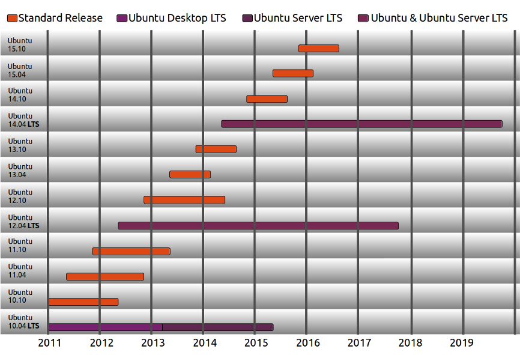

===========================================================
 Ubuntu Server Hardware Certification Overview (14.04 LTS)
===========================================================

.. include:: <isonum.txt>

.. header:: |ubuntu_logo|

.. |ubuntu_logo| image:: images/logo-ubuntu_su-white_orange-hex.png
   :scale: 20%

.. footer:: |canonical_logo|

.. |canonical_logo| image:: images/logo-canonical_no-tm-white-hex.png
   :scale: 10%

.. raw:: pdf

   PageBreak oneColumn

.. contents::

.. raw:: pdf

   PageBreak

Summary
=======

The Ubuntu Server Hardware Certification is available to members of the
Technical Partner Programme that have a commercial support or distribution
agreement to help original equipment manufacturers (OEMs) and original
design manufacturers (ODMs) manufacture high-quality, enterprise-class
server products that are compatible with Ubuntu Server.

Server Certification uses an extensive set of hardware and operating system
tests that ensure the certified hardware is fully compatible with the
Ubuntu Server OS and the Ubuntu deployment tools.  

Canonical's Technical Partner Managers, Field Engineers and the Server
Certification Team work closely with manufacturers to resolve test issues 
and assure that the testing is representative of in-field use.

As of Ubuntu Server 14.04 LTS, MAAS will be used as part of the testing
process for testing scale out deployment capabilities which will be a
requirement for a system to be listed as Ubuntu Server Certified Hardware. 
This means that a given server must be able to be automatically provisioned
by Canonical's Metal as a Service tool (MAAS) with no unnecessary manual
intervention.

To meet this goal the test environment will require a provisioning server
running MAAS which will be used to deploy and test the hardware.  This is a
change from the way we tested Ubuntu on Servers with 12.04 LTS.  This
general overview covers x86-based servers only, please contact your
Canonical account team for support of other architectures.

Certification Goals
===================

* Testing that hardware works correctly with a specific LTS and future
  point releases of Ubuntu Server.

* Testing that a system can be provisioned and deployed using MAAS.

* Identifying technical issues and potential certification blockers.

* Publicly advertising hardware that is proven compatible with Ubuntu
  Server, is supported by the OEM, and there is a commercial distribution
  model for Ubuntu and/or Ubuntu support

* Providing Ubuntu Server users with resources for determining which
  systems to buy when deploying Ubuntu Server.

Scope of the Ubuntu Server Hardware Certification
=================================================

Certification is open to members of the Technical Partners Program
(http://www.ubuntu.com/partners/find-a-partner/hardware).   Servers to be
certified are initially tested at customer's premises or in special
circumstances at Canonical's certification laboratories to ensure that
hardware is fully compatible with Ubuntu Server and Ubuntu deployment
tools.

Once systems have passed testing  and are to be listed as certified, a
representative sample of hardware is sent to Canonical's Labs.  This
hardware is an agreed upon subset of the partner's product line that
encompasses all the various components (storage controllers, network
controllers, processor families, etc) that make up the product line.  The
representative hardware may be used to replicate support cases, SRU and
point release testing,  as well as ongoing extensive testing as part of our
Openstack Interoperability Lab
(http://www.ubuntu.com/cloud/ecosystem/ubuntu-oil).

Additionally, in some situations it is possible for Canonical engineers to
remotely perform certification testing on hardware located on a
customer's premises.

Servers are tested using all point releases for the latest supported LTS
release of Ubuntu Server.  LTS Point Releases (e.g. Ubuntu Server 12.04.4
LTS) and interim releases are tested every three months on actual or
representative hardware to find regressions.  Although interim releases are
tested, Ubuntu Server Certification does NOT include certification against
non-LTS releases.  Interim release testing is part of the process and
eventual testing and certification of the corresponding LTS point release.

         recent standard (non-LTS) releases are supported for nine
         months.
   :width: 100%

Systems are certified for the life cycle of the Ubuntu Server LTS Version
against which they were certified, including future point releases.  A
certificate will be associated with a particular software and hardware
configuration.  Additional software and hardware configurations may require
re-testing.  To determine if your additional configurations will require
retesting, please contact your technical partner manager who will assist in
determination.

Servers that are determined to be Ubuntu Server Certified are listed
publicly:

        http://www.ubuntu.com/certification/server

Service Level Agreement
=======================

The Server Certification Team will respond to any and all certificate
requests within 3 Business Days.  The Server Certification Team will also
complete Certification requests within 10 Business Days.  That is, we will
endeavor to take a system from Uncertified to Fully Certified within 10
Business Days.  This, however, is a best case scenario and assumes that
there are no issues found that require hardware enablement or bug fixing. 
In such an event that blocking issues are discovered, the Server
Certification Team will work with the Partner, the TPP team and other
relevant teams within Canonical to help resolve blocking issues to move
requested certification work along in a timely fashion.

We do NOT guarantee a timeframe for blocker resolution, or for certificate
completion in such cases, as these cases can vary greatly on the amount of
time, effort and people required to find and enact a resolution.

Website
=======

Public certification listings will be available at `a specific public
server certification website.`_ OEM/ODMs will have access to additional
resources on `the private Canonical certification portal.`_

.. _`a specific public server certification website.`:
   http://www.ubuntu.com/certification/server/

.. _`the private Canonical certification portal.`:
   https://certification.canonical.com

For each certified server, the certificate will show information about:

* Software configuration used to test that server (Ubuntu image version,
  point release version, kernel version)

* Hardware configuration of the certified server (a list of the components
  that are part of the certified server)

  * In the case of multiple configurations of a single model being tested
    for certification the public site will display an aggregated list of
    components tested across all configurations in a single entry.

Partner Resources
=================

Partners can advertise and promote the certification of their systems with
Ubuntu Server.

Canonical's marketing team provides resources to partners for media and
packaging, such as logos and guidelines for logo usage.

Users of Ubuntu are provided with a list of certified hardware that has
been formally tested with Ubuntu Server and considered supported.

In the event a system fails certification, Canonical provides a means by
which Hardware, OEM, and ODM partners can engage Canonical for hardware
enablement services. These services are NOT included by default in either
the Technical Partner Programme or as part of Ubuntu Server Hardware
Certification.

Programme Access
================

System manufacturers and builders who want to have their servers designated
as Ubuntu Server Certified Hardware can apply online for the Technical
Partner Programme. Registration is a simple process and offers partners
access to a Technical Partner Manager, access to the Partner Portal and the
private Certification Portal.

To apply for Canonical's Technical Partner Programme, use the online
Partner Registration form

     http://www.canonical.com/partners/contact-us

Enter your contact details and company information and a sales
representative will contact you regarding your needs.

Once registered, partners can access the certification program online at:

       https://certification.canonical.com/

If you would like to reach the Technical Partner Program managers directly
you can also e-mail tpp@canonical.com.
