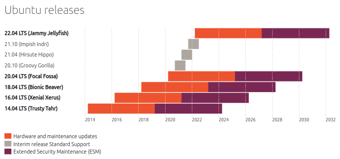

===============================================
 Ubuntu Server Hardware Certification Overview
===============================================

.. include:: <isonum.txt>

.. header:: |ubuntu_logo|

.. |ubuntu_logo| image:: images/logo-ubuntu_su-white_orange-hex.png
   :scale: 20%

.. footer:: |canonical_logo|

.. |canonical_logo| image:: images/logo-canonical_no-tm-white-hex.png
   :scale: 10%

.. raw:: pdf

   PageBreak oneColumn

.. contents::

.. raw:: pdf

   PageBreak

Summary
=======

The Ubuntu Server Hardware Certification is available to members of the
Canonical OEM Partner Programme that have a commercial support or distribution
agreement. This program exists to help Canonical's hardware partners (OEMs,
ODMs and resellers) manufacture and sell high-quality, enterprise-class server
products that are compatible with Ubuntu Server.

Server Certification uses an extensive set of hardware and operating system
tests that ensure the certified hardware is fully compatible with the
Ubuntu Server OS and the Ubuntu deployment tools. 

Canonical's Partner Engineers, Field Engineers and the Server Certification
Team work closely with manufacturers to resolve test issues and assure that
the testing is representative of in-field use.

Installation and configuration of Canonical's `Metal as a Service (MAAS)`_ tool,
certification environment, and Server Test Suite can be found in other guides
available on the Certification Portal (https://certification.canonical.com)

.. _`Metal as a Service (MAAS)`:
  http://maas.io

Certification Goals
===================

* Verifying that hardware works correctly with a specific LTS and future
  LTS point releases of Ubuntu Server.

* Ensuring that a system can be provisioned and deployed using MAAS.

* Identifying technical issues and potential certification blockers.

* Publicly advertising that hardware that has been proven to be compatible
  with Ubuntu Server, that it is supported by the Hardware Partner, and that
  there is a commercial distribution model for Ubuntu and/or Ubuntu support.

* Providing Ubuntu Server users with resources for determining which
  systems and options are supported when deploying Ubuntu Server.

Scope of the Ubuntu Server Hardware Certification
=================================================

Certification is open to members of the Canonical OEM Partner Program
(https://partners.ubuntu.com/programmes/hardware). Systems to be certified are
initially tested at the customer's premises or at Canonical's certification 
labs, to ensure that hardware is fully compatible with Ubuntu Server and 
Ubuntu deployment tools.

Certification testing at the Partner's premesis can be conducted by the
Partner's engineers or by Canonical Engineers.

Once systems have passed testing and are to be listed as Ubuntu Server
Certified, Canonical will need the ability to purchase up to 2 of each
certified model for support needs and ongoing testing needs including, but not
limited to, Stable Release Update (SRU) testing, new release testing, debugging
customer issues, and other needs.

This hardware is an agreed-upon subset of the partner's product line that
encompasses the most commonly ordered components (storage controllers, network
controllers, processor families, etc) that make up the product line. The
representative hardware may be used to replicate support cases, and perform
SRU and point release testing.

Additionally, in some situations it is possible for Canonical engineers to
remotely perform certification testing on hardware located on a customer's
premises.

Servers are tested using the initial GA release of an LTS or the latest LTS
point release (if necessary due to hardware support issues). Although interim
releases are tested for regressions, Ubuntu Server Certification is not valid
for non-LTS releases. Interim release testing is part of the regression testing
process as each Interim release forms the basis for the next LTS Point release.

         recent Interim (non-LTS) releases are supported for nine
         months.
   :width: 100%

.. The preceding figure is taken from
   http://www.ubuntu.com/info/release-end-of-life

Systems are certified for the life cycle of the Ubuntu Server LTS Version
against which they were certified, including future point releases. A
certificate will be associated with a particular server model. Additionally,
testing will be required to validate all Vendor Approved Options that a
customer could order for a given certified Server Model. The Certification
Team and the Partner Engineers will work with you to determine a test matrix
to ensure the widest breadth of test coverage with the least amount of actual
testing performed.

Service Level Agreement
=======================

The Server Certification Team will attempt to respond to any and all certificate
requests within 3 Business Days. The Server Certification Team will also
attempt to complete Certification requests within 10 Business Days. That is, we
will endeavor to take a system from Uncertified to Fully Certified within 10
Business Days. This, however, is a best case scenario and assumes that there
are no issues found that require hardware enablement or bug fixing. In the
event that blocking issues are discovered, the Server Certification Team will
work with the Partner, the Partner Engineering team and other relevant teams
within Canonical to help resolve blocking issues to move requested certification
work along in a timely fashion.

We do **not** guarantee a timeframe for blocker resolution, or for
certificate completion in such cases, as these cases can vary greatly on
the amount of time, effort and people required to find and enact a
resolution.

Website
=======

Public certification listings will be available at `a specific public
server certification website.`_ Hardware Partners will have access to
additional resources on `the private Canonical certification portal.`_

.. _`a specific public server certification website.`:
   https://certification.ubuntu.com/server/

.. _`the private Canonical certification portal.`:
   https://certification.canonical.com

For each certified server, the certificate will show information about:

* Software configuration used to test that server (Ubuntu image version,
  point release version, kernel version)

* Hardware configuration of the certified server (a list of the components
  that are part of the certified server)

* Status of all applicable Vendor Approved Options (certified, risk assumed,
  untested, etc)

Actual test results are **never** publicly revealed, nor are they accessible
to anyone other than the Partner and Canonical.

Partner Resources
=================

Partners can advertise and promote the certification of their systems with
Ubuntu Server.

Canonical's marketing team provides resources to partners for media and
packaging, such as logos and guidelines for logo usage.

Users of Ubuntu are provided with a list of certified hardware that has
been formally tested with Ubuntu Server and considered supported.

In the event a system fails certification, Canonical provides a means by
which Hardware, OEM, and ODM partners can engage Canonical for hardware
enablement services. These services are NOT included by default in either
the Canonical OEM Partner Programme or as part of Ubuntu Server Hardware
Certification. Your assigned Partner Engineer can assist in requesting any
necessary enablement services.

Programme Access
================

System manufacturers and builders who want to have their servers designated
as Ubuntu Server Certified Hardware shoud contact Canonical via the Partners
contact form. Once the OEM Partner Programme  agreement has been accepted,
partners will have access to the Partner Portal and the private Certification
Portal. To apply for Canonical's OEM Partner Programme, use the online
Partner Registration form

     http://www.canonical.com/partners/contact-us

Enter your contact details and company information and a sales
representative will contact you regarding your needs.

Once registered, partners can access the certification program online at:

       https://certification.canonical.com/

If you have questions about the Server Certification Programme or the OEM
Partner Programme, please contact us directly at server-certification@canonical.com.
