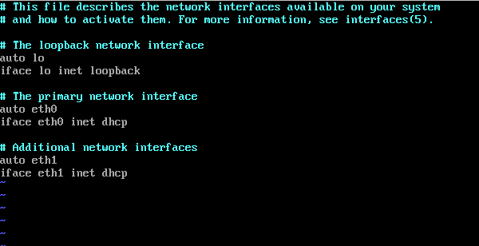

=================================================================
 Ubuntu Server Certified Hardware Self-Testing Guide (16.04 LTS)
=================================================================

.. header:: |ubuntu_logo|

.. |ubuntu_logo| image:: images/logo-ubuntu_su-white_orange-hex.png
   :scale: 20%

.. footer:: |canonical_logo|

.. |canonical_logo| image:: images/logo-canonical_no-tm-white-hex.png
   :scale: 10%

.. raw:: pdf

   PageBreak oneColumn

.. contents::

.. raw:: pdf

   PageBreak

Introduction
============

The aim of this document is to provide the information needed to certify
a server on-site using the Canonical Server Test Suite without requiring
an Internet connection.

Glossary
========

The following definitions apply to terms used in this document.

1Gbps
  1 Gigabit per second -- Network speed for Gigabit Ethernet (1000Mbps).

10Gbps
  10 Gigabits per second -- Network speed for 10 Gigabit Ethernet
  (10,000Mbps).

BMC
  Baseboard Management Controller -- A device in many server models
  that enables remote in- and out-of-band management of hardware.

DHCP
  Dynamic Host Control Protocol -- A method for providing IP
  addresses to the SUT and Targets.

Greylist test
  A test that must be performed but will not affect the
  granting of a certified status.

KVM
  Kernel Virtual Machine -- A system for running virtual machines on
  Ubuntu Server.

IPMI
  Intelligent Platform Management Interface -- A technology for
  remotely connecting to a computer to perform management functions.

JBOD
  Just a bunch of disks -- A non-RAID disk configuration.

LAN
  Local Area Network -- The network to which your SUT and Targets are
  connected. The LAN does not need to be Internet accessible (though that
  is preferable if possible).

.. raw:: pdf

   PageBreak

MAAS
  Metal as a Service -- A Canonical product for provisioning systems
  quickly and easily.

NIC
  Network Interface Card -- The network device(s).

PXE
  Pre-boot Execution Environment -- A technology that enables you to
  boot a computer using remote images for easy deployment or network-based
  installation.

RAID
  Redundant Array of Independent Disks - Multi-disk storage
  providing redundancy, parity checking, and data integrity.

RAM
  Random Access Memory -- System memory.

SAN
  Storage Area Network -- Usually FibreChannel.

SUT
  System Under Test -- The machine you are testing for certification.

Target
  A computer on the test LAN that the SUT can use for network testing. The
  Target must be running an ``iperf`` server, but otherwise does not need
  any special configuration. The MAAS server may double as the Target.

Test case
  A test to be executed as part of the certification test
  suite. Test cases include things such as "CPU Stress" and "CPU
  Topology."

Whitelist test
  A test that *must* pass for the SUT to be granted a certified status.

Overview of the Certification Process
=====================================

The certification process has certain prerequisites and procedures with
which you should be familiar before beginning. Specifically, you should
be aware of hardware requirements and the needs of the network test
environment. There are steps you should perform before running the
certification tests and before uploading the results. The following
sub-sections briefly describe these requirements. Detailed descriptions
appear later in this document.

Hardware Requirements
---------------------

-  SUTs must contain at least 4GiB of RAM and one hard disk, but using
   the maximum amount of RAM and the maximum number of disks is
   preferable. Likewise, if configurable, using the maximum number of
   CPUs is desirable.

-  CPUs should support virtualization (VMX/SVM), when supported by CPU
   architecture.

-  All firmware (BIOS/UEFI, NIC, storage controller, etc) should be
   shipping level, *not* development level.

-  A monitor and keyboard for the SUT are helpful because they will
   enable you to monitor its activities. If necessary, however,
   certification can be done without these items.

Network Test Environment
------------------------

-  In addition to the SUT, the network must contain at least one other
   machine, which will run MAAS and an ``iperf`` server. The MAAS Advanced
   NUC Installation and Configuration (MANIAC) document (available from
   https://certification.canonical.com) describes how to configure a MAAS
   server. This server may be a standard part of the testing network or
   something you bring with you for testing purposes alone. A laptop or a
   small portable computer such as an Intel NUC is sufficient. MAAS version
   1.7 or later is strongly preferred for certification work; the older
   MAAS 1.5 lacks certain features that are becoming increasingly
   important. This document describes use of MAAS 1.8. If you use MAAS 1.7,
   some procedures will differ slightly.

-  The MAAS server computer should run Ubuntu 14.04 (Trusty Tahr) or later,
   and should be configured to deliver Ubuntu 16.04 images to its clients.
   Testing with fixed point releases, as described in the "Configuring MAAS
   to Deliver Fixed Point Releases" section of the MANIAC document, is
   required.

-  Ideally, the network should have few or no other computers;
   extraneous network traffic can negatively impact the network tests.

-  Ideally, the MAAS server system should handle DNS and DHCP for the
   network. If other computers manage these tasks, be sure that they're
   configured to work with the MAAS server so that the SUT obtains its
   PXE-boot images from the MAAS server.

-  Network cabling, switches, and the ``iperf`` server should be capable of
   at least the SUT's best speed. For instance, if the SUT has 1Gbps
   Ethernet, the other network components should be capable of 1Gbps or
   faster speeds. If the local network used for testing is less capable
   than the best network interfaces on the SUT, those interfaces must be
   tested later on a more-capable network.

-  If desired, the MAAS server may be run inside a virtual machine;
   however, it is advisable to run the ``iperf`` server on "real" hardware
   so as to minimize the risk of network tests failing because of
   virtualization issues.

Before Running Test Cases
-------------------------

-  The SUT must be properly configured and cabled.

-  The SUT must have Ubuntu 16.04 installed on it. (This must be done via
   MAAS.) See the `Installing Ubuntu on the System`_ section below for
   details on how to do this.

-  The ``canonical-certification-server`` package must be installed on the
   SUT together with all its dependencies. (This will normally be done via
   MAAS.) For more information about how to get all the packages, please
   refer to the `Installing the Server Test Suite Packages`_ section below.

-  Be sure to have all the items described in the `Equipment to
   Bring`_ section below.

-  Some manual configuration will be necessary to perform
   network testing. See the `Installing Ubuntu on the
   System`_ section below.

Before Uploading Test Case Results
----------------------------------

Prior to uploading results to Canonical's certification site, you must
handle some preliminary tasks:

-  You will need an account at the certification web site,
   https://certification.canonical.com.

   -  The certification web site is the location where all the test case
      results will be uploaded once your testing session has finished.

   -  *If you do not have an account for your company on the private
      certification web site, please contact your account manager who will
      work with the Server Certification Team to establish the account.*

-  You must create a hardware entry (unless one already exists for the
   SUT) at the certification web site with a secure ID.

   -  The secure ID is a string made from 15 alphanumeric characters that
      is used to make sure that only authorized parties upload results to
      the site and also to associate the results to the hardware being
      tested. This can be found on the hardware entry page on the
      Certification web site:

      .. image:: images/secure_id.png
         :alt: The Secure ID can be obtained from the Ceritification web site.
         :align: left
         :width: 50%

   -  For more information on creating the hardware entry, please see
      `Creating a Hardware Entry on C3` below.

-  If the SUT lacks Internet access, the package
   ``canonical-certification-submit`` should be installed on the system
   from which you plan to submit results. Please see the section below
   titled `Manually Uploading Test Results to the Certification Site`_ for
   more information on this topic.

Initial Setup
=============

Before you certify the hardware, you must perform some initial setup
steps. These steps are preparing the hardware you'll bring, configuring
the SUT for testing, installing Ubuntu, and installing the Server Test
Suite.

Equipment to Bring
------------------

The requirements for running the tests for a server are minimal. Ensure
that you have:

-  A writable USB stick with enough free space (> 256MB). It must contain a
   *single partition* with a *writable FAT* filesystem on it. If you need
   to test more than one computer then *bring one USB stick per system*. 
   Note that a USB stick with multiple partitions may cause problems, so if
   necessary you should repartitition your device to have a single
   partition.

-  A data CD with some files written to it. This is required to test the
   system's optical drive read capabilities. Note that a movie DVD or an
   audio CD won't be useful in this case, as they are not in the right
   format for the test. If you need to test more than one computer then
   *bring one medium per system*.

-  A computer to function as a MAAS server and ``iperf`` target on the test
   LAN. This server will provision the SUT. The MAAS server can be a normal
   part of the test LAN or can be brought in specifically for testing SUTs
   on the test LAN. (Note, however, that the MAAS server for certification
   testing should ideally be configured to automatically install the Server
   Test Suite on the SUT, which will not be the case for a "generic" MAAS
   server.)

-  A USB flash drive that holds the Server Test Suite software. (This is a
   precautionary measure in case MAAS can't install the Server Test Suite
   packages and your LAN lacks Internet access.) The `Bringing the Server
   Test Suite Packages With You`_ section of Appendix A describes how to
   obtain the software.

Hardware Setup
--------------

The following should be considered the minimum requirements for setting
up the SUT and test environment:

-  Minimum loadout

   -  Minimum of 4GiB RAM

   -  1 HDD (2 with minimal RAID)

   -  1 CPU of a supported type

-  Recommended (preferred) loadout

   -  Maximum supported number of HDDs or SSDs, especially if you can
      configure multiple RAID levels (e.g. 2 for RAID 0, 3 for RAID 5, and
      6 for RAID 50)

   -  Maximum amount of supported RAM

   -  Maximum number of supported CPUs

-  The SUT should not contain any extraneous PCI devices that are not
   part of the certification.

   -  This includes things like network, SAN and iSCSI cards.

   -  Hardware RAID cards are allowed if they are used to provide RAID
      services to the SUT's onboard storage.

-  The SUT should be running a release level BIOS/UEFI configured using
   factory default settings, with the following exceptions:

   -  If the hardware virtualization options in the BIOS/UEFI are not
      enabled, enable them, save the settings and allow the SUT to reboot.

   -  The SUT must be configured to PXE-boot by default.

-  Storage should be properly configured.

   -  If the SUT is to be tested using RAID, then the proper hardware RAID
      configuration should be set up prior to testing.

   -  Software RAID, including firmware-supported software RAID (aka "fake
      RAID") should *not* be used. If hardware RAID is not available,
      configure the server for JBOD.

   -  Any additional HDDs or logical drives should be partitioned and
      mounted prior to testing. Partitions on those additional HDDs should,
      preferably, be a single partition that spans the entire disk.

   -  Some computers may have problems booting from disks over 2TiB in
      size. If the SUT fails for this reason, it may pass with smaller
      disks (or a smaller RAID array). In some cases, configuring the SUT
      to boot in UEFI mode may also solve this problem; but consult the
      Canonical Certification Team before changing firmware settings to
      overcome such a problem.

-  If possible, as many processors as the SUT will support should be
   installed.

   -  Note that systems that ship with processors from different families
      (e.g Sandy Bridge vs. Haswell) will require extra testing.

   -  CPU speed bumps and die shrinks do not require extra testing.

-  Disks with 4,096-byte *logical* sector sizes may require booting in
   EFI/UEFI mode, and MAAS's support for this is still new, so be alert to
   potential problems. For instance, some computers support EFI-mode
   booting but not EFI-mode PXE-booting. Note that disks with 4,096-byte
   *physical* sector sizes are fine, so long as the disk's firmware
   translates those sectors into 512-byte logical sectors.

-  The test environment should have a working network setup. Internet
   access is not required, and testing should work on any private or
   segregated LAN.

   -  If possible, the test LAN's speed should match or exceed the network
      speed of the SUT. For instance, a SUT with 1Gbps onboard Ethernet
      should be connected to a LAN capable of at least 1Gbps and a system
      with 10Gbps Ethernet should be connected to a LAN capable of at least
      10Gbps. Connecting a SUT to a network with greater network speed is
      acceptable.

   -  If the primary test network cannot meet these requirements,
      re-running the network tests in an environment that does match these
      requirements will be necessary.

   -  Every network port must be cabled to the LAN and properly configured
      with either DHCP or static addressing. If a SUT has 4 NIC ports, then
      all 4 must be connected to the LAN.

   -  It is very strongly recommended that SUT and Target machines be on a
      clean network (that is, one that is not full of other traffic), as
      extraneous network traffic could impact the network testing results.

-  The test LAN must have a working MAAS server that can provision and run
   the tests on the SUT. The MAAS Advanced NUC Installation and
   Configuration (MANIAC) document, available at
   https://certification.canonical.com, describes the basics of the MAAS
   setup, but you may need to refer to additional documentation to complete
   the task if you're not already familiar with MAAS.

-  The test LAN must have one system available to act as a Target for
   network testing with ``iperf``. Note that accessing an ``iperf`` server
   that's reachable only via a router may not work, because routing tables
   are temporarily lost during network testing. The ``iperf`` server is
   normally the same as the MAAS server, but this does not need to be the
   case. If the SUT has a faster network interface than the MAAS server,
   you should set up another computer that matches the SUT's network
   interface speed to function as an ``iperf`` server.

-  The SUT's BMC, if present, may be configured via DHCP or with a static
   IP address. MAAS will set up its own BMC user account (``maas``) when
   enlisting the SUT.

Installing Ubuntu on the System
-------------------------------

Beginning with Ubuntu 14.04 (Trusty Tahr), server certification requires
that the SUT be installable via MAAS. Therefore, the following procedure
assumes the presence of a properly-configured MAAS server. The MAAS
Advanced NUC Installation and Configuration (MANIAC) document describes how
to set up a MAAS server for certification testing purposes. This document
describes use of MAAS 1.8. Using MAAS 1.7 is also acceptable, but some user
interface details differ.

Once the SUT and MAAS server are both connected to the network, you can
install Ubuntu on the SUT as follows:

#. Unplug any USB flash drives or external hard disks from the SUT.
   (MAAS will attempt to install to a USB flash drive if it's detected
   before the hard disk. This is obviously undesirable.)

#. Power on the SUT and allow it to PXE-boot.

   -  The SUT should boot the MAAS enlistment image and then power off.

   -  You should see the SUT appear as a newly-enlisted computer in your
      MAAS server's node list. (You may need to refresh your browser to see
      the new entry.)

#. Check and verify the following items in the MAAS server's node details
   page:

   -  If desired, set a node name for the SUT.

   -  Check the SUT's power type and ensure it's set correctly (IPMI, AMT,
      etc.). If the SUT has no BMC, you can leave this section blank or
      enter "dummy" data. If the power control information was detected
      incorrectly or incompletely, you should consult the Canonical
      Certification Team for advice.

#. Commission the node by clicking Take Action followed by Commission
   and then Go.

   -  If the SUT has a BMC, the computer should power up, pass more
      information about itself to the MAAS server, and then power down
      again.

   -  If the SUT does not have a BMC, you should manually power on the SUT
      after clicking the Commission Node button. The SUT should power up,
      pass more information about itself to the MAAS server, and then power
      down again.

   -  Note that manual power control is acceptable only on low-end servers
      that lack BMCs. If MAAS fails to detect a BMC that is present or if
      MAAS cannot control a BMC that is present, please consult the
      Canonical Certification Team.

#. On the MAAS server, verify that the SUT's Status is listed as Ready
   in the node list or on the node's details page. You may need to
   refresh the page to see the status update.

#. Click Take Action followed by Deploy. Options to select the OS version
   to deploy should appear.

#. Select the Ubuntu release you want to deploy. Normally, you'll pick a
   point release that you installed as described in the MANIAC document.
   This image will appear as an OS type of Custom" and a description that
   you gave it. The normal procedure is to test with 16.04 GA followed by
   the latest point release. `Appendix D - Point Release Testing`_,
   elaborates on this policy.

#. Click Go to begin deployment.

   -  If the SUT has a BMC, it should power up and install Ubuntu. This
      process can take several minutes.

   -  If the SUT does not have a BMC, you should power it on manually after
      clicking Acquire and Start Node. The SUT should then boot and install
      Ubuntu. This process can take several minutes.

If MAAS has problems in any of the preceding steps, the SUT might not
pass certification. For instance, certification requires that MAAS be
able to detect the SUT and set its power type information automatically.
If you have problems with any of these steps, contact the
Canonical Server Certification Team to learn how to proceed; you might
have run into a simple misconfiguration, or the server might need
enablement work.

Logging Into the SUT
--------------------

Once the SUT is installed, you should be able to log into it using SSH from
the MAAS server. Check the node details page to learn its primary IP
address. (Using a hostname will also work if DNS is properly configured,
but this can be fragile.) The username on the node is ``ubuntu``, and you
should require no password when logging in from the MAAS server or from any
other computer and account whose SSH key you've registered with the MAAS
server.

You should keep some details in mind as you continue to access the SUT:

-  You should *not* install updates to the SUT unless they are absolutely
   necessary to pass the certification. In that case, the Canonical
   Certification Team will make the determination of what updates should be
   applied.

-  You should verify your SUT's version by typing ``lsb_release -a``. The
   result includes both the main release version (such as 16.04) and the
   point release version (such as 16.04.2, on the *Description* line). You
   can also check your kernel version by typing ``uname -r``. The kernel
   version changes with the Ubuntu release.

-  By default, MAAS provides a DHCP server, and the SUT should use it to
   obtain an IP address. If necessary for your environment, you may
   manually change these settings on the SUT to use a static IP address.

-  If you want to log in at the console or from another computer, you
   must set a password::

    $ sudo passwd ubuntu

   After prompting, this command changes the password for the user called
   ``ubuntu``, which is the default user created by MAAS. Testing at the
   console has certain advantages (described shortly).

-  A MAAS installation configured for certification testing should
   provision the SUT with the Server Test Suite and related packages. If
   you're using a more "generic" MAAS setup, you'll have to install the
   certification software yourself, as described in `Appendix A -
   Installing the Server Test Suite Manually`_.

Ensure all network devices are configured in the file
``/etc/network/interfaces``:

         for your system's interfaces.
   :width: 100%

Be sure to start networking on all the interfaces. (The network tests will
*not* bring up a network interface, even if it's defined in
``/etc/network/interfaces``.) In most cases, typing ``sudo ifup eth1``, and
so on for additional entries, will do the job. (The ``eth0`` interface is
normally enabled by default on the first boot and so need not be explicitly
brought up, but this isn't always the case.) Once you've done this, typing
``ifconfig`` should show that all the interfaces have IP addresses.

Installing the Server Test Suite Packages
-----------------------------------------

Three methods of installing the Server Test Suite exist:

-  Automatically by the MAAS server

-  Using APT to retrieve the Server Test Suite packages on a SUT with
   full Internet access

-  By loading the Server Test Suite Debian packages from a USB flash
   drive or other medium you bring with you to the test site

If MAAS is fully configured as described in the `MAAS Advanced NUC
Installation and Configuration (MANIAC)` document, it should deploy the
Server Test Suite automatically. If MAAS doesn't deploy the Server Test
Suite properly, you can do so manually, as described in `Appendix A -
Installing the Server Test Suite Manually`_.

Creating a Hardware Entry on C3
===============================

In order to upload test results to the certification web site
(http://certification.canonical.com, or C3 for short) you need to create a
hardware entry for the system which you will be certifying. If the SUT has
no direct Internet connection, you can put off creating the C3 entry until
after the test (although doing it before testing is fine, too). If you
don't plan to submit the results, you should not create a C3 entry for the
machine. To create an entry you can go directly to:

https://certification.canonical.com/hardware/create-system

If you have problems accessing this site, contact your account manager.

When creating an entry, you must enter assorted pieces of information:

#. Fill in the details:

   * **Account** -- The name of your account. If the account is incorrect
     or can't be set, please contact your account manager for assistance.
     This field is never published; it is for internal use only.

   * **Make** -- The manufacturer of the system, e.g. Dell, HP, as you
     would like it to appear on the public web site.

   * **Model** -- The name of the system itself, e.g ProLiant DL630 or
     PowerEdge R210, as you would like it to appear on the public web site.

   * **Aliases** -- This is used for alternate marketing names for a
     server. This field is only accessible to the Canonical Server
     Certification Team.  If you need to add items to this field, please
     contact your account manager. These do appear publicly as separate
     entries in the database (e.g. Server1000, Alias1001 and Alias1002 all
     point to the same system, but appear as three separate entries on the
     public web site).

   * **Codenames** -- This is for your internal reference and use and is
     for the internal code name associated with the SUT. This data is
     *never* published and is visible only to you and to Canonical.

   * **Web site** -- Optional, link to the system info on the
     manufacturer's web site. This field is published publicly and is a way
     for potential customers to directly access information about your
     hardware on your own web site.

   * **Comment** -- Optional, any comment you want to make about the
     hardware, including things like tester name, test location, etc. 
     These comments are never made public, they are for internal use only.

   * **Form factor** -- The type of system: Laptop, Server, etc. This is
     not published directly, but determines where your system is displayed
     on the public site.  Client form factors appear in one place while
     server form factors appear elsewhere on the public certification site.
     You may select any of the Server form factors you like except for
     Server SoC, which is reserved for System on Chip certifications.

   * **Architecture** -- The CPU architecture of the SUT. This is used
     internally and is not published.

   * **Confidential** -- Defaults to False (unchecked). Check the box if
     the system has not been publicly announced yet or should remain
     unpublished for any reason. This will cause the entire entry to *not*
     be published to the public web site.

#. Click Submit.

#. Note the "Secure ID for testing purposes" value. You'll need this
   when submitting the test results. (Note that this value is unique for
   each machine.)

Running the Certification Tests
===============================

To initiate a testing session in a server:

#. Connect to the server via SSH or log in at the console. A standard MAAS
   installation creates a user called ``ubuntu``, as noted earlier. You can
   test using either a direct console login or SSH, but an SSH login may be
   disconnected by the network tests or for other reasons.

#. Before testing you must ensure that all network ports are cabled to a
   working LAN and configured in ``/etc/network/interfaces`` using the
   appropriate configuration (static or DHCP) for your test environment.
   If you edit this file, either reboot or bring up the interfaces you
   add with ``ifup`` before running tests.

#. If the SUT provides the suitable ports and drives, plug in a USB 2
   stick, plug in a USB 3 stick, and insert a suitable data CD in the
   optical drive. Note that USB testing is not required for blades that
   provide USB ports only via specialized dongles. These media must remain
   inserted *throughout the test run*, because the media tests will be
   kicked off partway through the run.

#. If the system doesn't have Internet access:

   * Copy the image you downloaded from
     http://cloud-images.ubuntu.com/trusty/current/trusty-server-cloudimg-i386-disk1.img (as
     noted in `Appendix A`) to any directory of the SUT.

   * Supply the full path under the section labeled "environment" in
     ``/etc/xdg/canonical-certification.conf``. For example::

       [environment]
       KVM_TIMEOUT:
       KVM_IMAGE: /home/ubuntu/trusty-server-cloudimg-i386-disk1.img

#. If necessary, edit the ``/etc/xdg/canonical-certification.conf`` file on
   the SUT so as to specify your ``iperf`` server. For example::

    TEST_TARGET_FTP = your-ftp-server.example.com
    TEST_USER = anonymous
    TEST_PASS =
    TEST_TARGET_IPERF =  192.168.0.2

   If you configured your MAAS server as described in the MANIAC document,
   the ``TEST_TARGET_IPERF`` line should point to your SUT's gateway address,
   which is normally also your MAAS server; but if your network
   configuration deviates from the one described in MANIAC, you may need to
   adjust this value. The Server Test Suite does not currently use FTP, but
   these lines must be uncommented. They may be left at their default
   values.

#. While editing ``/etc/xdg/canonical-certification.conf``, you may
   optionally enter the SUT's Secure ID in the ``[sru]`` section. This can
   simplify submission of results at the end of the test; however, this
   will work only if the SUT has full Internet access.

#. Launch ``iperf`` on the server identified in the SUT's
   ``/etc/xdg/canonical-certification.conf`` file by typing::

    $ iperf -s

#. If you're running the test via SSH, type screen on the SUT to ensure
   that you can reconnect to your session should your link to the SUT go
   down, as may happen when running the network tests. If you're
   disconnected, you can reconnect to your session by logging in and
   typing ``screen -r``. This step is not important if you're running the
   Server Test Suite at the console.

#. Run::

    $ canonical-certification-server

#. A welcome message will be displayed. Make sure to read the message
   and follow its instructions.

#. Press the Enter key. The system will display a Suite Selection
   screen:

   .. figure:: images/some_tests.png
      :alt: The suite selection screen enables you to pick which
            tests to run
      :width: 100%

#. Select the *Server-full-16.04* item and deselect the other items.
   (These other suites exist to enable easy re-running of subsets of
   tests that often fail in some environments.)

#. Use the arrow keys to highlight the *<OK>* option and then press
   Enter.

#. After a few seconds, a test selection screen will appear, as shown
   below. You should ordinarily leave all the tests selected. (Tests that
   are irrelevant for a given computer, such as tests of the optical drive
   on computers that lack this hardware, are automatically ignored.) If a
   test is hanging or otherwise causing problems, please contact the
   Canonical Server Certification Team for advice on how to proceed. Using
   this screen is fairly straightforward, but `Appendix C - Using the Test
   Selection Screen`_ covers the details.

   .. figure:: images/ccs_tests.png
      :alt: The suite selection screen enables you to pick which
            tests to run
      :width: 100%

#. Press the *T* key to start testing. The screen will begin displaying a
   scrolling set of technical details about the tests as they are
   performed.

#. The full test suite can take several hours to complete, depending on
   the hardware configuration (amount of RAM, disk space, etc). During
   this time the computer may be unresponsive. This is due to the
   inclusion of some stress test cases. These are deliberately
   intensive and produce high load on the system's resources.

#. If at any time during the execution you are *sure* the computer has
   crashed (or it reboots spontaneously) then after the system comes back
   up you should run the ``canonical-certification-server`` command again
   and respond `y` when asked if you want to resume the previous session.

#. When the test run is complete, you should see a summary of tests run, a
   note about where the ``submission.xml``, ``results.html``, and
   ``results.xlsx`` files have been stored, and a prompt to submit the
   results to ``certification.canonical.com``. If you're connected to the
   Internet, typing ``y`` at this query should cause the results to be
   submitted. You will need either a Secure ID value or to have already
   entered this value in the ``/etc/xdg/canonical-certification.conf``
   file.

#. Copying the results files off of the SUT is advisable. This is most
   important if the automatic submission of results fails; however,
   having the results available as a backup can be useful because it
   enables you to review the results off-line or in case of submission
   problems that aren't immediately obvious. The results are stored in
   the ``~/.local/share/plainbox`` directory.

#. Copy the whole directory to an external medium and bring it with you
   after certifying the system. It contains a file called
   ``submission.xml`` which is the results of the testing as well as a file
   called ``results.html`` that, if loaded in a web browser, will show you
   the results.

If you review your results by loading ``results.html`` in a web browser,
you can quickly spot failed tests because they're highlighted in red with a
"FAILED" notation in the Result column, whereas passed tests acquire a
green color, with the word "PASSED." Note, however, that *a failed test
does not necessarily denote a failed certification*. Reasons a test might
fail but still enable a certification to pass include the following:

-  A test may be a greylist test, as described in the `Ubuntu Server
   Hardware Certification Coverage` document, available from
   https://certification.canonical.com.

-  Some tests are known to produce occasional false positives -- that
   is, they claim that problems exist when in fact they don't.

-  Some test environments are sub-optimal, necessitating that specific
   tests be re-run. This can happen with network tests or if the tester
   forgot to insert a removable medium. In such cases, the specific test
   can be re-run rather than the entire test suite.

Consult your account manager if you have questions about specific test
results.

Manually Uploading Test Results to the Certification Site
=========================================================

If you can't upload test results to the certification site from the
certification program itself, you must do so manually, perhaps from
another computer. To upload the results, you should have the Server Test
Suite and ``canonical-certification-submit`` installed on the system from
which you plan to submit results. The Server Test Suite is part of the
default install on all Ubuntu Desktop systems. At this time, there is no
mechanism for submitting results from an OS other than Ubuntu.

To add the Hardware Certification PPA, install
``canonical-certification-submit``, and submit the results, follow these
instructions:

#. Add the Hardware Certification PPA::

   $ sudo apt-add-repository ppa:hardware-certification/public
   $ sudo apt-get update

#. Install the package::

   $ sudo apt-get install canonical-certification-submit

#. Run the following command::

    $ canonical-certification-submit --secure_id <SUT_SECURE_ID> \
      <PATH_TO>/submission.xml

   where:

   -  ``<SUT_SECURE_ID>`` can be found on your system's page on the
      certification web site (http://certification.canonical.com) by
      looking next to "Secure ID for testing purposes":

      .. image:: images/secure_id.png
         :alt: The Secure ID can be obtained from the Ceritification web site.
         :align: left
         :width: 50%

   -  ``<PATH_TO>`` refers to the location of the ``submission.xml file``
      (which should be contained in the ``~/.local/share/plainbox``
      directory you copied to the USB key).

   -  Older versions of this tool used ``\-\-hwid`` rather than
      ``\-\-secure_id``.

You should see output similar to the following for a successful
submission::

  $ canonical-certification-submit --hwid a00D000000LU9Ji \
     ~/.local/share/plainbox/submission.xml
   2012-03-28 11:05:30,575 INFO     Preparing to submit results using Hardware
                                    ID: a00D000000LU9Ji
   2012-03-28 11:05:30,576 INFO     Getting messages
   2012-03-28 11:05:56,726 INFO     Exchanged 8 of 8 messages
   2012-03-28 11:05:56,726 INFO     Results have been successfully submitted.
                                    To review your test results now, please
                                    go to the following URL:
               https://certification.canonical.com/submission/eFXnst3rVbBvdu2
  
Once results submission is complete, use the provided link in the output
to review the results and confirm that they are correct.

Requesting a Certificate
========================

Once you've uploaded the data to the certification site, you should
review it in the web interface. If you're satisfied that there are no
problems, you can request a certificate:

#. Click the date link under the Created column in the Submissions
   section. The result should be a page showing most of the same
   information as the previous page, but in a different format, and
   restricted to that one test run.

#. Click the Request Certificate link. The result should be a page with
   a few radio buttons in which you can enter information:

   -  Status is fixed at In Progress.

   -  Release indicates the Ubuntu release used for testing, and for which
      the certificate will be issued.

   -  Level indicates the type of certification:

      -  Certified is for for hardware that's ready to be deployed with
         Ubuntu.

      -  Certified Pre-installed is for hardware that ships with a (possibly
         customized) version of Ubuntu.

   -  Is Private should be checked if the certification should be kept
      private. Note that this check box affects the certificate only, not
      the entry for the computer as a whole on
      http://certification.canonical.com. Other public pre-existing
      certificates, or those issued in the future, will remain public.

#. Click Submit. You'll see a new screen in which you can (and in one
   case *must*) enter more information. In particular, you can click:

   -  Link Bug to link to a bug on https://bugs.launchpad.net.
      This option is available only to Canonical engineers.

   -  Create Note or Create Note from Template to create a note. Most
      systems will have at least two notes:

      -  *A note titled "Tester" with the name of the person who did the
         testing is required.*

      -  A note titled "Test Notes" is usually present. It describes
         test-specific quirks, such as why a failure should be ignored
         (say, if a network test failed because of local network problems
         but succeeded on re-testing). If the
         *miscellanea/get-maas-version* test fails, be sure to specify the
         version of MAAS used to deploy the SUT.

      In most cases, the "Private" check box should be checked for your
      notes.

.. raw:: pdf

   PageBreak

Appendix A - Installing the Server Test Suite Manually
======================================================

Ordinarily, MAAS will install the Server Test Suite onto the SUT as part
of the provisioning process, as described in the main body of this
document. If the MAAS server is not configured to do this, though, you
have two additional options for installing the Server Test Suite: You
may use APT if the SUT has full Internet access or you may install
the Server Test Suite from a tarball that you bring with you.

Installing the Server Test Suite via APT
----------------------------------------

If your lab setup has Internet access, getting the testing tools is a
pretty straightforward process, because you can install the necessary
tools from the Ubuntu Hardware Certification PPA.

Log in to the server locally or via SSH or KVM and run the following
commands::

  $ sudo apt-add-repository ppa:hardware-certification/public
  $ sudo apt-add-repository ppa:firmware-testing-team/ppa-fwts-stable
  $ sudo apt-get update
  $ sudo apt-get install canonical-certification-server

.. The ppa:hardware-certification/public should be stable. For
   the development PPA, instead use ppa:checkbox-dev/ppa.

If for some reason you want to  run the test suite from an Ubuntu live
medium, you must also enable the universe repository::

  $ sudo apt-add-repository universe

Note that running the test suite from a live medium is not accepted for any
certification attempt; this information is provided to help in unusual
situations or when debugging problems that necessitate booting in this way.

During the installation, you may be prompted for a password for ``mysql``.
This can be set to anything you wish; it will not be used during testing.

At this point, you should have the test suite and dependencies installed
and be ready to begin testing.

Bringing the Server Test Suite Packages With You
------------------------------------------------

If you do not have Internet access from your LAN, you can find the
pre-built tarball including the Server Test Suite packages under:

https://certification.canonical.com/offline

Note that you will be asked for your account credentials when you access
that URL.

Copy the appropriate ``.tar.gz`` file to a USB stick and bring this with
you when testing the system. You will also need to obtain and bring a copy
of a bootable Ubuntu Cloud Image for the virtualization portion of the
certification test.  You can obtain that here:

http://cloud-images.ubuntu.com/trusty/current/trusty-server-cloudimg-i386-disk1.img

You can use another release of Ubuntu if this is convenient. An i386
image is used even when you're testing 64-bit hardware. The point is to
test that virtualization features work, not that a specific Ubuntu
version or architecture is supported. Because the i386 image is more
general, it's the one that we use in testing.

To install the server certification packages from the copied tarball,
perform the following steps on the SUT:

#. Insert the USB drive on which you placed the tarball.

#. Extract the contents of the ``.tar.gz`` file from the USB stick to a
   temporary directory (such as ``/tmp/``)::

    $ tar -C /tmp -xzf ubuntu-16.04-server-amd64.tar.gz
    $ cd /tmp

#. Look for a directory whose name begins with ``apt-repo`` and switch to
   it (note this is just an example, your exact directory name may be
   different)::

    $ cd apt-repo-ubuntu-16.04.1-server-amd64.iso-20140901-canonical-certification-ser

4. Use a provided helper script to add a local package repository::

    $ sudo ./add_offline_repository -u

5. Install the Server Test Suite::

    $ sudo apt-get install canonical-certification-server

During the installation, you may be prompted for a password for ``mysql``.
This can be set to anything you wish; it will not be used during testing.
If you're asked about mail server configuration, respond that the mail
server should not be configured.

.. raw:: pdf

   PageBreak

Appendix B - Re-Testing and Installing Updated Tests
====================================================

Occasionally, a test will fail, necessitating re-testing a feature. For
instance, if you forget to insert a USB flash drive, the relevant USB
tests will fail. The same thing will happen if a USB flash drive is
defective or improperly prepared. Another common source of problems is
network tests, which can fail because of busy LANs, flaky switches, bad
cables, and so on. When this happens, you must re-run the relevant
test(s).

Although it's often possible to re-run a test by directly executing a
single test script, the preferred method is:

#. Re-run ``canonical-certification-server``.

#. Use one of the abbreviated testing whitelists (such as *Network-only*)
   or adjust the set of tests to be run (as described in `Appendix C`).

#. Submit the resulting ``submission.xml`` file to the C3 site.

You can then request a certificate based on the main results (the one with
the most passed tests) and refer to the secondary set of results in the
certificate notes. This procedure ensures that all the necessary data will
be present on C3. It also ensures that (sometimes subtle) problems will be
avoided; for instance, network tests may not be valid if network ports that
are not being tested are active. The ``canonical-certification-server``
framework ensures that such potential problems are avoided.

From time to time, a test will be found to contain a bug or need to be
updated to deal with a problem. In such cases, it is often impractical
to wait for the fix to work its way down through Ubuntu's packaging
system, or even through the PPAs in which some of the relevant tools are
distributed. In such cases, the usual procedure for replacing the script
or file is as follows:

#. Consult with the Server Certification Team about the problem; *do
   not* install an updated script from some other source!

#. Obtain the updated file (typically a script) from the Server
   Certification Team. Store it on the SUT in the home directory of the
   test account. For instance, the new script might be
   ``/home/ubuntu/newscript``. If necessary, give the new file execute
   permissions.

#. On the SUT, rename or delete the original file, as in::

    $ sudo rm /usr/lib/2013.canonical.com\:checkbox/bin/oldscript

#. Create a symbolic link from the new script to the original name, as
   in::

     $ sudo ln -s /home/ubuntu/newscript \
       /usr/lib/2013.canonical.com\:checkbox/bin/oldscript

#. Run the tests again, using the ``canonical-certification-server`` user
   interface.

In some cases, another procedure might be necessary; for instance, a bug
fix might require installing a new Debian package with the dpkg command,
or you might need to edit a configuration file. The Canonical Server
Certification Team can advise you about such requirements.

.. raw:: pdf

   PageBreak

Appendix C - Using the Test Selection Screen
============================================

It may be necessary for you to deselect some of the tests which are to
be run for certification. This is unlikely, though, and you should only
do it when so instructed.

The test selection screen looks like this:

.. figure:: images/ccs_tests2.png
   :alt: The test selection screen enables you to select the tests
         you want to run.
   :width: 100%

Every test suite name is preceded by a brackets that contain either an
*X* character or nothing to identify whether the test suite has been
selected or not.

Tests are arranged hierarchically. When a top-level test is highlighted,
you can hide or reveal the details by pressing the Enter key; or you can
select or deselect all the tests in that category by pressing the
Spacebar. For instance, with *Benchmark tests* highlighted, as in the
figure, pressing Enter will hide the lines up to *CPU tests*; and pressing
the Spacebar will deactivate (or re-activate) all of the benchmark
tests. You can select or de-select an individual test, such as the
*hdparm-read_sda* test, by highlighting it and pressing the Spacebar.

Once you've selected all the tests, press the *T* key to begin the testing
process.

.. raw:: pdf

   PageBreak

Appendix D - Point Release Testing
==================================

Ordinarily, 16.04 certification requires testing two releases:

-  Ubuntu 16.04 GA -- That is, the version that was released in April of
   2016.

-  The current point release -- That is, version 16.04.2 or whatever is
   the latest release in the 16.04 series. Obviously, a point-release test
   will not be possible until 16.04.1 becomes available.

In theory, compatibility will only improve with time, so a server might
fail testing with 16.04 GA because it uses new hardware that had not
been supported in April of 2016, but pass with the latest version. Such
a server would be certified for that latest version, but not for the
original GA release. If such a situation arises, testing should also be
done with intervening releases so as to determine the earliest working
version of Ubuntu.

If a server fails certification with a more recent release but works
with an earlier one, this situation is treated as a regression; a bug
report should be filed and note made of the problem in the certificate
request. Please notify your TPM about such problems to facilitate their
resolution.

Because Ubuntu 16.04.1 uses the same ?.?? kernel series as 16.04 GA,
testing 16.04.1 is required only if 16.04 GA fails. (Although 16.04 GA
and 16.04.1 use the same kernel series, 16.04.1 ships with a later
kernel within that series, so it might fix a bug that blocks 16.04 GA
certification.)

If the procedure for installing point releases, as described in
the MANIAC document (available from https://certification.canonical.com),
fails, then you should consult the Server Certification Team.

.. raw:: pdf

   PageBreak

Appendix E - Troubleshooting Tips
=================================

Submitting Results
------------------

If submitting results from the Server Test Suite itself fails, you can use
the ``canonical-certification-submit`` program, as described earlier, in
`Manually Uploading Test Results to the Certification Site`. You can try
this on the SUT, but if network problems prevented a successful submission,
you may need to bring the files out on a USB flash drive or other removable
medium and submit them from a computer with better Internet connectivity.

Inconsistent Message when Submitting Results
--------------------------------------------

If you receive a message that looks like the following when using
``canonical-certification-submit``, please be sure to save the
``submission.xml`` file and contact your account manager::

  2014-04-28 10:55:33,894 CRITICAL Error: Inconsistent message

Network Problems
----------------

Network problems are common in testing. These problems can manifest as
complete failures of all network tests or as failures of just some
tests. Specific suggestions for fixing these problems include:

-  **Check cables and other hardware** -- Yes, this is very basic; but bad
   cables can cause problems. For instance, one bad cable at Canonical
   resulted in connections at 100Mbps rather than 1Gbps, and therefore
   failures. Some of these failures were identified in the output as the
   lack of a route to the host. Similarly, if a switch connecting the SUT
   to the ``iperf`` server is deficient, it will affect the network test
   results.

-  **Use the simplest possible network** -- Complex network setups and those
   with heavy traffic from computers uninvolved in the testing or those
   with multiple switches, bridges, etc., can create problems for
   network testing. Simplifying the network in whatever way is practical
   can improve matters.

-  **Check the iperf server** -- Ensure that the server computer is up and
   that the ``iperf`` server program is running on it. Also ensure that the
   computer has no issues. For instance, some versions of ``iperf``, when
   run in daemon mode, cause the load average to go up every time a client
   disconnects. This can bring even a powerful computer to its knees quite
   quickly!

-  **Ensure the iperf server is on the SUT's local network** -- The
   network tests temporarily remove the default route from the routing
   table, so the ``iperf`` server must be on the same network segment as
   the SUT.

-  **Check the SUT's network configuration** -- A failure to configure the
   network ports in ``/etc/network/interfaces`` will cause a failure of the
   network tests. Likewise, a failure to bring up a network interface
   before testing will cause the test to fail, even if
   ``canonical-certification-server`` detects the interface.

-  **Check your DHCP server** -- A sluggish or otherwise malfunctioning
   DHCP server can delay bringing up the SUT's network interfaces (which
   repeatedly go down and come up during testing). This in turn can cause
   network testing failures.

If you end up having to re-run the network tests, either do so from within
``canonical-certification-server`` or be sure to bring down all the network
interfaces except the one you're testing before using ``iperf`` manually.
The way Linux manages network interfaces makes it difficult to ensure that
network traffic will be restricted to a single network port if more than
one is active.

Issues During Testing
---------------------

The testing process should be straightforward and complete without issue.
Should you encounter issues during testing, please contact your account
manager. Be sure to save the ``~/.local/share/plainbox`` and
``~/.cache/plainbox`` directory trees as they will contain logs and other
data that will help the Server Certification Team determine if the issue is
a testing issue or a hardware issue that will affect the certification
outcome.

If possible, please also save a copy of any terminal output or
tracebacks you notice to a text file and save that along with the
previously-noted directories. (Feel free to send us a photo of the
screen taken with a digital camera.)

