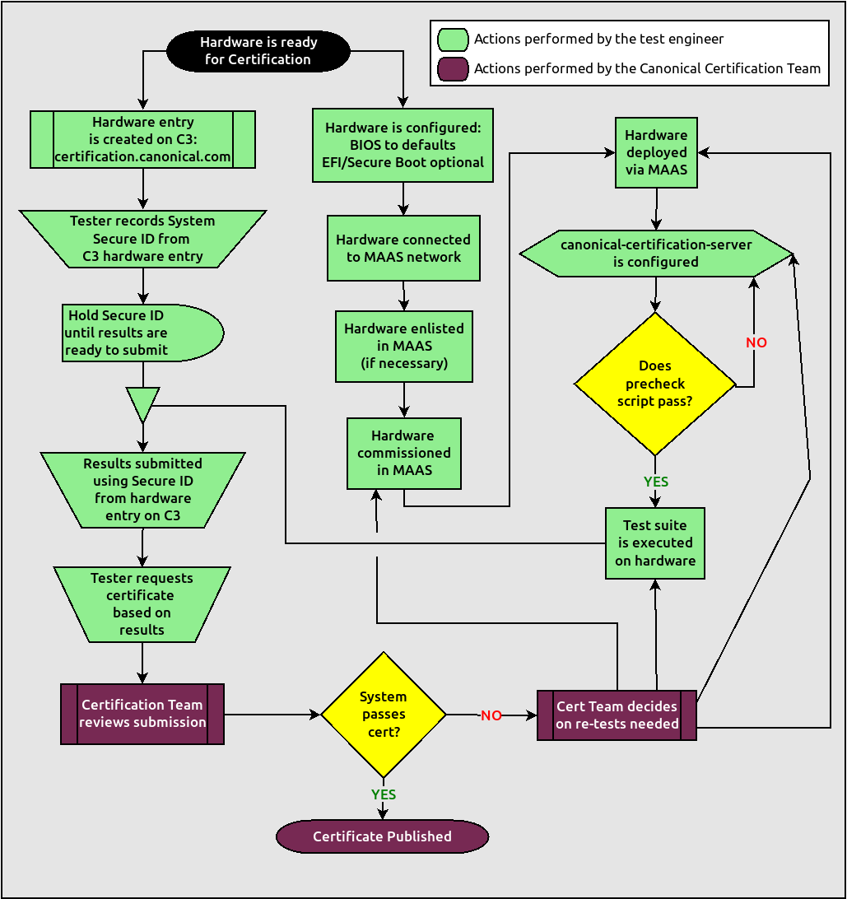

=================================================================
 Ubuntu Server Certified Hardware Self-Testing Guide (16.04 LTS) 
=================================================================

.. header:: |ubuntu_logo|

.. |ubuntu_logo| image:: images/logo-ubuntu_su-white_orange-hex.png
   :scale: 20%

.. footer:: |canonical_logo|

.. raw:: pdf

   PageBreak oneColumn

.. contents::

.. raw:: pdf

   PageBreak

Introduction
============

The aim of this document is to provide the information needed to test a
server on-site using the Canonical Server Test Suite and then submit the
results of that testing to Canonical to meet the requirements for Server
Hardware Certification. Testing may be done with or without an Internet
connection.

Glossary
========

The following definitions apply to terms used in this document.

BMC
  Baseboard Management Controller -- A device in many server models
  that enables remote in- and out-of-band management of hardware.

CSM
  Compatbility Support Module -- A feature of many UEFI implementations
  that enables the machine to boot using older BIOS-mode boot loaders.

DHCP
  Dynamic Host Control Protocol -- A method for providing IP
  addresses to the SUT and Targets.

Greylist test
  A test that must be performed but will not affect the
  granting of a certified status.

KVM
  Kernel Virtual Machine -- A system for running virtual machines on
  Ubuntu Server.

IPMI
  Intelligent Platform Management Interface -- A BMC technology for
  remotely connecting to a computer to perform management functions.

JBOD
  Just a bunch of disks -- A non-RAID disk configuration.

LAN
  Local Area Network -- The network to which your SUT and Targets are
  connected. The LAN does not need to be Internet accessible (though that
  is preferable if possible).

.. raw:: pdf

   PageBreak

MAAS
  Metal as a Service -- A Canonical product for provisioning systems
  quickly and easily.

PXE
  Pre-boot Execution Environment -- A technology that enables you to
  boot a computer using remote images for easy deployment or network-based
  installation.

RAID
  Redundant Array of Independent Disks - Multi-disk storage
  providing redundancy, parity checking, and data integrity.

SAN
  Storage Area Network -- Usually FibreChannel.

Secure ID (SID)
  A string that uniquely identifies computers on the certification site,
  ``certification.canonical.com``.

SUT
  System Under Test -- The machine you are testing for certification.

Target
  A computer on the test LAN that the SUT can use for network testing. The
  Target must be running an ``iperf3`` server, but otherwise does not need
  any special configuration. The MAAS server may double as the Target.

Test case
  A test to be executed as part of the certification test
  suite. Test cases include things such as "CPU Stress" and "CPU
  Topology."

Whitelist test
  A test that *must* pass for the SUT to be granted a certified status.

Understanding the Certification Process
=======================================

The workflow for testing SUTs is described in detail in the rest of this
document. An overview is presented in the following flowchart:

                 hardware creation through certificate issuing.
           :width: 100%

.. raw:: pdf

   PageBreak

The highlights of this process are:

#. Set up your MAAS server and, if necessary, connect it to the test LAN.
   This process is covered in the MANIACS document (available from
   https://certification.canonical.com).

#. Create an entry on https://certification.canonical.com (C3 for short)
   for the SUT, as described in more detail shortly, in `Creating a
   Hardware Entry on C3`_. If an entry already exists for your specific
   configuration (not just the model), you should use the existing entry.

#. Use MAAS to deploy the SUT using a custom point-release image, as
   described in the upcoming section, `Installing Ubuntu on the System`_.

#. Check the SUT's configuration. (The ``canonical-certification-precheck``
   script, described in `Running the Certification
   Tests`_, can help with this.)

#. Run the test suite on the SUT, as described in `Running the
   Certification Tests`_.

#. Submit the test results to C3. This may be done semi-automatically
   when running the tests, or can be done manually, as described in
   `Manually Uploading Test Results to the Certification Site`_.

#. If desired, you can request a certificate, as described in `Requesting a
   Certificate`_.

Creating a Hardware Entry on C3
===============================

You can run certification tests without submitting them to C3; however, if
you want to certify the system, you need a C3 account. *If
you do not have an account for your company on the private certification
web site, or if you do not have access to your company's account, please
contact your Technical Partner Manager, who will work with the Server
Certification Team to establish the account.*

Additionally, anyone who needs to access the account on C3 will need their own
account on Launchpad.net, and their Launchpad account will need to be added to
the Access Control List for the company account. You can create a Launchpad
account here, http://launchpad.net/+login. *If, after the Launchpad
account is created and you have been added to the ACL, you still can not see
the Account Information on C3, try logging out of C3, clearing any browser
cache and cookies, and logging back into C3.*

In order to upload test results to C3, you need to create a hardware entry
for the system which you will be certifying. You can put off creating the
C3 entry until after the test, although doing it before testing is usually
preferable. If you don't plan to submit the results, you should not create
a C3 entry for the machine. If the specific machine or configuration
you're testing already
has a C3 entry, you should *not* create a new one. To create an entry you
can go directly to:

https://certification.canonical.com/hardware/create-system

If you have problems accessing this site, contact your Technical Partner
Manager.

.. image:: images/hardware-creation-flowchart-landscape.png
           :alt: This flowchart outlines the steps necessary to create
                 hardware entries on C3.
           :width: 100%

The process of creating an entry is outlined in the preceding flowchart.
When creating an entry, you must enter assorted pieces of information:

#. Fill in the details:

   * **Account** -- The name of your account. If the account is incorrect
     or can't be set, please contact your account manager for assistance.
     This field is never published; it is for internal use only.

   * **Make** -- The manufacturer of the system, e.g. Dell, HP, as you
     would like it to appear on the public web site.

   * **Model** -- The name of the system itself, e.g ProLiant DL630 or
     PowerEdge R210, as you would like it to appear on the public web site.

   * **Codenames** -- This is for your internal reference and identifies
     the internal code name associated with the SUT. This data is
     *never* published and is visible only to you and to Canonical.

   * **Web site** -- This optional field links to the system information on
     the manufacturer's web site. This field is not currently published
     publicly.

   * **Comment** -- This optional field holds any comment you want to make
     about the
     hardware, including things like tester name, test location, etc. 
     These comments are never made public, they are for internal use only.

   * **Form factor** -- The type of system: Laptop, Server, etc. This is
     not published directly, but determines where your system is displayed
     on the public site.  Client form factors appear in one place while
     server form factors appear elsewhere on the public certification site.
     You may select any appropriate Server form factor for the SUT except for
     Server SoC, which is reserved for System on Chip certifications.

   * **Architecture** -- The CPU architecture of the SUT. This is used
     internally and is not published.

   * **Confidential** -- Defaults to False (unchecked). Check the box if
     the system has not been publicly announced yet or should remain
     unpublished for any reason. This will cause the entire entry to *not*
     be published to the public web site.

#. Click Submit.

#. Note the "Secure ID for testing purposes" value. You'll need this
   when submitting the test results. (Note that this value is unique for
   each machine.)

Preparing the Test Environment
==============================

Before you certify the hardware, you must perform some initial setup
steps. These steps are preparing the hardware you'll bring, configuring
the SUT for testing, and configuring the test network.

Ensuring Equipment is Ready
---------------------------

The requirements for running the tests for a server are minimal. Ensure
that you have:

-  Writable USB sticks with enough free space (> 256 MB). Each stick must
   contain a *single partition* with a *writable FAT* filesystem on it. 
   Note that a USB stick with multiple partitions may cause problems, so if
   necessary you should repartitition your device to have a single
   partition. Modern computers typically provide both USB 2 and USB 3
   ports, which are tested separately. Thus, you're likely to need two USB
   sticks per computer, at least one of which must be a USB 3 device. If
   you need to test more than one computer then *bring enough USB sticks to
   test all the systems*.

-  Writable SD cards configured with the same rules as the USB sticks.
   These SD cards are needed only on those (rare) servers that have
   external SD card slots.

-  A data CD with some files written to it. This is required to test the
   system's optical drive read capabilities. Note that a movie DVD or an
   audio CD won't be useful in this case, as they are not in the right
   format for the test. If you need to test more than one computer then
   *bring one medium per system*.

-  A computer to function as a MAAS server and ``iperf3`` target on the test
   LAN. This server will provision the SUT. The MAAS server can be a normal
   part of the test LAN or can be brought in specifically for testing SUTs
   on the test LAN. (Note, however, that the MAAS server for certification
   testing should ideally be configured to automatically install the Server
   Test Suite on the SUT, which will not be the case for a "generic" MAAS
   server.)

Configuring the SUT for Testing
-------------------------------

The following should be considered the minimum requirements for setting
up the SUT and test environment:

-  Minimum loadout

   -  Minimum of 4 GiB RAM

   -  1 HDD or SSD (2 with minimal RAID)

   -  1 CPU of a supported type

-  Recommended (preferred) loadout

   -  Maximum supported number of HDDs or SSDs, especially if you can
      configure multiple RAID levels (e.g. 2 for RAID 0, 3 for RAID 5, and
      6 for RAID 50)

   -  The largest disk capacity available from the OEM -- ideally, over
      2 TiB on a single disk or RAID array.

   -  Maximum amount of supported RAM

   -  Maximum number of supported CPUs

   - If the SUT has multiple disk controllers (such as a motherboard-based
     disk controller and a separate RAID controller), we strongly recommend
     that disk devices be connected to all controllers during testing.

-  All hardware, including CPUs, must be production level. Development
   level hardware is not eligible for certification.

   -  This can be excepted on a case by case basis for pre-release systems
      where the Partner and Canonical have arranged certification to be
      published coinciding with a SUT's release announcement.

-  If possible, as many processors as the SUT will support should be
   installed.

   -  Note that systems that ship with processors from different families
      (e.g Broadwell vs. Skylake) will require extra testing.

   -  CPU speed bumps and die shrinks do not require extra testing.

-  The SUT should not contain any extraneous PCI devices that are not
   part of the certification.

   -  This includes things like network, SAN and iSCSI cards.

   -  Hardware RAID cards are allowed if they are used to provide RAID
      services to the SUT's onboard storage.

-  Virtualization (VMX/SVM) should be enabled in the BIOS/UEFI, when
   supported by the CPU's architecture.

-  The SUT should be running release or GA level (*not* development level)
   firmware. Development level firmware is generally not eligible for
   certification.

   -  The one exception to this rule is that you may use unsigned GA equivalent
      firmware if such allows you to flash the system up and down rev as
      needed. However, the test results must show the version to be equal to
      the publicly available version.

-  BIOS/UEFI should be configured using factory default settings, with the
   following exceptions:

   -  If the hardware virtualization options in the BIOS/UEFI are not
      enabled, enable them, save the settings and allow the SUT to reboot.

   -  The SUT must be configured to PXE-boot by default.

   -  If the SUT's firmware supports PXE-booting in UEFI mode, it must be
      configured to boot in UEFI mode, rather than in BIOS/CSM/legacy mode.

   -  On x86-64 systems, if the UEFI supports it, the SUT must be
      configured to boot with Secure Boot active.

-  The SUT Firmware should have verifiable identifiers in DMI Types 1, 2 and/or
   3 that match the information entered in the hardware entry on C3.
   
   -  For ODMs this means Make and Model data must be accurate in DMI Types 1
      and 2.
   
   -  For OEMs where Make and Model may not be determined yet, some other
      identifier must exist in DMI Types 1, 2 and/or 3 that matches data
      provided in the Hardware Entry on C3

-  Storage should be properly configured.

   -  Some BIOS-only computers may have problems booting from disks over
      2 TiB in size. If the SUT fails for this reason, it may pass with
      smaller disks (or a smaller RAID array), but this issue should be
      noted with the results submission.

   -  Disks must be configured for "flat" storage -- that is, filesystems
      in plain partitions, rather than using LVM or bcache configurations.
      "Flat" storage was the only option with MAAS 1.8 and earlier, but
      MAAS 1.9 introduced LVM and bcache options. Similarly, software RAID
      must *not* be used.

-  The SUT's BMC, if present, may be configured via DHCP or with a static
   IP address. If the BMC uses IPMI, MAAS will set up its own BMC user
   account (``maas``) when enlisting the SUT.

-  A monitor and keyboard for the SUT are helpful because they will
   enable you to monitor its activities. If necessary, however,
   certification can be done without these items.

Preparing the Network Test Environment
--------------------------------------

Particularly if you're testing in a location where you've never before
tested, or if you're testing a SUT with unique network hardware, you may
need to prepare the network environment. In particular, you should pay
attention to the following:

-  In addition to the SUT, the network must contain at least one other
   machine, which will run MAAS and an ``iperf3`` server; however, you may
   want to separate these two functions.

   - The MAAS Advanced NUC Installation and Configuration -- Scripted
     (MANIACS) document (available from
     https://certification.canonical.com) describes how to configure a MAAS
     server. This server may be a standard part of the testing network or
     something you bring with you for testing purposes alone. A laptop or a
     small portable computer such as an Intel NUC is sufficient. MAAS
     version 2.0 or later is required for certification work.

  -  When testing multiple SUTs simultaneously, you will need multiple
     ``iperf3`` Targets, one for each SUT. If your ``iperf3`` Target has a
     sufficiently fast NIC or multiple NICs, you can assign the computer
     multiple IP addresses and treat each one as a distinct Target. This
     topic is covered in more detail in Appendix D of the MANIACS document.
     Alternatively, you can run network tests against a single ``iperf3``
     Target sequentially; however, this approach complicates submission of
     results. Note that poor network infrastructure may make multiple
     simultaneous ``iperf3`` runs unreliable.

-  Ideally, the network should have few or no other computers;
   extraneous network traffic can negatively impact the network tests.

-  Network cabling, switches, and the ``iperf3`` server should be capable of
   at least the SUT's best speed. For instance, if the SUT has 1 Gbps
   Ethernet, the other network components should be capable of 1 Gbps or
   faster speeds. If the local network used for testing is less capable
   than the best network interfaces on the SUT, the network test won't run,
   and those interfaces must be
   tested later on a more-capable network. If the test environment uses
   separate networks with different speeds, with the SUT cabled to multiple
   networks via different ports, you can specify multiple ``iperf3``
   servers, as described later.

-  If desired, the MAAS server may be run inside a virtual machine;
   however, it is advisable to run the ``iperf3`` server on "real" hardware
   so as to minimize the risk of network tests failing because of
   virtualization issues.

-  Every network port must be cabled to the LAN and properly configured
   with either DHCP or static addressing. If a SUT has 4 NIC ports, then
   all 4 must be connected to the LAN.

Setting up the SUT for Testing
==============================

Before you can begin testing, you must install Ubuntu on the SUT and
perform some certification-specific configuration tasks on the SUT. Most of
the work of these tasks is performed with the help of MAAS, as described in
the following sections.

Installing Ubuntu on the System
-------------------------------

Beginning with Ubuntu 14.04 (Trusty Tahr), server certification requires
that the SUT be installable via MAAS. Therefore, the following procedure
assumes the presence of a properly-configured MAAS server. The MAAS
Advanced NUC Installation and Configuration -- Scripted (MANIACS) document
describes how to set up a MAAS server for certification testing purposes.
This document describes use of MAAS 2.2.

Once the SUT and MAAS server are both connected to the network, you can
install Ubuntu on the SUT as follows:

#. Unplug any USB flash drives or external hard disks from the SUT.
   (MAAS will attempt to install to a USB flash drive if it's detected
   before the hard disk. This problem is rare but undesirable.)

#. Power on the SUT and allow it to PXE-boot.

   -  The SUT should boot the MAAS enlistment image and then power off.

   -  You should see the SUT appear as a newly-enlisted computer in your
      MAAS server's node list. (You may need to refresh your browser to see
      the new entry.)

#. Check and verify the following items in the MAAS server's node details
   page:

   -  If desired, change the node name for the SUT.

   -  Check the SUT's power type and ensure it's set correctly (IPMI, AMT,
      etc.). If the SUT has no BMC, you can set it to Manual.

   -  Note that manual power control is acceptable only on low-end servers
      that lack BMCs. If MAAS fails to detect a BMC that is present or if
      MAAS cannot control a BMC that is present, please consult the
      Canonical Server Certification Team.

#. Commission the node by clicking Take Action followed by Commission
   and then Commission Machine.

   -  If the SUT has a BMC, the computer should power up, pass more
      information about itself to the MAAS server, and then power down
      again.

   -  If the SUT does not have a BMC, you should manually power on the SUT
      after clicking the Commission Node button. The SUT should power up,
      pass more information about itself to the MAAS server, and then power
      down again.

#. Check and, if necessary, adjust the following node details:

   - On the Interfaces tab, ensure that all the node's interfaces are
     active. (By default, MAAS activates only the first network interface
     on most computers.) If an interface is identified as *Unconfigured,*
     click the three horizontal bars in the Actions column, select Edit
     Interface, and set IP Mode to Auto Assign, DHCP, or Static Assign.
     (The first two cause MAAS to assign an IP address to the node itself,
     either by maintaining its own list of static IP addresses or by using
     DHCP. The Static Assign option requires you to set the IP address
     yourself. These three options are described in more detail in the
     MANIACS document, available from https://certification.canonical.com.)

   - On the Storage tab, look under Available Disks and Partitions for
     disks that have not been configured. If any are availble, scroll your
     mouse over to the right of the row to activate a set of pop-up
     options. Select the Partition option. You can then set a Filesystem
     (specify ext4fs) and Mount Point (something under ``/mnt`` usually
     works well, such as ``/mnt/sdb`` for the ``/dev/sdb`` disk). Click Add
     Partition when you've set these options. Repeat this step for any
     additional disks.

#. On the MAAS server, verify that the SUT's Status is listed as Ready
   in the node list or on the node's details page. You may need to
   refresh the page to see the status update.

#. Click Take Action followed by Deploy. Options to select the OS version
   to deploy should appear.

#. Select the Ubuntu release you want to deploy. There are two ways to do
   this:

   - Normally, you'll pick the "Ubuntu" image you want to test (such as
     "Ubuntu 16.04 LTS 'Xenial Xerus'") and either a GA or HWE kernel. (*Do
     not* pick a low-latency kernel.) The GA kernel is from the series that
     was used when the LTS release was first made, such as a 4.4.0-series
     kernel for Ubuntu 16.04; and the HWE kernel is the latest kernel
     available for that version, such as a 4.8.0-series kernel for Ubuntu
     16.04.2. If you use this method, you will normally test with the GA
     kernel and follow up with the HWE kernel.

   - Alternatively, you can pick a custom certification point release image
     that you installed as described in the MANIACS document. This image
     will appear as an OS type of "Custom" and a description that specifies
     the point-release version. These versions correspond to each
     point-release version, such as 16.04 GA, 16.04.1, 16.04.2, and so on,
     each of which uses its own kernel. Note that this deployment method
     causes the network and disk configuration options described earlier to
     be ignored; the SUT will use DHCP on all network interfaces and you'll
     have to prepare additional disks manually after deployment. If you use
     this method of deployment, you will normally begin with the 16.04 GA
     image and follow up with the latest point-release image. This method
     of testing is now deprecated.

   `Appendix C - Testing Point Releases`_, elaborates on the procedures for
   testing different kernels and point releases.

#. Click Deploy Machine to begin deployment.

   -  If the SUT has a BMC, it should power up and install Ubuntu. This
      process can take several minutes.

   -  If the SUT does not have a BMC, you should power it on manually after
      clicking Deploy Machine. The SUT should then boot and install Ubuntu.
      This process can take several minutes.

If MAAS has problems in any of the preceding steps, you should first check
`Appendix D - Troubleshooting`_ for suggestions. If that doesn't help,
the SUT might not pass certification. For instance, certification requires
that MAAS be able to detect the SUT and, in most cases, set its power type
information automatically. If you have problems with any of these steps,
contact the Canonical Server Certification Team to learn how to proceed;
you might have run into a simple misconfiguration, or the server might need
enablement work.

If MAAS is fully configured as described in the `MAAS Advanced NUC
Installation and Configuration -- Scripted (MANIACS)` document, it should
deploy the Server Test Suite automatically. If MAAS doesn't deploy the
Server Test Suite properly, you can do so manually, as described in
`Appendix A - Installing the Server Test Suite Manually`_.

Performing Final Pre-Testing SUT Configuration
----------------------------------------------

Once the SUT is deployed, you should be able to log into it using SSH from
the MAAS server. Check the node details page to learn its primary IP
address. (Using a hostname will also work if DNS is properly configured,
but this can be fragile.) The username on the node is ``ubuntu``, and you
should require no password when logging in from the MAAS server or from any
other computer and account whose SSH key you've registered with the MAAS
server.

You may need to perform a few additional minor tasks before running the
Certification Suite, and keep some other factors in mind as you continue to
access the SUT:

-  If you want to log in at the console or from another computer, the
   password is ``ubuntu``, assuming the certification preseed files are
   used on the MAAS server. If you're using a "generic" MAAS installation,
   you must set the password manually. Testing at the console has certain
   advantages (described shortly).

-  You should *not* install updates to the SUT unless they are absolutely
   necessary to pass certification. In that case, the Canonical
   Certification Team will make the determination of what updates should be
   applied.

-  You should verify your SUT's kernel version by typing ``uname -r``.
   Ubuntu 16.04 GA ships with a 4.4.0-series kernel, while 16.04.2 uses a
   4.8.0-series kernel. Note that, although updated kernels ship with most
   point-release versions, if you use the standard MAAS images,
   ``lsb_release -a`` will show that you have the latest point-release
   version even if you're using the GA kernel. It's the kernel version
   that's important for testing purposes, as elaborated on in `Appendix C -
   Testing Point Releases`_.

-  If any network interfaces are not configured, you should configure them
   in ``/etc/network/interfaces`` and activate them with ``ifup``.

-  If the SUT has more than one HDD, all but the first disk must be
   partitioned and mounted prior to testing. Partitions on those
   additional HDDs should preferably be a single partition that spans the
   entire disk and that uses the ext4 filesystem.

-  A MAAS installation configured for certification testing should
   provision the SUT with the Server Test Suite and related packages. If
   you're using a more "generic" MAAS setup, you'll have to install the
   certification software yourself, as described in `Appendix A -
   Installing the Server Test Suite Manually`_.

Running the Certification Tests
===============================

You can initiate a testing session in a server as follows:

#. Launch ``iperf3`` on the Target server(s) you plan to use by typing::

    $ iperf3 -s

#. Connect to the SUT via SSH or log in at the console. A standard MAAS
   installation creates a user called ``ubuntu``, as noted earlier. You can
   test using either a direct console login or SSH, but an SSH login may be
   disconnected by the network tests or for other reasons.

#. If the SUT provides the suitable ports and drives, plug in a USB 2
   stick, plug in a USB 3 stick, plug in an SD card, and insert a suitable
   data CD in the optical drive. (Note that USB testing is not required for
   blade/cartridge style systems *unless* the blade or cartridge has
   dedicated USB ports that are not shared via the chassis.) These media
   must remain inserted *throughout the test run*, because the media tests
   will be kicked off partway through the run.

#. You should double-check that the server's configuration is correct by
   running the ``canonical-certification-precheck`` script, which tests
   critical configuration details:

   - If the script does not detect a Secure ID (SID) configured in
     ``/etc/xdg/canonical-certification.conf``, the script gives you the
     option of entering one. Doing so can simplify submitting results;
     however, this will work only if the SUT has full Internet access.

   - Information on some critical configuration details is displayed,
     followed by a summary, such as the following:

     .. figure:: images/cert-pretest.png
        :alt: The certification pre-test script helps you identify
              simple problems that might make you go d'oh!
        :width: 100%

   - Summary results are color-coded, with white for information, green for
     passed results, yellow for warnings, and red for problems that should
     be corrected. In the preceding output, the Installed RAM value was
     displayed in yellow because the system's RAM is a bit shy of 4 GiB;
     the ``iperf`` line is in red because the script detected no ``iperf3``
     server; and the ``USB_Disks`` line is red because no USB flash drive
     was inserted in the SUT. If your terminal supports the feature, you
     can scroll up to see details of any warnings or failures.

   - If the script identifies any other problems, be sure to correct them.
     Some common sources of problems include the following:

     - If the precheck script fails the ``NICs_enabled`` test, you must
       correct the problem before testing. You must ensure that all network
       ports are cabled to a working LAN and configured in
       ``/etc/network/interfaces`` using the appropriate configuration
       (static or DHCP) for your test environment. If you edit this file,
       either reboot or bring up the interfaces you add with ``ifup``
       before running tests.

     - If your ``IPERF`` test failed, you may need to launch the ``iperf3``
       server on the Target system, as described earlier. Your
       configuration may need updating in addition to or instead of this
       change, though. To do so, edit the
       ``/etc/xdg/canonical-certification.conf`` file on the SUT so as to
       specify your ``iperf3`` server(s). For example::

         TEST_TARGET_IPERF = 192.168.0.2,172.24.124.7

       If your environment includes multiple ``iperf3`` servers, you can
       identify them all, separated by commas. The test suite will attempt
       to use each server in sequence until one results in a passed test or
       until a timeout period of one hour has passed. You can use this
       feature if your environment includes separate networks with
       different speeds or simply to identify all of your ``iperf3``
       servers. (Note that ``iperf3`` refuses a connection if a test is
       ongoing, so you can list multiple ``iperf3`` servers and let the
       test suite try them all until it finds a free one.)

     - If the ``Hard_Disks`` or ``USB_Disks`` options failed, you may need
       to attend to them. USB flash drives need only be prepared with FAT
       filesystems and inserted into the SUT, as described earlier. Most
       disks have device filenames of ``/dev/sda``, ``/dev/sdb``, and so
       on; but some exotic disk devices may appear under other device
       names, such as ``/dev/nvme*``. If ``ls /dev/sd*`` shows a disk with
       no partitions, you should partition the disk (one big disk-spanning
       partition is best), create an ext4 filesystem on it, and mount it
       (subdirectories of ``/mnt`` work well). Repeat this process for each
       unmounted disk.

     - If the ``KVM_Image_Check`` or ``LXD_Image_Check`` tests failed, or
       if your Internet access is slow, you should download the relevant
       virtualization images on the SUT:

       #. On a computer with better Internet access, download KVM and LXD
          cloud image files from
          http://cloud-images.ubuntu.com/xenial/current/. In particular,
          obtain the ``xenial-server-cloudimg-amd64-disk1.img``,
          ``xenial-server-cloudimg-amd64-root.tar.xz``, and
          ``xenial-server-cloudimg-amd64-lxd.tar.xz`` files, or the
          equivalent for your CPU architecture.

       #. Copy those images to any convenient directory on the SUT.

       #. Supply the full paths under the section labeled "environment" in
          ``/etc/xdg/canonical-certification.conf``. For example::

            [environment]
            KVM_TIMEOUT = 300
            KVM_IMAGE = /home/ubuntu/xenial-server-cloudimg-amd64-disk1.img
            LXD_ROOTFS = /home/ubuntu/xenial-server-cloudimg-amd64-root.tar.xz
            LXD_TEMPLATE = /home/ubuntu/xenial-server-cloudimg-amd64-lxd.tar.xz

          Note that the KVM and LXD configurations are separated by
          several lines of comments in the configuration file.

#. If you're running the test via SSH, type ``screen`` on the SUT to ensure
   that you can reconnect to your session should your link to the SUT go
   down, as may happen when running the network tests. If you're
   disconnected, you can reconnect to your session by logging in and
   typing ``screen -r``. This step is not important if you're running the
   Server Test Suite at the console.

#. Run::

    $ canonical-certification-server

#. A welcome message will be displayed. Make sure to read the message
   and follow its instructions.

#. Press the Enter key. The system will display a Suite Selection
   screen:

   .. figure:: images/suite-selection-xenial.png
      :alt: The suite selection screen enables you to pick which
            tests to run
      :width: 100%

#. Select the *16.04 server certification full* item by using the arrow
   keys and then pressing Spacebar. (The other test
   plans exist to enable easy re-running of subsets of
   tests that often fail in some environments or to run tests on Ubuntu
   14.04.)

#. Press Enter to move on to the test selection screen.

#. After a few seconds, a test selection screen will appear, as shown
   below. You should ordinarily leave all the tests selected. (Tests that
   are irrelevant for a given computer, such as tests of the optical drive
   on computers that lack this hardware, are automatically ignored.) If a
   test is hanging or otherwise causing problems, please contact the
   Canonical Server Certification Team for advice on how to proceed. Using
   this screen is fairly straightforward -- you can use Enter to expand
   or collapse a category, the spacebar to select or deselect an option
   or category, arrow keys to navigate through the options, and so on.

   .. figure:: images/test-selection-xenial.png
      :alt: The suite selection screen enables you to pick which
            tests to run
      :width: 100%

#. Press the *T* key to start testing. The screen will begin displaying a
   scrolling set of technical details about the tests as they are
   performed.

#. The full test suite can take several hours, or in extreme cases over a
   day, to complete, depending on the hardware configuration (amount of
   RAM, disk space, etc). During this time the computer may be
   unresponsive. This is due to the inclusion of some stress test cases.
   These are deliberately intensive and produce high load on the system's
   resources.

#. If at any time during the execution you are *sure* the computer has
   crashed (or it reboots spontaneously) then after the system comes back
   up you should run the ``canonical-certification-server`` command again
   and respond `y` when asked if you want to resume the previous session.

#. If any tests fail or do not run, the test selection screen will
   reappear, but it will show only those tests that failed or did not run.
   You can use this opportunity to re-run a test if you believe it failed
   for a transient reason, such as if your ``iperf3`` server crashed or was
   unavailable. Note that the presence of a test in this list does not
   necessarily mean that the test failed; tests that were skipped for
   harmless reasons can also appear in this list.

#. When the test run is complete, you should see a summary of tests run, a
   note about where the ``submission*`` files have been stored, and a
   prompt to submit the results to C3. If you're connected to the Internet,
   typing ``y`` at this query should cause the results to be submitted. You
   will need either a Secure ID value or to have already entered this value
   in the ``/etc/xdg/canonical-certification.conf`` file. (The
   ``canonical-certification-precheck`` script will edit this file
   appropriately if you provided the SID when you ran that script.)

#. Copying the results files off of the SUT is advisable. This is most
   important if the automatic submission of results fails; however,
   having the results available as a backup can be useful because it
   enables you to review the results off-line or in case of submission
   problems that aren't immediately obvious. The results are stored in
   the ``~/.local/share/checkbox-ng`` directory. The upcoming section,
   `Manually Uploading Test Results to the Certification Site`_, describes
   how to upload results manually to C3.

You can review your results locally by loading
``submission_<DATECODE>.html`` in a web
browser. This enables you to
quickly spot failed tests because they're highlighted in red with a
"FAILED" notation in the Result column, whereas passed tests acquire a
green color, with the word "PASSED." Note, however, that *a failed test
does not necessarily denote a failed certification*. Reasons a test might
fail but still enable a certification to pass include the following:

-  A test may be a greylist test, as described in the `Ubuntu Server
   Hardware Certification Coverage` document, available from
   https://certification.canonical.com.

-  Some tests are known to produce occasional false positives -- that
   is, they claim that problems exist when in fact they don't.

-  Some test environments are sub-optimal, necessitating that specific
   tests be re-run. This can happen with network tests or if the tester
   forgot to insert a removable medium. In such cases, the specific test
   can be re-run rather than the entire test suite.

Consult your account manager if you have questions about specific test
results.

Manually Uploading Test Results to the Certification Site
=========================================================

If you can't upload test results to the certification site from the
certification program itself, you must do so manually, perhaps from
another computer that runs Ubuntu. At this time, there is no
mechanism for submitting results from an OS other than Ubuntu.

To add the Hardware Certification PPA, install
``canonical-certification-submit``, and submit the results, follow these
instructions:

#. Add the Hardware Certification PPA::

   $ sudo apt-add-repository ppa:hardware-certification/public
   $ sudo apt-get update

#. Install the package::

   $ sudo apt-get install canonical-certification-submit

#. Run the following command::

    $ canonical-certification-submit --secure_id <SUT_SECURE_ID> \
      <PATH_TO>/submission_<DATECODE>.xml

   where:

   -  ``<SUT_SECURE_ID>`` can be found on your system's page on the
      certification web site (http://certification.canonical.com) by
      looking next to "Secure ID for testing purposes":

      .. image:: images/secure_id.png
         :alt: The Secure ID can be obtained from the Ceritification web site.
         :align: left
         :width: 70%

   -  ``<PATH_TO>`` refers to the location of the
      ``submission_{datecode}.xml`` file
      (which should be contained in the ``~/.local/share/checkbox-ng``
      directory you copied to the USB key).

   -  ``<DATECODE>`` is a date code. Note that if you re-run the
      certification suite, you're likely to see multiple
      ``submission_<DATECODE>.xml`` files, each with a different date code,
      one for each run. Ordinarily, you should submit the most recent file.

You should see output similar to the following for a successful
submission::

  $ canonical-certification-submit --secure_id a00D000000XndQJIAZ \
    ~/.local/share/checkbox_ng/submission_2016-03-23T19\:06\:18.244727.xml 
  Successfully sent, submission status at
  https://certification.canonical.com/submissions/status/20409

  
Once results submission is complete, use the provided link in the output
to review the results and confirm that they are correct.

Requesting a Certificate
========================

Once you've uploaded the data to the certification site, you should
review it in the web interface. If you're satisfied that there are no
problems, you can request a certificate:

#. Click the date link under the Created column in the Submissions
   section. The result should be a page showing most of the same
   information as the previous page, but in a different format, and
   restricted to that one test run.

#. Click the Request Certificate link. The result should be a page with
   a few radio buttons in which you can enter information:

   -  Status is fixed at In Progress.

   -  Release indicates the Ubuntu release used for testing, and for which
      the certificate will be issued.

   -  Level indicates the type of certification:

      -  Certified is for for hardware that's ready to be deployed with
         Ubuntu. This is the option to choose for server hardware as that
         typically does not ship with a pre-installed operating system.

      -  Certified Pre-installed is for hardware that  ships with a (possibly
         customized) version of Ubuntu. This option is used almost exclusively
         for Client hardware such as desktops, laptops and tablets that 
         typically ship with a pre-installed operating system.

   -  Is Private should be checked if the certification should be kept
      private. Note that this check box affects the certificate only, not
      the entry for the computer as a whole on
      http://certification.canonical.com. Other public pre-existing
      certificates, or those issued in the future, will remain public.

#. Click Submit. You'll see a new screen in which you can (and in one
   case *must*) enter more information. In particular, you can click:

   -  Link Bug to link to a bug on https://bugs.launchpad.net.
      This option is available only to Canonical engineers.

   -  Create Note or Create Note from Template to create a note. Most
      systems will have at least two notes:

      -  *A note titled "Tester" with the name of the person who did the
         testing is required.*

      -  A note titled "Test Notes" is usually present. It describes
         test-specific quirks, such as why a failure should be ignored
         (say, if a network test failed because of local network problems
         but succeeded on re-testing). If the
         *miscellanea/get-maas-version* test fails, be sure to specify the
         version of MAAS used to deploy the SUT.

      In most cases, the "Private" check box should be checked for your
      notes.

.. raw:: pdf

   PageBreak

Appendix A - Installing the Server Test Suite Manually
======================================================

Ordinarily, MAAS will install the Server Test Suite onto the SUT as part of
the provisioning process. If the MAAS server is not configured to do this,
you may use APT to do the job after deploying the SUT. In order to do this,
your lab must have Internet access or a local APT repository with both the
main Ubuntu archives and the relevant PPAs. You can install the necessary
tools using ``apt-get``.

Log in to the server and run the following commands::

  $ sudo apt-add-repository ppa:hardware-certification/public
  $ sudo apt-add-repository ppa:firmware-testing-team/ppa-fwts-stable
  $ sudo apt-get update
  $ sudo apt-get install canonical-certification-server

.. The ppa:hardware-certification/public should be stable. For
   the development PPA, instead use ppa:checkbox-dev/ppa.

If you want to  run the test suite from an Ubuntu live medium, you must
also enable the universe repository::

  $ sudo apt-add-repository universe

Note that running the test suite from a live medium is not accepted for any
certification attempt; this information is provided to help in unusual
situations or when debugging problems that necessitate booting in this way.

During the installation, you may be prompted for a password for ``mysql``.
This can be set to anything you wish; it will not be used during testing.

At this point, the test suite and dependencies should be installed.

.. raw:: pdf

   PageBreak

Appendix B - Re-Testing and Installing Updated Tests
====================================================

Occasionally, a test will fail, necessitating re-testing a feature. For
instance, if a USB flash drive is defective or improperly prepared, the
relevant USB tests will fail. Another common source of problems is
network tests, which can fail because of busy LANs, flaky switches, bad
cables, and so on. When this happens, you must re-run the relevant
test(s).

Although it's often possible to re-run a test by directly executing a
single test script, the preferred method is:

#. Re-run ``canonical-certification-server``.

#. Use one of the abbreviated testing whitelists (such as *Network-only*)
   or adjust the set of tests to be run.

#. Submit the resulting ``submission_<DATECODE>.xml`` file to the C3 site.

You can then request a certificate based on the main results (the one with
the most passed tests) and refer to the secondary set of results in the
certificate notes. This procedure ensures that all the necessary data will
be present on C3. It also ensures that (sometimes subtle) problems will be
avoided; for instance, network tests may not be valid if network ports that
are not being tested are active. The ``canonical-certification-server``
framework ensures that such potential problems are avoided.

From time to time, a test will be found to contain a bug or need to be
updated to deal with a problem. In such cases, it is often impractical
to wait for the fix to work its way down through Ubuntu's packaging
system, or even through the PPAs in which some of the relevant tools are
distributed. In such cases, the usual procedure for replacing the script
or file is as follows:

#. Consult with the Server Certification Team about the problem; *do
   not* install an updated script from some other source!

#. Obtain the updated file (typically a script) from the Server
   Certification Team. Store it on the SUT in the home directory of the
   test account. For instance, the new script might be
   ``/home/ubuntu/newscript``. If necessary, give the new file execute
   permissions.

#. On the SUT, rename or delete the original file, as in::

    $ sudo rm /usr/lib/plainbox-provider-checkbox/bin/oldscript

#. Create a symbolic link from the new script to the original name, as
   in::

     $ sudo ln -s /home/ubuntu/newscript \
       /usr/lib/plainbox-provider-checkbox/bin/oldscript

#. Run the tests again, using the ``canonical-certification-server`` user
   interface.

In some cases, another procedure might be necessary; for instance, a bug
fix might require installing a new Debian package with the dpkg command,
or you might need to edit a configuration file. The Canonical Server
Certification Team can advise you about such requirements.

.. raw:: pdf

   PageBreak

Appendix C - Testing Point Releases
===================================

Ordinarily, 16.04 certification requires testing Ubuntu releases or Linux
kernels:

-  Ubuntu 16.04 GA -- That is, the version that was released in April of
   2016. This version shipped with a 4.4.0-series kernel.

-  The current point release -- That is, version 16.04.2 or whatever is the
   latest release in the 16.04 series. Ubuntu LTS releases starting with
   the .2 version (such as 16.04.2) update the kernel to the same series as
   the most-recently released non-LTS Ubuntu version. For instance, 16.04.2
   uses the same kernel series as Ubuntu 16.10 -- that is, the 4.8.0 kernel
   series.

In theory, compatibility will only improve with time, so a server might
fail testing with 16.04 GA and its 4.4.0 kernel because it uses new
hardware that had not
been supported in April of 2016, but pass with the latest version. Such
a server would be certified for that latest version, but not for the
original GA release. If such a situation arises, testing may also be
done with intervening releases so as to determine the earliest working
version of Ubuntu.

If a server fails certification with a more recent release but works
with an earlier one, this situation is treated as a regression; a bug
report should be filed and note made of the problem in the certificate
request. Please notify your TPM about such problems to facilitate their
resolution.

Because Ubuntu 16.04.1 uses the same 4.4.0 kernel series as 16.04 GA,
testing 16.04.1 is not required.

If you have problems controlling the SUT's kernel version or installing
particular point releases, then you should consult the Server Certification
Team.

.. raw:: pdf

   PageBreak

Appendix D - Troubleshooting
============================

Fixing Deployment Problems
--------------------------

Sometimes a node fails to deploy. When this happens, check the installation
output on the node's MAAS page. (With MAAS 2.1, scroll down to "Machine
output" and click the radio button to the right; "Installation Output"
should be one of the options. With MAAS 2.2, click the "Installation" tab
to see the installation output.) Often, a clue to the nature of the problm
appears near the end of that output. If you don't spot anything obvious,
copy that output into a file and send it to the Server Certification Team.

One common cause of deployment problems is IP address assignment issues. To
minimize the risk of such problems, set the node's network settings to use
DHCP exclusively. To do this, you must first release the node. You can then
scroll to the Network section on the node's summary page in MAAS and set
all the IP Address fields to DHCP. This change can also help prevent a
node's IP address from changing if you shut it down for a while and then
reboot or after the certification network tests complete.

Submitting Results
------------------

If submitting results from the Server Test Suite itself fails, you can use
the ``canonical-certification-submit`` program, as described earlier, in
`Manually Uploading Test Results to the Certification Site`_. You can try
this on the SUT, but if network problems prevented a successful submission,
you may need to bring the files out on a USB flash drive or other removable
medium and submit them from a computer with better Internet connectivity.

Addressing the Inconsistent Message when Submitting Results
-----------------------------------------------------------

If you receive a message that looks like the following when using
``canonical-certification-submit``, please be sure to save the
``submission.xml`` file and contact your account manager::

  2014-04-28 10:55:33,894 CRITICAL Error: Inconsistent message

Resolving Network Problems
--------------------------

Network problems are common in testing. These problems can manifest as
complete failures of all network tests or as failures of just some
tests. Specific suggestions for fixing these problems include:

-  **Check cables and other hardware** -- Yes, this is very basic; but bad
   cables can cause problems. For instance, one bad cable at Canonical
   resulted in connections at 100 Mbps rather than 1 Gbps, and therefore
   failures. Some of these failures were identified in the output as the
   lack of a route to the host. Similarly, if a switch connecting the SUT
   to the ``iperf3`` server is deficient, it will affect the network test
   results.

-  **Use the simplest possible network** -- Complex network setups and those
   with heavy traffic from computers uninvolved in the testing or those
   with multiple switches, bridges, etc., can create problems for
   network testing. Simplifying the network in whatever way is practical
   can improve matters.

-  **Check the iperf3 server** -- Ensure that the server computer is up and
   that the ``iperf3`` server program is running on it. Also ensure that the
   computer has no issues, such as a runaway process that's consuming too
   much CPU time.

-  **Verify the iperf3 server is not overworked** -- The ``iperf3`` server
   program refuses connections if it's already talking to another client.
   Thus, a SUT may fail its network test if the ``iperf3`` server is
   already in use. You may need to re-run the network tests on one or more
   SUTs if this is the case. Note that a faster ``iperf3`` server (say, one
   with a 10 Gbps NIC used to test 1 Gbps SUTs) requires special
   configuration to handle multiple simultaneous connections, as described
   in the MANIACS guide.

-  **Ensure the iperf3 server is on the SUT's local network** -- The
   network tests temporarily remove the default route from the routing
   table, so the ``iperf3`` server must be on the same network segment as
   the SUT.

-  **Check the SUT's network configuration** -- A failure to configure the
   network ports in ``/etc/network/interfaces`` will cause a failure of the
   network tests. Likewise, a failure to bring up a network interface
   before testing will cause the test to fail, even if
   ``canonical-certification-server`` detects the interface.

-  **Check your DHCP server** -- A sluggish or otherwise malfunctioning
   DHCP server can delay bringing up the SUT's network interfaces (which
   repeatedly go down and come up during testing). This in turn can cause
   network testing failures.

If you end up having to re-run the network tests, either do so from within
``canonical-certification-server`` or be sure to bring down all the network
interfaces except the one you're testing before using ``iperf3`` manually.
The way Linux manages network interfaces makes it difficult to ensure that
network traffic will be restricted to a single network device if more than
one is active.

Handling Miscellaneous Issues During Testing
--------------------------------------------

The testing process should be straightforward and complete without issue.
Should you encounter problems during testing, please contact your account
manager. Be sure to save the ``~/.local/share/checkbox-ng`` and
``~/.cache/plainbox`` directory trees as they will contain logs and other
data that will help the Server Certification Team determine if the issue is
a testing issue or a hardware issue that will affect the certification
outcome.

If possible, please also save a copy of any terminal output or
tracebacks you notice to a text file and save that along with the
previously-noted directories. (Feel free to send us a photo of the
screen taken with a digital camera.)

.. raw:: pdf

   PageBreak

Appendix E - Using SoL
======================

Many servers support *serial-over-LAN (SoL).* When configured in this way,
the server mirrors its console output to a serial port device, which in
turn is intercepted by the BMC and made accessible to you. Using SoL may be
helpful when a server fails to enlist, commission, or deploy; or sometimes
even if works correctly but you need to adjust its firmware settings
remotely or obtain a record of early boot messages.

The details of SoL configuration vary from one server to another. Broadly
speaking, you must do three things:

1. Identify (and possibly set) console redirection options in the
   firmware. If the computer ships with SoL options active by default, this
   may not be necessary except in service of the next step.

2. Set kernel options to redirect kernel output to the correct serial
   device. This step is required only if you need to access Linux kernel
   messages or the login console remotely.

3. Access the server from another computer by using ``ipmitool`` or a
   similar utility.

Setting Firmware Options
------------------------

Console access settings are typically set in the firmware setup utility,
often under a menu option called "Advanced" and a sub-option called
"Console Redirection" or "Remote Access." You must typically specify the
serial port device, which is usually described in DOS form, such as
``COM1`` or later, as well as serial port settings such as bit rate
(115,200, 57,600, or similar), flow control, and a terminal type. You can
set these options to whatever you like, but you must remember what the
settings are, at least if you want to use SoL once the Linux kernel has
gained control of the computer, because you must replicate these settings
to use SoL after the kernel has taken over.

Setting Kernel Options
----------------------

If you want to use SoL with the Linux kernel, you must replicate the
settings you discovered or set in the firmware as options passed to the
Linux kernel by the boot loader. The options will look something like
this::

  console=tty1 console=ttyS2,115200n8

The first ``console=`` option tells the computer to continue using its main
screen (``tty1``); the second one tells it to use a serial port device
(``ttyS2`` in this example), as well, and specifies the speed and other
serial port options.  Note that the firmware's ``COM1`` equates to
``ttys0`` in Ubuntu, ``COM2`` becomes ``ttyS1``, and so on. Thus, this
example tells the kernel to use what the firmware calls ``COM3``, at
115,200 bps, no parity, and 8 bits.

Once you know what kernel parameters you need to provide, there are three
ways to pass them to the kernel:

* **Setting post-deployment kernel options** -- If Ubuntu is already
  installed, you can modify GRUB to pass the relevant options to the node
  in question. You can do this as follows:

  1. Open ``/etc/default/grub`` on the node in a text editor.

  2. Set the ``GRUB_CMDLINE_LINUX_DEFAULT`` and ``GRUB_CMDLINE_LINUX``
     lines to resemble the following, making changes as described earlier::

       GRUB_CMDLINE_LINUX_DEFAULT="console=tty1 console=ttyS2,115200n8"
       GRUB_CMDLINE_LINUX="console=tty1 console=ttyS2,115200n8"

  3. Type ``sudo update-grub`` to update the GRUB configuration file,
     ``/boot/grub/grub.cfg``.

  4. Reboot to activate these changes.

* **Setting per-node kernel options** -- If Ubuntu is not yet installed,
  you can add the kernel command line options to a single node by following
  these instructions:

  1. On the MAAS server, type ``maas admin tags create
     name='SoL-ttyS2-115200' comment='SoL ttyS2 115200'
     kernel_opts='console=tty1 console=ttyS2,115200n8'``, changing the
     kernel options for your node as noted earlier. (You can change the
     name and comment, too.) Note that this command assumes you set up the
     MAAS server using the ``maniacs-setup`` script; if you used some other
     way, you may need to register a login via the ``maas login admin``
     command, which takes a MAAS URL and API key as options; or use an
     existing MAAS CLI account name other than ``admin``, as specified in
     this example.

  2. Using the MAAS web UI, go to the node's summary page, click Edit, and
     apply the ``SoL-ttyS2-115200`` tag to the node you want to deploy in
     this way. Note that you can define multiple tags that set different
     options, such as options for nodes that use different serial ports or
     bit rates, and apply different tags to different nodes.

  3. Commission or enlist the node. It should then use the SoL options
     you've just specified. Note that this procedure will not help you if
     you're having difficulties enlisting a node, since you can apply a tag
     to a node only after the node has enlisted.

* **Setting global kernel options** -- If Ubuntu is not yet installed, you
  can add the kernel command line options to the Global Kernel Parameters
  area in the MAAS settings page (``http://localhost/MAAS/settings/``).
  **WARNING:** This action will apply these settings to *all* the nodes you
  subsequently enlist, commission, or deploy! Unless they're all configured
  to use SoL with the same options, the result can be enlistment,
  commissioning, and deployment failures on the nodes that are not
  configured to use SoL or that are configured with different settings!
  Thus, you should use this option only for a brief period when debugging
  enlistment, commissioning, and deployment problems -- and commissioning
  and deployment problems are better handled using per-node kernel options,
  as described in the previous bullet point.

Remotely Accessing a Server's Console
-------------------------------------

Once SoL is configured, you can access a node via the ``ipmitool`` utility
in Ubuntu, or similar tools in other environments. For instance::

  ipmitool -H 172.24.124.253 -I lanplus -U maas -P 2TR2Rssku sol activate

This example accesses the node whose BMC is at 172.24.124.253, using the
``lanplus`` (IPMI v2.0) protocol, a username of ``maas``, and a password of
``2TR2Rssku``. You may use the same username and password that MAAS uses,
or any other that exist on the BMC with sufficient privileges.

If you power on the node, you should see its firmware startup messages,
possibly followed by a GRUB menu, kernel startup messages, and subsequent
Ubuntu startup messages. If this is a normal post-deployment boot, these
will culminate in a ``login:`` prompt. You should be able to use the SoL
session to enter the firmware setup utility early in the process, or to log
in to Ubuntu once deployment is complete. There are limitations to using
SoL; for instance, you must use special escape key sequences to enter some
keyboard characters. (See the ``ipmitool`` documentation for details.)

