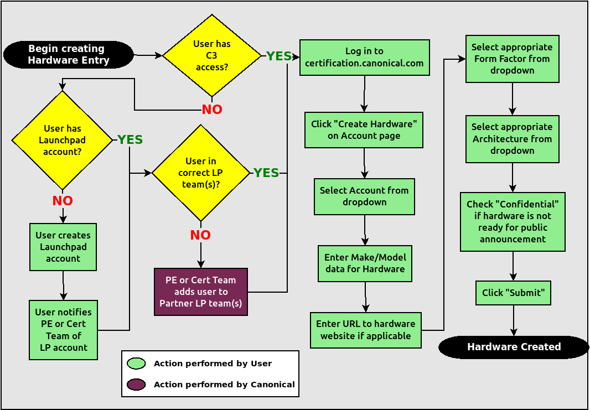

=====================================================
 Ubuntu Server Certified Hardware Self-Testing Guide 
=====================================================

.. header:: |ubuntu_logo|

.. |ubuntu_logo| image:: images/logo-ubuntu_su-white_orange-hex.png
   :scale: 20%

.. footer:: |canonical_logo|

.. |canonical_logo| image:: images/logo-canonical_no-tm-white-hex.png
   :scale: 10%

.. raw:: pdf

   PageBreak oneColumn

.. contents::

.. raw:: pdf

   PageBreak

Introduction
============

The aim of this document is to provide the information needed to test a
server on-site using the Canonical Server Test Suite and then submit the
results of that testing to Canonical to meet the requirements for Server
Hardware Certification. Testing may be done with or without an Internet
connection.

Glossary
========

The following definitions apply to terms used in this document.

Blocking test
  A test that *must* pass for the SUT to be granted a certified status.

BMC
  Baseboard Management Controller -- A device in many server models
  that enables remote in- and out-of-band management of hardware.

CSM
  Compatbility Support Module -- A feature of many UEFI implementations
  that enables the machine to boot using older BIOS-mode boot loaders.

DCPMM or NVDIMM
  Intel Optane Datacenter Persistent Memory Module -- A specialized RAM device
  introduced with Cascade Lake that can be configured to provide a block device
  that sits on the Memory Bus. Generically these are called NVDIMM or
  Non-Volatile Dual In-line Memory Module.

DHCP
  Dynamic Host Control Protocol -- A method for providing IP
  addresses to the SUT and Targets.

IPMI
  Intelligent Platform Management Interface -- A BMC technology for
  remotely connecting to a computer to perform management functions.

KVM
  Kernel Virtual Machine -- A system for running virtual machines on
  Ubuntu Server.

.. raw:: pdf

   PageBreak

LAN
  Local Area Network -- The network to which your SUT and Targets are
  connected. The LAN does not need to be Internet accessible (though that
  is preferable if possible).

MAAS
  Metal as a Service -- A Canonical product for provisioning systems
  quickly and easily.

Non-blocking test
  A test that must be performed but will not affect the
  granting of a certified status.

PXE
  Pre-boot Execution Environment -- A technology that enables you to
  boot a computer using remote images for easy deployment or network-based
  installation.

RAID
  Redundant Array of Independent Disks - Multi-disk storage
  providing redundancy, parity checking, and data integrity.

SAN
  Storage Area Network -- Usually FibreChannel.

Secure ID (SID)
  A string that uniquely identifies computers on the certification site,
  ``certification.canonical.com``.

SUT
  System Under Test -- The machine you are testing for certification.

Target
  A computer on the test LAN that the SUT can use for network testing. The
  Target must be running an ``iperf3`` server, but otherwise does not need
  any special configuration. The MAAS server may double as the Target.

Test case
  A test to be executed as part of the certification test suite. Test cases
  include things such as "stress test of system memory" and "test the CPU
  for clock jitter."

Understanding the Certification Process
=======================================

The workflow for testing SUTs is described in detail in the rest of this
document. An overview is presented in the following flowchart:

.. image:: images/certification-process-flowchart-portrait.png
           :alt: This flowchart outlines the certification process from
                 hardware creation through certificate issuing.
           :width: 100%

.. raw:: pdf

   PageBreak

The highlights of this process are:

#. Set up your MAAS server and connect it to the test LAN.
   This process is covered in the MANIACS document (available from
   https://certification.canonical.com).

#. Create an entry on https://certification.canonical.com (C3 for short)
   for the SUT, as described in more detail shortly, in `Creating a
   Hardware Entry on C3`_. If an entry already exists for your specific
   configuration (not just the model), you should use the existing entry.

#. Use MAAS to deploy the SUT, as described in the upcoming section,
   `Installing Ubuntu on the System`_.

#. Check the SUT's configuration. (The ``canonical-certification-precheck``
   script, described in `Running the Certification
   Tests`_, is key to this check.)

#. Run the test suite on the SUT, as described in `Running the
   Certification Tests`_.

#. Submit the test results to C3. This may be done semi-automatically
   when running the tests, or can be done manually, as described in
   `Manually Uploading Test Results to the Certification Site`_.

#. If desired, you can request a certificate, as described in `Requesting a
   Certificate`_.

Creating a Hardware Entry on C3
===============================

You can run certification tests without submitting them to C3; however, if
you want to certify the system, you need a C3 account. *If
you do not have an account for your company on the private certification
web site, or if you do not have access to your company's account, please
contact your Partner Engineer, who will work with the Server
Certification Team to establish the account.*

Additionally, anyone who needs to access the account on C3 will need their own
account on ``launchpad.net``, and their Launchpad account will need to be added to
the Access Control List for the company account. You can create a Launchpad
account at http://launchpad.net/+login. *If, after the Launchpad
account is created and you have been added to the ACL, you still can not see
the Account Information on C3, try logging out of C3, clearing any browser
cache and cookies, and logging back into C3.*

In order to upload test results to C3, you need to create a hardware entry
for the system which you will be certifying; however, creating a new entry
is not always necessary. You *should* create an entry if:

* A C3 entry for that specific machine (model and configuration) does not
  already exist; *and*

* You plan to submit certification data for that machine.

You should *not* create a new entry if:

* C3 already hosts an entry for that specific machine; instead, use
  the existing entry, even if it has existing submissions associated with
  it (say, for an earlier version of Ubuntu); *or*

* You don't plan to submit certification data for this computer.

You can put off creating the C3 entry until after the test, although doing
it before testing is usually preferable. To create an entry you can go
directly to:

https://certification.canonical.com/hardware/create-system

If you have problems accessing this site, contact your assigned Partner
Engineer.

                 hardware entries on C3.
           :width: 100%

The process of creating an entry is outlined in the preceding flowchart.
When creating an entry, you must enter assorted pieces of information:

#. Fill in the details:

   * **Account** -- The name of your account. If the account is incorrect
     or can't be set, please contact your account manager for assistance.
     This field is never published; it is for internal use only.

   * **Make** -- The manufacturer of the system, e.g. Dell, HPE, as you
     would like it to appear on the public web site.

   * **Model** -- The name of the system itself, e.g PowerEdge R7425 or
     ProLiant DL380, as you would like it to appear on the public web site.

   * **Codename** -- This is for your internal reference and identifies
     the internal code name associated with the SUT. This data is
     *never* published and is visible only to you and to Canonical.

   * **Web site** -- This optional field links to the system information on
     the manufacturer's web site. This field is not currently published
     publicly.

   * **Comment** -- This optional field holds any comment you want to make
     about the
     hardware, including things like tester name, test location, etc. 
     These comments are never made public, they are for internal use only.

   * **Form factor** -- The type of system: Laptop, Server, etc. This is
     not published directly, but determines where your system is displayed
     on the public site.  Client form factors appear in one place while
     server form factors appear elsewhere on the public certification site.
     You may select any appropriate Server form factor for the SUT except for
     Server SoC, which is reserved for System on Chip certifications.

   * **Architecture** -- The CPU architecture of the SUT. This is used
     internally and is not published.

   * **Confidential** -- Defaults to False (unchecked). Check the box if
     the system has not been publicly announced yet or should remain
     unpublished for any reason. This will cause the entire entry to *not*
     be published to the public web site.

#. Click Submit.

#. Note the "Secure ID for testing purposes" value. You'll need this
   when submitting the test results. (Note that this value is unique for
   each machine.)

Preparing the Test Environment
==============================

Before you test the hardware, you must perform some initial setup
steps. These steps are preparing ancillary hardware, configuring
the SUT for testing, and configuring the test network.

Ensuring Equipment is Ready
---------------------------

The requirements for running the tests for a server are minimal. Ensure
that you have:

-  Writable USB sticks with enough free space (> 256 MB). Each stick must
   contain a *single partition* with a *writable FAT* filesystem on it. 
   Note that a USB stick with multiple partitions may cause problems, so if
   necessary you should repartitition your device to have a single
   partition. Modern computers typically provide both USB 2 and USB 3
   ports, which are tested separately. Thus, you're likely to need two USB
   sticks per computer, at least one of which must be a USB 3 device. If
   you need to test more than one computer then *bring enough USB sticks to
   test all the systems*.

-  Writable SD cards configured with the same rules as the USB sticks.
   These SD cards are needed only on those (rare) servers that have
   external SD card slots.

-  Data CDs that hold data (for servers with optical drives only). These
   are required to test the
   systems' optical drive read capabilities. Note that a movie DVD or an
   audio CD won't be useful in this case, as they are not in the right
   format for the test. If you need to test more than one computer then
   *bring one medium per system*.

-  A computer to function as an ``iperf3`` Target on the test LAN. This
   computer must have network ports that equal or exceed the speed of the
   fastest network port on your SUTs.

-  A computer to function as a MAAS server on the test LAN. This server
   will provision the SUT. (Note that a MAAS server for certification
   testing should ideally be configured to automatically install the Server
   Test Suite on the SUT, which will not be the case for a "generic" MAAS
   server.)

Frequently, the MAAS server and ``iperf3`` Target are one and the same
computer; however, sometimes it is desirable to use two computers for these
two purposes. The upcoming section, `Preparing the Network Test
Environment`_, covers these servers in more detail.

Configuring the SUT for Testing
-------------------------------

The following should be considered the minimum requirements for setting
up the SUT and test environment:

-  Minimum loadout

   -  Minimum of 4 GiB RAM

   -  1 internal storage device (HDD, SSD, or NVMe); 2 with minimal RAID

   -  1 CPU of a supported type

-  Recommended (preferred) loadout

   -  Maximum supported number of internal storage devices, especially if you can
      configure multiple RAID levels (e.g. 2 for RAID 0, 3 for RAID 5, and
      6 for RAID 50)

   -  The largest disk capacity available from the OEM -- ideally, over
      2 TiB on a single disk or RAID array

   -  Maximum amount of supported RAM

   -  Maximum number of supported CPUs

   - If the SUT has multiple disk controllers (such as a motherboard-based
     disk controller and a separate RAID controller), we strongly recommend
     that disk devices be connected to all controllers during testing.

-  All hardware, including CPUs, must be production level. Development
   level hardware is not eligible for certification.

   -  This can be excepted on a case by case basis for pre-release systems
      where the Partner and Canonical have arranged certification to be
      published coinciding with a SUT's release announcement.

-  If possible, as many processors as the SUT will support should be
   installed.

   -  Note that systems that ship with processors from different families
      (e.g., Coffee Lake vs. Cascade Lake) will require extra testing.

   -  CPU speed bumps and die shrinks do not require extra testing.

-  The SUT should not contain any extraneous PCI devices that are not
   part of the certification.

   -  This includes things like network, SAN and iSCSI cards.

   -  Hardware RAID cards are allowed if they are used to provide RAID
      services to the SUT's onboard storage.

-  Virtualization (VMX/SVM) should be enabled in the BIOS/UEFI, when
   supported by the CPU's architecture.

-  The SUT should be running release or GA level (*not* development level)
   firmware. Development level firmware is generally not eligible for
   certification.

   -  The one exception to this rule is that you may use unsigned GA equivalent
      firmware if such allows you to flash the system up and down rev as
      needed. However, the test results must show the version to be equal to
      the publicly available version.

-  BIOS/UEFI should be configured using factory default settings, with the
   following exceptions:

   -  Many systems ship with **IPMI-over-LAN** disabled by default. This will need
      to be enabled to ensure MAAS can remotely manage the SUT.

   -  If the hardware virtualization options in the BIOS/UEFI are not
      enabled, enable them, save the settings and allow the SUT to reboot.

   -  The SUT must be configured so that at least ONE network device is set to
      PXE-boot by default.

   -  If the SUT's firmware supports PXE-booting in UEFI mode, it must be
      configured to boot in UEFI mode, rather than in BIOS/CSM/legacy mode.

   -  All non-network devices have been removed from the Boot Options so that
      Network Booting (PXE) is the only option. The Ubuntu installer will add
      an Ubuntu menu option and that is OK, but testing expects the Network
      Boot device is the first item in the boot menu.

-  The SUT Firmware should have verifiable identifiers in DMI Types 1, 2 and/or
   3 that match the information entered in the hardware entry on C3.
   
   -  For ODMs this means Make and Model data must be accurate in DMI Types 1
      and 2.
   
   -  For OEMs where Make and Model may not be determined yet, some other
      identifier must exist in DMI Types 1, 2 and/or 3 that matches data
      provided in the Hardware Entry on C3

-  Storage should be properly configured.

   -  Disks must be configured for "flat" storage -- that is, filesystems
      in plain partitions, rather than using LVM or bcache configurations.
      Similarly, software RAID must *not* be used.

-  The SUT's BMC, if present, may be configured via DHCP or with a static
   IP address. If the BMC uses IPMI, MAAS will set up its own BMC user
   account (``maas``) when enlisting the SUT.

-  A monitor and keyboard for the SUT are helpful because they will
   enable you to monitor its activities. If necessary, however,
   certification can be done without these items.

Preparing the Network Test Environment
--------------------------------------

Particularly if you're testing in a location where you've never before
tested, or if you're testing a SUT with unique network hardware, you may
need to prepare the network environment. In particular, you should pay
attention to the following:

-  In addition to the SUT, the network must contain at least one other
   machine, which will run MAAS and an ``iperf3`` server; however, you may
   want to separate these two functions.

   - The MAAS Advanced Network Installation and Configuration -- Scripted
     (MANIACS) document (available from
     https://certification.canonical.com) describes how to configure a MAAS
     server. The MAAS server computer itself does not need to be very
     powerful by modern standards. MAAS version 3.1 or later is required
     for certification work.

  -  When testing multiple SUTs simultaneously, you will need multiple
     ``iperf3`` Targets, one for each SUT. If your ``iperf3`` Target has a
     sufficiently fast NIC or multiple NICs, you can assign the computer
     multiple IP addresses and treat each one as a distinct Target. This
     topic is covered in more detail in Appendix B of the MANIACS document.
     Alternatively, you can run network tests against a single ``iperf3``
     Target sequentially; however, this approach complicates submission of
     results. Note that poor network infrastructure may make multiple
     simultaneous ``iperf3`` runs unreliable.

-  Ideally, the network should have few or no other computers;
   extraneous network traffic can negatively impact the network tests.

-  Network cabling, switches, and the ``iperf3`` server should be capable of
   at least the SUT's best speed. For instance, if the SUT has 100 Gbps
   Ethernet, the other network components should be capable of 100 Gbps or
   faster speeds. If the local network used for testing is less capable
   than the best network interfaces on the SUT, the network test won't run,
   and those interfaces must be
   tested later on a more-capable network. If the test environment uses
   separate networks with different speeds, with the SUT cabled to multiple
   networks via different ports, you can specify multiple ``iperf3``
   servers, as described later.

-  If desired, the MAAS server may be run inside a virtual machine;
   however, it is advisable to run the ``iperf3`` server on "real" hardware
   so as to minimize the risk of network tests failing because of
   virtualization issues.

-  Every network port must be cabled to the LAN and properly configured
   with either DHCP or static addressing. If a SUT has 4 NIC ports, then
   all 4 must be connected to the LAN.

Setting up the SUT for Testing
==============================

Before you can begin testing, you must install Ubuntu on the SUT and
perform some certification-specific configuration tasks on the SUT. Most of
the work of these tasks is performed with the help of MAAS, as described in
the following sections.

Installing Ubuntu on the System
-------------------------------

Server certification requires
that the SUT be installable via MAAS. Therefore, the following procedure
assumes the presence of a properly-configured MAAS server. The MAAS
Advanced Network Installation and Configuration -- Scripted (MANIACS) document
describes how to set up a MAAS server for certification testing purposes.
This document describes use of MAAS 3.1.

Once the SUT and MAAS server are both connected to the network, you can
install Ubuntu on the SUT as follows:

#. Power on the SUT and allow it to PXE-boot.

   -  The SUT should boot the MAAS enlistment image and then power off.

   -  You should see the SUT appear as a newly-enlisted computer in your
      MAAS server's node list. (You may need to refresh your browser to see
      the new entry.)

   -  MAAS 2.6 and later may attempt to commission the node
      immediately after enlisting it, thus skipping the next two steps. If
      this does not happen or if you want to change the node's name, you can perform
      the next two steps manually after the commissioning attempt.

#. Check and verify the following items in the MAAS server's node details
   page:

   -  If desired, change the node name for the SUT.

   -  Check the SUT's power type and ensure it's set correctly (IPMI, AMT,
      etc.). If the SUT has no BMC, you can set it to Manual.

   -  Note that manual power control is acceptable only on low-end servers
      that lack BMCs. If MAAS fails to detect a BMC that is present or if
      MAAS cannot control a BMC that is present, please consult the
      Canonical Server Certification Team.

#. Commission the node by clicking Take Action followed by Commission
   and then Start Commissioning for Machine.

   -  On some systems, it is necessary to remove the smartctl-validate
      option under Testing Scripts before clicking Commission Machine.

   -  If the SUT has a BMC, the computer should power up, pass more
      information about itself to the MAAS server, and then power down
      again.

   -  If the SUT does not have a BMC, you should manually power on the SUT
      after clicking the Start Commissioning for Machine button. The SUT
      should power up,
      pass more information about itself to the MAAS server, and then power
      down again.

   -  Some servers provide an option called "minimum password change
      interval," or something similar, in their BMCs' web-based interfaces,
      that prevents BMC passwords from being changed very frequently. MAAS
      will attempt to change the password upon commissioning, though, and
      if this is done immediately after enlisting the node, it will fail.
      If the BMC configuration commissioning step fails, you may need to
      set this minimum password change interval to 0 or otherwise disable
      this feature, then try commissioning again. Alternatively, checking
      the "Skip configuring supported BMC controllers with a MAAS generated
      username and password" option when commissioning the node may work
      around this problem.

#. Check and, if necessary, adjust the following node details:

   - On the Network tab, ensure that all the node's interfaces are
     active. (By default, MAAS activates only the first network interface
     on most computers.) If an interface is identified as *Unconfigured,*
     click the down arrow in the Actions column, select Edit
     Physical, and set IP Mode to Auto Assign, DHCP, or Static Assign.
     (The first two cause MAAS to assign an IP address to the node itself,
     either by maintaining its own list of static IP addresses or by using
     DHCP. The Static Assign option requires you to set the IP address
     yourself. These three options are described in more detail in the
     MANIACS document, available from https://certification.canonical.com.)
     When you've made this change, click Save Interface.

   - On the Storage tab, look under Available Disks and Partitions for
     disks that have not been configured. If any are availble, click the
     down arrow in the Actions column and select Add
     Partition. You can then set a Filesystem
     (specify ext4) and Mount Point (something under ``/mnt``
     works well, such as ``/mnt/sdb`` for the ``/dev/sdb`` disk). Click Add
     Partition when you've set these options. Repeat this step for any
     additional disks.

     - If MAAS complains that there's insufficient free space on the
       device, try manually reducing the partition's size by a small
       amount. Usually rounding down to the nearest whole number works
       around this problem.

       ..
          RST comment: Above is bug:
          https://bugs.launchpad.net/maas/+bug/1938296. Fix committed
          2/4/2022, but is not released, as of 2/8/2022. Delete above
          bullet point, and this comment, once the fix is released.

#. On the MAAS server, verify that the SUT's Status is listed as Ready
   in the node list or on the node's details page. You may need to
   refresh the page to see the status update.

#. Click Take Action followed by Deploy. Options to select the OS version
   to deploy should appear.

#. Select the Ubuntu release you want to deploy:

   - Choose the Ubuntu version you wish to deploy from the list of available
     Ubuntu releases. The options will appear similar to **20.04 LTS
     "Focal Fossa"** in the middle drop-down box.

   - Choose the kernel you wish to deploy. The available kernels are in the
     dropdown box below the Ubuntu version. For recent versions of Ubuntu,
     they will be named similar to **focal (ga-20.04)**.

     - When deploying the SUT for testing, you should always start out with
       the original GA kernel.  For 20.04 LTS, the **focal (ga-20.04)**
       option is appropriate. If the sysetm is not deployable or fails
       certification using the GA kernel, you will then need to re-deploy
       the SUT choosing the correct HWE kernel option (if available). Note
       that an HWE kernel option becomes available only starting with the
       second point release for an LTS version, such as 18.04.2 or 20.04.2.

     - Do not choose any of the **edge** or
       **lowlatency** kernel options for official Certification testing.

   `Appendix C - Testing Point Releases`_, elaborates on the procedures for
   testing different kernels and point releases.

#. Click Deploy Machine to begin deployment.

   -  If the SUT has a BMC, it should power up and install Ubuntu. This
      process can take several minutes.

   -  If the SUT does not have a BMC, you should power it on manually after
      clicking Deploy Machine. The SUT should then boot and install Ubuntu.
      This process can take several minutes.

If MAAS has problems in any of the preceding steps, you should first check
`Appendix E - Troubleshooting`_ for suggestions. If that doesn't help,
the SUT might not pass certification. For instance, certification requires
that MAAS be able to detect the SUT and, in most cases, set its power type
information automatically. If you have problems with any of these steps,
contact the Canonical Server Certification Team to learn how to proceed;
you might have run into a simple misconfiguration, or the server might need
enablement work.

If MAAS is fully configured as described in the `MAAS Advanced Network
Installation and Configuration -- Scripted (MANIACS)` document, it should
deploy the Server Test Suite automatically. If MAAS doesn't deploy the
Server Test Suite properly, you can do so manually, as described in
`Appendix A - Installing the Server Test Suite Manually`_.

Configuring DCPMM Devices for Testing
-------------------------------------

Starting with Cascade Lake, Intel servers have included support for Intel
Optane DCPMM devices. These are RAM devices that use
the standard DIMM form factor and are populated alongside standard DIMMs. These
special devices can function in one of three different modes, described below.

* **Memory Mode** is a configuration where the DCPMMs are dedicated
  completely to the traditional volatile RAM role, like any other standard
  memory DIMM. In this mode, the certification suite will exercise the DCPMMs
  using the Memory test cases.

* **AppDirect Mode** is a configuration where the DCPMMs are presented to the
  installed OS as persistent storage devices.  AppDirect allows for four
  different storage modes, three of which are currently tested using the Disk
  test cases:

  - fsdax -- Filesystem-DAX mode is the default mode of a namespace when
    specifying ``ndctl create-namespace`` with no options. It creates a
    block device (``/dev/pmemX[.Y]``) that supports the DAX capabilities of
    Linux filesystems (XFS and ext4 to date). DAX enables workloads or
    working-sets that would exceed the capacity of the page cache to scale
    up to the capacity of persistent memory. When in doubt, pick this mode.

  - sector -- Use this mode to host legacy filesystems that do not checksum
    metadata or applications that are not prepared for torn sectors after a
    crash. Expected usage for this mode is for small boot volumes. This mode is
    compatible with other operating systems.

  - raw -- Raw mode is effectively just a memory disk that does not support DAX.
    Typically this indicates a namespace that was created by tooling or another
    operating system that did not know how to create a Linux fsdax or devdax
    mode namespace. This mode is compatible with other operating systems, but
    again, does not support DAX operation.

  - devdax -- Device-DAX mode enables similar ``mmap(2)`` DAX mapping capabilities
    as Filesystem-DAX. However, instead of a block device that can support a
    DAX-enabled filesystem, this mode emits a single character device file
    (``/dev/daxX.Y``). Use this mode to assign persistent memory to a
    virtual machine, register persistent memory for RDMA, or when gigantic
    mappings are needed. *As of this writing, devdax is not yet supported by
    tests in Checkbox*

* **Mixed Mode** enables configuring a mix of both Memory and AppDirect
  spaces using either the system configuration tools (e.g. Setup/BIOS) or
  userspace tools after installation, which requires a reboot afterwards. 
  If using userspace tools, you will need to use ``ipmctl`` for the initial
  configuration.  ``ipmctl`` is available in 18.04 LTS via the Hardware
  Certification PPA that provides the Server Test Suite, and is available
  via the Universe repo in 20.04 LTS. Using ``ipmctl`` you should allocate
  at least 25% of the DCPMM space to Memory Mode and the remainder as
  AppDirect Mode.

This guide provides one path to configuration using Mixed Mode to reduce
the amount of retests necessary to complete certification. Some OEMs may
support operation of DCPMMs in Memory or AppDirect only. If that applies to
your SUT, you will need to configure each mode separately and run retests to
ensure both modes have been tested. 

Once initial configuration is done using ``ipmctl``, you will need to use
``ndctl``, which is available from 18.04 LTS onward in the Universe repo, to do
the final configuation.

For this step, you should create a fsdax device, a sector device, and a
raw device of more or less equal size.  

Once you have configured this, you will need to reboot the SUT to ensure the
configuration is performed.  Once you have rebooted the server, you will need
to add a partition table and a partition to each AppDirect device, and
format them appropriately using a supported filesystem (such as ext4).

From this point onward, the Server Test Suite will treat the AppDirect
devices as any other block device and test them accordingly using the various
Disk test cases.

Performing Final Pre-Testing SUT Configuration
----------------------------------------------

Once the SUT is deployed, you should be able to log into it using SSH from
the MAAS server. Check the node details page to learn its primary IP
address. (Using a hostname will also work if DNS is properly configured,
but this can be fragile.) The username on the node is ``ubuntu``, and no
password should be required when logging in from the MAAS server or from any
other computer and account whose SSH key you've registered with the MAAS
server.

You may need to perform a few additional minor tasks before running the
Certification Suite, and keep some other factors in mind as you continue to
access the SUT:

-  If you want to log in at the console or from another computer, the
   password is ``ubuntu``, assuming the certification preseed files are
   used on the MAAS server. If you're using a "generic" MAAS installation,
   you must set the password manually. Testing at the console has certain
   advantages (described shortly).

-  You should *not* install updates to the SUT unless they are absolutely
   necessary to pass certification. In that case, the Canonical
   Certification Team will make the determination of what updates should be
   applied.

-  You should verify your SUT's kernel version by typing ``uname -r``.
   Ubuntu 18.04 GA ships with a 4.15.0-series kernel and Ubuntu 20.04 GA
   ships with a 5.4.0-series kernel. Note that, although updated kernels
   ship with most
   point-release versions, if you use the standard MAAS images,
   ``lsb_release -a`` will show that you have the latest point-release
   version even if you're using the GA kernel. It's the kernel version
   that's important for testing purposes, as elaborated on in `Appendix C -
   Testing Point Releases`_.

-  If any network interfaces are not configured, you should configure them:

   - The best way is to release the node in MAAS, adjust the network
     configuration as described in `Installing Ubuntu on the System`_, and
     re-deploy the node. If the interfaces don't show up in MAAS, then you
     should re-commission the node.

   - If MAAS doesn't detect an interface, or if it requires configuration
     MAAS can't handle, you can reconfigure the network in the deployed
     installation: Edit ``/etc/netplan/50-cloud-init.yaml`` and activate
     the changes with ``sudo netplan apply``. (NetPlan configuration is
     described in more detail at https://wiki.ubuntu.com/Netplan/Design.)

-  All disk devices (HDDs, SSDs, NVMes, and DCPMMs) must be partitioned and
   mounted prior to testing. Each disk beyond the first one should ideally
   be configured with a single partition that spans the entire disk and
   that uses the ext4 filesystem.

   - As with network interfaces, the easiest way to do this is via MAAS
     before deployment.

   - If necessary, you can manually partition the disk (using ``gdisk``,
     ``fdisk``, ``parted``, or similar tools), create filesystems on them
     (using ``mkfs`` or related tools), and mount them (with the ``mount``
     command or ``/etc/fstab`` file).

-  If the SUT has DCPMMs installed, you should configure them prior to running
   the test suite. **Note: This document assumes that the SUT will support
   Mixed Mode operation. If the SUT only supports a single operating mode at a
   time, you will need to configure DCPMMs in one mode, run tests, then
   re-configure the DCPMMs into the remaining mode and run the appropriate
   tests separately.**

-  A MAAS installation configured for certification testing should
   provision the SUT with the Server Test Suite and related packages. If
   you're using a more "generic" MAAS setup, you'll have to install the
   certification software yourself, as described in `Appendix A -
   Installing the Server Test Suite Manually`_.

-  If the SUT includes an nVidia GPGPU that is to be tested, please refer to
   `Appendix G - Setting Up and Testing a GPGPU`_.

Running the Certification Tests
===============================

You can initiate a testing session in a server as follows:

#. Launch ``iperf3`` on the Target server(s) you plan to use by typing::

    $ iperf3 -s

   In the case of high-speed (typically, over 10 Gbps) networks, network
   configuration and launching the ``iperf3`` server are more complex. See
   `Appendix D - Network Performance Tuning`_ for details.

#. Connect to the SUT via SSH or log in at the console. A standard MAAS
   installation creates a user called ``ubuntu``, as noted earlier. You can
   test using either a direct console login or SSH, but an SSH login may be
   disconnected by the network tests or for other reasons.

#. If the SUT provides the suitable ports and drives, plug in a USB 2
   stick, plug in a USB 3 stick, plug in an SD card, and insert a suitable
   data CD in the optical drive. (Note that USB testing is not required for
   blade/cartridge style systems *unless* the blade or cartridge has
   dedicated USB ports that are not shared via the chassis.) These media
   must remain inserted *throughout the test run*, because the media tests
   will be kicked off partway through the run.

#. run the ``canonical-certification-precheck`` script, which tests
   critical configuration details and fixes some common problems:

   - The script completes APT configuration, which is sometimes incomplete
     at system installation.

   - If the script detects that the
     ``/etc/xdg/canonical-certification.conf`` file is missing information,
     it will give you the opportunity to fill it in. This information
     includes the SUT's Secure ID (SID) number and pointers to KVM and LXD
     image files.

   - Information on some critical configuration details is displayed,
     followed by a summary, such as the following:

     .. figure:: images/cert-pretest.png
        :alt: The certification pre-test script helps you identify
              simple problems that might make you go d'oh!
        :width: 100%

   - Summary results are color-coded, with white for information, green for
     passed results, yellow for warnings, and red for problems that should
     be corrected. In the preceding output, the Installed RAM value was
     displayed in yellow because the system's RAM is a bit shy of 4 GiB;
     the ``USB_Disks`` line is red because no USB flash drive
     was inserted in the SUT; and the ``UVT_KVM_Image_Check`` line is red
     because the KVM image was not configured. If your terminal supports
     the feature, you
     can scroll up to see details of any warnings or failures.

   - If the script identifies any problems, be sure to correct them.
     Some common sources of problems include the following:

     - If the precheck script fails the ``NICs_enabled`` test, you must
       correct the problem before testing. You must ensure that all network
       ports are cabled to a working LAN and configured as described
       earlier, in `Performing Final Pre-Testing SUT Configuration`_.

     - If your ``IPERF`` test failed, you may need to launch the ``iperf3``
       server on the Target system, as described earlier. Your
       configuration may need updating in addition to or instead of this
       change, though. To do so, edit the
       ``/etc/xdg/canonical-certification.conf`` file on the SUT so as to
       specify your ``iperf3`` server(s). For example::

         TEST_TARGET_IPERF = 192.168.0.2,172.24.124.7

       If your environment includes multiple ``iperf3`` servers, you can
       identify them all, separated by commas. The test suite will attempt
       to use each server in sequence until one results in a passed test or
       until a timeout period of one hour has passed. You can use this
       feature if your environment includes separate networks with
       different speeds or simply to identify all of your ``iperf3``
       servers. (Note that ``iperf3`` refuses a connection if a test is
       ongoing, so you can list multiple ``iperf3`` servers and let the
       test suite try them all until it finds a free one.)

     - If the ``Hard_Disks`` or ``USB_Disks`` options failed, you may need
       to attend to them. USB flash drives need only be prepared with FAT
       filesystems and inserted into the SUT, as described earlier. Most
       disks have device filenames of ``/dev/sda``, ``/dev/sdb``, and so
       on; but some disk devices may appear under other device
       names, such as ``/dev/nvme*``. If ``ls /dev/sd*`` shows a disk with
       no partitions, you should partition the disk (one big disk-spanning
       partition is best), create an ext4 filesystem on it, and mount it
       (subdirectories of ``/mnt`` work well). Repeat this process for each
       unmounted disk.

     - If the ``UVT_KVM_Image_Check`` or ``LXD_Image_Check`` tests failed
       and if your Internet access is slow, you should download the relevant
       virtualization images on the SUT:

       #. On a computer with better Internet access, download KVM and LXD
          cloud image files from
          http://cloud-images.ubuntu.com/focal/current/. In particular,
          obtain the ``focal-server-cloudimg-amd64.img``,
          ``focal-server-cloudimg-amd64.squashfs``, and
          ``focal-server-cloudimg-amd64-lxd.tar.xz`` files, or the
          equivalent for your CPU architecture.

       #. Copy those images to any convenient directory on the SUT.

       #. Supply the full paths under the section labeled "environment" in
          ``/etc/xdg/canonical-certification.conf``. For example::

            [environment]
            KVM_TIMEOUT = 300
            KVM_IMAGE = /home/ubuntu/focal-server-cloudimg-amd64.img
            LXD_ROOTFS = /home/ubuntu/focal-server-cloudimg-amd64.squashfs
            LXD_TEMPLATE = /home/ubuntu/focal-server-cloudimg-amd64-lxd.tar.xz

          Note that the KVM and LXD configurations are separated by
          several lines of comments in the configuration file.

       A failure of the virtualization image precheck need not be a problem
       if your outside network access is good; the test script will attempt
       to obtain the virtualization image from public mirrors if it is
       not present locally.

#. If you're running the test via SSH, type ``screen`` on the SUT to ensure
   that you can reconnect to your session should your link to the SUT go
   down, as may happen when running the network tests. If you're
   disconnected, you can reconnect to your session by logging in and
   typing ``screen -r``. This step is not important if you're running the
   Server Test Suite at the console.

#. Run the certification tests by typing an appropriate command, such as::

    $ certify-20.04

   In some cases, though, another command may be necessary:

   - If you're testing another Ubuntu version, you must change the version
     number.

   - More exotic options, including running a limited set of tests, are
     described in `Appendix B - Re-Testing and Installing Updated Tests`_.

#. The full test suite can take several hours, or in extreme cases over a
   day, to complete, depending on the hardware configuration (amount of
   RAM, disk space, etc). During this time the computer may be
   unresponsive. This is due to the inclusion of some stress test cases.
   These are deliberately intensive and produce high load on the system's
   resources.

#. If at any time during the execution you are *sure* the computer has
   crashed (or it reboots spontaneously) then after the system comes back
   up you should run the ``certify-20.04`` command again
   and respond `y` when asked if you want to resume the previous session.

#. If any tests fail or do not run, a screen will appear that summarizes
   those tests that failed or did not run. The summary screen separates
   failures into two categories:

   * **Failed Jobs** -- These failures *might* be serious, or they might
     not be. (This issue is addressed in more detail shortly.)

   * **Jobs with Failed Dependencies** -- Failures in this category are
     *not* serious. A failed dependency means that a precondition for even
     running the test did not exist. For instance, in the below screen
     shot, a test intended for IBM Power-architecture (ppc64el) computers
     was not run because the SUT used an x86-64 CPU.

     .. figure:: images/cert-failures.png
        :alt: You can sometimes correct problems and re-run tests
              before submitting results.
        :width: 100%

   You can use this opportunity to
   re-run a test if you believe it failed for a transient reason, such as
   if your ``iperf3`` server crashed or was unavailable or if you forgot to
   insert a USB drive. To re-run tests, use the
   arrow keys to highlight each test you want to re-run, press Spacebar to
   select it, and then press the **R** key to re-run the selected tests.
   If you don't want to re-run any tests, press **F** to finish.

#. When the test run is complete, you should see a summary of tests run, a
   note about where the ``submission*`` files have been stored, and a
   prompt to submit the results to C3. If you're connected to the Internet,
   typing ``y`` at this query should cause the results to be submitted. You
   will need either a Secure ID value or to have already entered this value
   in the ``/etc/xdg/canonical-certification.conf`` file. (The
   ``canonical-certification-precheck`` script will edit this file
   appropriately if you provided the SID when you ran that script.) The
   script will also prompt you for a description of the test run. This
   description is not shared publicly; it's intended to help both you and
   the Server Certification Team identify the purpose of a test run.

#. Copying the results files off of the SUT is advisable. This is most
   important if the automatic submission of results fails; however,
   having the results available as a backup can be useful because it
   enables you to review the results off-line or in case of submission
   problems that aren't immediately obvious. The results are stored in
   the ``~/.local/share/checkbox-ng`` directory. The upcoming section,
   `Manually Uploading Test Results to the Certification Site`_, describes
   how to upload results manually to C3.

You can review your results locally by loading
``submission_<DATECODE>.html`` in a web
browser. This enables you to
quickly spot failed tests because they're highlighted in red with a
"failed" notation in the Result column, whereas passed tests acquire a
green color, with the word "passed." Note, however, that *a failed test
does not necessarily denote a failed certification*. Reasons a test might
fail but still enable a certification to pass include the following:

-  A test may be a non-blocking test, as described in the `Ubuntu Server
   Hardware Certification Coverage` document, available from
   https://certification.canonical.com. In the preceding screen shot,
   the Test That System Booted with Secure Boot Active is such a test.

-  Some tests are known to produce occasional false positives -- that
   is, they claim that problems exist when in fact they don't. In the
   preceding screen shot, the Run FWTS Server Cert Selected Test failure is
   an example of this condition.

-  Some test environments are sub-optimal, necessitating that specific
   tests be re-run. This can happen with network tests or if the tester
   forgot to insert a removable medium. In such cases, the specific test
   can be re-run rather than the entire test suite. In the preceding screen
   shot, the failed USB tests are examples; the tests failed because no USB
   devices were inserted, which is an easily-corrected oversight.

Consult your account manager if you have questions about specific test
results.

Manually Uploading Test Results to the Certification Site
=========================================================

If you can't upload test results to the certification site from the
certification program itself, you must do so manually, perhaps from
another computer that runs Ubuntu. At this time, there is no
mechanism for submitting results from an OS other than Ubuntu.

To submit results, you must first add the Hardware Certification PPA and
install the ``checkbox-ng`` package. Follow these instructions:

#. Add the Hardware Certification PPA::

   $ sudo apt-add-repository ppa:hardware-certification/public
   $ sudo apt-get update

#. Install the package::

   $ sudo apt-get install checkbox-ng

#. Run the following command::

    $ checkbox-cli submit <SUT_SECURE_ID> <PATH_TO>/submission_<DATECODE>.tar.xz

   where:

   -  ``<SUT_SECURE_ID>`` can be found on your system's page on the
      certification web site (http://certification.canonical.com) by
      looking next to "Secure ID for testing purposes":

      .. image:: images/secure_id.png
         :alt: The Secure ID can be obtained from the Ceritification web site.
         :align: left
         :width: 70%

   -  ``<PATH_TO>`` refers to the location of the
      ``submission_<DATECODE>.tar.xz`` file
      (which should be contained in the ``~/.local/share/checkbox-ng``
      directory you copied to the USB key).

   -  ``<DATECODE>`` is a date code. Note that if you re-run the
      certification suite, you're likely to see multiple
      ``submission_<DATECODE>.xml`` files, each with a different date code,
      one for each run. Ordinarily, you should submit the most recent file.

You should see output similar to the following for a successful
submission::

  $ checkbox-cli submit a00D000000XndQJIAZ \
    ~/.local/share/checkbox_ng/submission_2016-03-23T19\:06\:18.244727.xml 
  Successfully sent, submission status at
  https://certification.canonical.com/submissions/status/28d85e09-11d4

Once results submission is complete, use the provided link in the output
to review the results and confirm that they are correct.

Requesting a Certificate
========================

Once you've uploaded the data to the certification site, you should
review it in the web interface. If you're satisfied that there are no
problems, you can request a certificate:

#. Click the date link under the Created column in the Submissions
   section. The result should be a page showing most of the same
   information as the previous page, but in a different format, and
   restricted to that one test run.

#. Click the Request Certificate link. The result should be a page with
   a few radio buttons in which you can enter information:

   -  Status is fixed at In Progress.

   -  Certified Release indicates the Ubuntu release used for testing, and
      for which the certificate will be issued.

   -  Level indicates the type of certification:

      -  Certified is for for hardware that's ready to be deployed with
         Ubuntu. This is the option to choose for server hardware as that
         typically does not ship with a pre-installed operating system.

      -  Certified Pre-install is for hardware that  ships with a (possibly
         customized) version of Ubuntu. This option is used almost exclusively
         for Client hardware such as desktops and laptops that 
         typically ship with a pre-installed operating system.

   -  Is Private should be checked if the certification should be kept
      private. Note that this check box affects the certificate only, not
      the entry for the computer as a whole on
      http://certification.canonical.com. Other public pre-existing
      certificates, or those issued in the future, will remain public.

#. Click Submit. You'll see a new screen in which you can enter more
   information. In particular, you can click:

   -  Link Bug to link to a bug on https://bugs.launchpad.net.
      This option is available only to Canonical engineers.

   -  Create Note or Add Note from Template to create a note. Most
      systems will have at least two notes:

      -  *A note titled "Requester" with the name of the person who
         requested the certificate is required.* This note should be
         created automatically, but you may optionally modify it.

      -  A note titled "Test Notes" is usually present. It describes
         test-specific quirks, such as why a failure should be ignored
         (say, if a network test failed because of local network problems
         but succeeded on re-testing). If the
         *miscellanea/get-maas-version* test fails, be sure to specify the
         version of MAAS used to deploy the SUT.

      In most cases, the "Private" check box should be checked for your
      notes.

.. raw:: pdf

   PageBreak

Appendix A - Installing the Server Test Suite Manually
======================================================

Ordinarily, MAAS will install the Server Test Suite onto the SUT as part of
the provisioning process. If the MAAS server is not configured to do this,
you may use APT to do the job after deploying the SUT. In order to do this,
your lab must have Internet access or a local APT repository with both the
main Ubuntu archives and the relevant PPAs. You can install the necessary
tools using ``apt-get``.

Log in to the server and run the following commands::

  $ sudo apt-add-repository ppa:hardware-certification/public
  $ sudo apt-add-repository ppa:firmware-testing-team/ppa-fwts-stable
  $ sudo apt-get update
  $ sudo apt-get install canonical-certification-server

.. The ppa:hardware-certification/public should be stable. For
   the development PPA, instead use ppa:checkbox-dev/ppa.

If you want to  run the test suite from an Ubuntu live medium, you must
also enable the universe repository::

  $ sudo apt-add-repository universe

Note that running the test suite from a live medium is not accepted for any
certification attempt; this information is provided to help in unusual
situations or when debugging problems that necessitate booting in this way.

During the installation, you may be prompted for a password for ``mysql``.
This can be set to anything you wish; it will not be used during testing.
You may also be prompted to configure the Postfix mail server. Selecting
**No configuration** is appropriate.

At this point, the test suite and dependencies should be installed.

.. raw:: pdf

   PageBreak

Appendix B - Re-Testing and Installing Updated Tests
====================================================

Occasionally, a test will fail, necessitating re-testing a feature. For
instance, if a USB flash drive is defective or improperly prepared, the
relevant USB tests will fail. Another common source of problems is
network tests, which can fail because of busy LANs, flaky switches, bad
cables, and so on. When this happens, you must re-run the relevant
test(s). Broadly speaking, there are two ways to re-run tests: via a
limited test script and by installing updated test scripts.

Running a Limited Test Script
-----------------------------

In addition to the ``certify-20.04`` test script, several others are
provided with the Server Test Suite:

- If you're testing a System-on-Chip (SoC) rather than a production
  server, you should run ``certify-soc-20.04``.

- If you're testing a virtual machine, you should run
  ``certify-vm-20.04``.

- The ``test-firmware`` command runs firmware tests.

- The ``test-functional-20.04`` command runs functional tests.

- The ``test-gpgpu`` command runs tests on nVidia GPGPUs. (See
  `Appendix G - Setting Up and Testing a GPGPU`_ for important information
  related to GPGPU testing.)

- The ``test-memory`` command runs memory tests.

- The ``test-network`` command runs network tests.

- The ``test-network-underspeed`` command runs the network tests with the speed
  check disabled. This is helpful in situations where a network device reports
  an incorrect maximum speed.

- The ``test-nvdimm`` command will run the memory and storage focused tests and
  some NVDIMM health checks. This launcher is intended for testing NVDIMMs
  configured in mixed mode. (See `Configuring DCPMM Devices for Testing`_ for
  more information.)

- The ``test-storage`` command runs tests of storage devices.

- The ``test-usb`` command runs tests of USB ports.

- The ``test-stress`` command runs CPU, RAM and storage stress tests.

- The ``test-virtualization`` command runs virtualization (KVM and
  LXD) tests.

If you're testing NVDIMMs alone, you should note that ``test-nvdimm`` will run
both memory and storage stress tests and thus will take a while to run.  If
your NVDIMMs are configured only in memory or storage mode you can save some
time by using the ``test-memory`` or ``test-storage`` launchers respectively.

If you're testing Ubuntu 18.04, change the version number in commands that
include it. Consult your Partner Engineer if you need help
deciding which of these tests to run.

When the test run completes, submit the test result in the same way you
would for a complete test run. You can then request a certificate based on
the main results (the one with the most passed tests) and refer to the
secondary set of results in the certificate notes. This procedure ensures
that all the necessary data will be present on C3.

Installing and Running Updated Tests
------------------------------------

From time to time, a test will be found to contain a bug or need to be
updated to deal with a problem. In such cases, it is often impractical
to wait for the fix to work its way down through Ubuntu's packaging
system, or even through the PPAs in which some of the relevant tools are
distributed. In such cases, the usual procedure for replacing the script
or file is as follows:

#. Consult with the Server Certification Team about the problem; *do
   not* install an updated script from some other source!

#. Obtain the updated file (typically a script) from the Server
   Certification Team. Store it on the SUT in the home directory of the
   test account. For instance, the new script might be
   ``/home/ubuntu/newscript``. If necessary, give the new file execute
   permissions.

#. On the SUT, rename or delete the original file, as in::

    $ sudo rm /usr/lib/plainbox-provider-checkbox/bin/oldscript

#. Create a symbolic link from the new script to the original name, as
   in::

     $ sudo ln -s /home/ubuntu/newscript \
       /usr/lib/plainbox-provider-checkbox/bin/oldscript

#. Run the tests again, using the ``canonical-certification-server`` user
   interface.

In some cases, another procedure might be necessary; for instance, a bug
fix might require installing a new Debian package with the ``dpkg`` command,
or you might need to edit a configuration file. The Canonical Server
Certification Team can advise you about such requirements.

.. raw:: pdf

   PageBreak

Appendix C - Testing Point Releases
===================================

Ubuntu LTS releases are updated to a new *point release* version
approximately three months after each intervening release -- that is,
20.04.1 was released in August of 2020 (about three months after 20.04),
20.04.2 was released in February of 2021 (three months after 20.10),
and so on. These updates use the kernels from the latest interim release,
which can affect hardware compatibility; however, the new kernels are
supported for a limited period of time compared to the GA kernel.
Therefore, certification can involve testing multiple Ubuntu releases or
Linux kernels:

-  The GA release -- That is, the version that was released in April of the
   release year (2018 for 18.04, 2020 for 20.04). Ubuntu 18.04 shipped with
   a 4.15.0-series kernel, and 20.04 shipped with a 5.4.0-series kernel.

-  The current point release -- That is, version 18.04.5, 20.04.3, or
   whatever is the
   latest release in the series. Testing point-release versions starting
   with the .2 point release in addition to the original GA version serves
   as a check for regressions in the kernel, and may be required if the GA
   kernel doesn't work on a SUT.

In theory, compatibility will only improve with time, so a server might
fail testing with the original GA kernel because it uses new hardware that
had not been supported in April of the OS release year, but pass with the
latest kernel in a subsequent point-release. Such a server would be
certified for that latest version, but not for the original GA release. If
such a situation arises, testing may also be done with intervening kernels
so as to determine the earliest working version of Ubuntu.

If a server fails certification with a more recent kernel but works
with an earlier one, this situation is treated as a regression; a bug
report should be filed and note made of the problem in the certificate
request. Please notify your PE about such problems to facilitate their
resolution.

Because x.04.1 releases use the same kernel series as their corresponding
GA releases, testing with x.04.1 point releases is not required.

If you have problems controlling the SUT's kernel version or installing
particular point releases, then you should consult the Server Certification
Team.

.. raw:: pdf

   PageBreak

Appendix D - Network Performance Tuning
=======================================

Ubuntu's default network configuration works fine for most 1 Gbps and 10
Gbps network devices; however, most servers require a little tweaking of
settings to perform adequately at higher speeds. The following procedure
configures both the SUT and the ``iperf3`` Target for optimal performance:

#. On the ``iperf3`` Target, install the ``certification-tools`` package
   from the certification PPA. (This package should be installed by default
   when you install ``maas-cert-server`` version 0.3.7 or later; but you
   may need to install it manually if you're using another computer as your
   ``iperf3`` Target.)

#. On the ``iperf3`` Target, ensure that jumbo frames are configured. You
   can do this either temporarily or permanently:

   - To make a temporary change, type ``sudo ip link set ens1f1 mtu 9000``,
     changing ``ens1f1`` to your high-speed network interface's name.

   - With recent versions of Ubuntu, a permanent change is done by editing
     the configuration file in ``/etc/netplan`` (such as
     ``/etc/netplan/01-netcfg.yaml``, although the exact name may differ).
     Locate the section for the high-speed network interface and add the
     line ``mtu: 9000``. The result might look something like this,
     although several options may be different depending on your network
     configuration::

      ens1f1:
        match:
          macaddress: 24:8a:07:a3:18:fc
        addresses: [ 172.24.124.1/22 ]
        dhcp4: false
        mtu: 9000
        optional: true

   - Note that setting jumbo frames is not normally necessary on low-speed
     network interfaces, and in some cases jumbo frames can cause problems.
     Specifically, some EFI-based computers can't PXE-boot from a MAAS
     server's interface that's configured to use jumbo frames. Thus, you
     should restrict this procedure to interfaces from which servers do
     *not* PXE-boot, if possible. If this is not possible and if you have
     problems PXE-booting computers, you may need to enable jumbo frames
     manually only when performing network tests that require this feature.

   - It's possible to configure the MAAS server to enable jumbo frames
     automatically on all nodes deployed on a particular network. Appendix
     B of the MANIACS guide describes how to configure MAAS in this way.

#. If ``iperf3`` is already running on the ``iperf3`` server, kill it.

#. On the ``iperf3`` server, type ``start-iperf3 -a 172.24.124.1 -n 10``,
   changing the IP address to the ``iperf3`` Target system's high-speed
   interface and setting the ``-n`` option to the number of ``iperf3``
   instances you want to run. The ``network`` test in Checkbox defaults to
   using one instance for every 10 Gbps of network throughput being tested,
   so you'll need at least ``-n 4`` to test a 40 Gbps NIC and ``-n 10`` to
   test a 100 Gbps NIC. You may find you'll need another value, though, as
   described shortly. If in doubt, run more ``iperf3`` instances than you
   think you'll need; the cost of running too many instances is very low.
   You can configure ``iperf3`` to start automatically by editing a startup
   script, such as ``/etc/rc.local``.

#. Repeat the preceding step for every other network interface that may be
   receiving ``iperf3`` connections.

#. You may need to enable jumbo frames on any switch(es) between the
   ``iperf3`` Target and the SUT. How to do this varies from one switch to
   another, so you must consult the switch's documentation.

#. Repeat steps 1 and 2 on the SUT.

These steps are sufficient to produce passing test results on many
high-speed networks; however, sometimes you may need to tweak the settings.
The reason for using multiple ``iperf3`` instances is that a single
``iperf3`` thread tends to max out the CPU at some level of throughput --
somewhere between 10 Gbps and 20 Gbps using the servers in our test lab. This
value may be different on other hardware, though. If either an ``iperf3``
server or a SUT has less-powerful CPUs, more ``iperf3`` instances may be
required; and fewer may be optimal if a CPU is more powerful. If you
suspect your network tests are failing for this reason, you can adjust the
``-n`` value in your ``start-iperf3`` command and then run the ``network``
script manually on the SUT, specifying the number of ``iperf3`` instances
it launches via the ``\-\-num-threads`` option, as in::

 sudo /usr/lib/plainbox-provider-checkbox/bin/network test -i ens1f1 \
  -t iperf --iperf3 --scan-timeout 3600 --fail-threshold 80 \
  --cpu-load-fail-threshold 90 --runtime 900 --num_runs 4 --num-threads 20 \
  --target 172.24.124.1

This example sets the number of ``iperf3`` instances to 20. You must adjust
the ``-i`` option for the SUT's interface and the ``\-\-target`` value to
point to the ``iperf3`` Target. Of course, the ``iperf3`` Target must also
be running at least the specified number of instances. If this procedure
produces acceptable results, you will need to append the *exact* command
you used and the output of the run to the test result submission in a note.

If you can't get adequate performance by setting jumbo frames and using
multiple ``iperf3`` instances, you may need to tweak additional network
settings. This can be done with the ``optimize-network`` script, which is
provided by the ``certification-tools`` package. This script takes the name
of the network interface as a required argument, using ``-i`` or
``\-\-interfaces``, as in::

 sudo optimize-network -i ens1f1

You may need to run this script on the ``iperf3`` Target, on the SUT, or
both. Be sure you do *not* reboot between running the script and running
your network tests, since the configuration changes will not survive a
reboot.

In extreme cases, additional configuration tweaks may be required. The full
procedure is documented at
https://certification.canonical.com/cert-notes/network-tuning/.

.. raw:: pdf

   PageBreak

Appendix E - Troubleshooting
============================

Fixing Deployment Problems
--------------------------

Sometimes a node fails to deploy. When this happens, check the installation
output on the node's MAAS page. (Click the Logs tab and
then click Installation Output.) Often, a clue to the nature of the problem
appears near the end of that output. If you don't spot anything obvious,
copy that output into a file and send it to the Server Certification Team.

One common cause of deployment problems is IP address assignment issues.
Depending on your MAAS configuration and local network needs, your network
might work better with DHCP, Auto Assign, or Static Assign as the method of
IP address assignment. To change this setting, you must first release the
node. You can then click the Network tab on the node's summary page in
MAAS and reconfigure the network options by using the Actions field, as
described earlier, in `Installing Ubuntu on the System`_.

If, when you try to deploy a GA kernel, MAAS complains that the kernel is
too old, try this:

#. Click the node's *Configuration* tab in MAAS.

#. Click *Edit* under *Machine Configuration.*

#. In the *Minimum Kernel* radio button, select *No Minimum Kernel.*

#. Click *Save Changes.*

#. Try to re-deploy.

Adding PPAs Manually
--------------------

Sometimes you may need to add a PPA manually. In order for this to work, your
SUT must be able to reach the internet and more specifically reach
``launchpad.net``.  If either of those requirements are not met, you will receive a
somewhat confusing message like this::

 ubuntu@ubuntu:~$ sudo apt-add-repository ppa:hardware-certification/public
 Cannot add PPA: 'ppa:hardware-certification/public'.
 Please check that the PPA name or format is correct.

To resolve this, ensure that your SUT can reach the internet and can reach
``launchpad.net`` directly.

Submitting Results
------------------

If submitting results from the Server Test Suite itself fails, you can use
the ``checkbox-cli`` program, as described earlier, in
`Manually Uploading Test Results to the Certification Site`_. You can try
this on the SUT, but if network problems prevented a successful submission,
you may need to bring the files out on a USB flash drive or other removable
medium and submit them from a computer with better Internet connectivity.

Addressing the Inconsistent Message when Submitting Results
-----------------------------------------------------------

If you receive a message that looks like the following when using
``checkbox-cli`` to submit results, please be sure to save the
``submission*.tar.xz`` file and contact your account manager::

  2014-04-28 10:55:33,894 CRITICAL Error: Inconsistent message

Resolving Network Problems
--------------------------

Network problems are common in testing. These problems can manifest as
complete failures of all network tests or as failures of just some
tests. Specific suggestions for fixing these problems include:

-  **Check cables and other hardware** -- Yes, this is very basic; but bad
   cables can cause problems. For instance, one bad cable at Canonical
   resulted in connections at 100 Mbps rather than 1 Gbps, and therefore
   failures. Some of these failures were identified in the output as the
   lack of a route to the host. Similarly, if a switch connecting the SUT
   to the ``iperf3`` server is deficient, it will affect the network test
   results.

-  **Use the simplest possible network** -- Complex network setups and those
   with heavy traffic from computers uninvolved in the testing or those
   with multiple switches, bridges, etc., can create problems for
   network testing. Simplifying the network in whatever way is practical
   can improve matters.

-  **Check firewall settings** -- Successful deployments may require access
   to several network sites. These include repositories at
   ``archive.ubuntu.com`` (or a regional mirror), Ubuntu's PPA site at
   ``ppa.launchpad.net``, and Ubuntu's key server at
   ``keyserver.ubuntu.com``. (You may instead use local mirrors of the
   archive and PPA sites.) If your site implements strict outgoing firewall
   rules, you may need to open access to these sites on ports 80 and/or
   443.

-  **Check the iperf3 server** -- Ensure that the server computer is up and
   that the ``iperf3`` server program is running on it. Also ensure that the
   computer has no issues, such as a runaway process that's consuming too
   much CPU time.

-  **Verify the iperf3 server is not overworked** -- The ``iperf3`` server
   program refuses connections if it's already talking to another client.
   Thus, a SUT may fail its network test if the ``iperf3`` server is
   already in use. You may need to re-run the network tests on one or more
   SUTs if this is the case. Note that a faster ``iperf3`` server (say, one
   with a 10 Gbps NIC used to test 1 Gbps SUTs) requires special
   configuration to handle multiple simultaneous connections, as described
   in the MANIACS guide.

-  **Ensure the iperf3 server is on the SUT's local network** -- The
   network tests temporarily remove the default route from the routing
   table, so the ``iperf3`` server must be on the same network segment as
   the SUT.

-  **Check the SUT's network configuration** -- A failure to configure the
   network ports will cause a failure of the
   network tests. Likewise, a failure to bring up a network interface
   before testing will cause the test to fail, even if
   the Server Test Suite detects the interface.

-  **Check your DHCP server** -- A sluggish or otherwise malfunctioning
   DHCP server can delay bringing up the SUT's network interfaces (which
   repeatedly go down and come up during testing). This in turn can cause
   network testing failures.

If you end up having to re-run the network tests, you can do so as
described earlier, in `Appendix B - Re-Testing and Installing Updated
Tests`_.

Fixing Virtualization Test Problems
-----------------------------------

Virtualization tests can fail for a number of reasons. If these tests fail,
you should first try these diagnostic or corrective actions:

- Type ``sudo apt install -f`` on the SUT. This command repairs some
  package installation problems, which can sometimes cause the KVM test to
  fail.

- Check your virtualization image sources, as described in `Running the
  Certification Tests`_. Note that you may need to check the configuration
  on the SUT (in ``/etc/xdg/canonical-certification.conf``) and on whatever
  server you use to host your virtualization images.

- If you're *not* hosting virtualization images locally, be aware that the
  virtualization tests will try to download images from the Internet. In
  this case, you must ensure that the SUT has Internet access.

You can run the virtualization tests alone by typing
``test-virtualization`` on the SUT.

Handling Secure Boot MOKs
-------------------------

Although most Ubuntu components, such as GRUB, the Linux kernel, and
standard Linux kernel modules, are cryptographically signed with
Canonical's key, some third-party and specialized modules (notably
including some used by the firmware test suite, or ``fwts``) are not so
signed. To use such modules, they must be signed with a machine owner key
(MOK), which is stored in the computer's NVRAM; and to store the MOK, UEFI
Secure Boot policy requires manual boot-time approval. Thus, if the
computer is deployed with Secure Boot active and certain packages are
updated via ``apt``, the ``apt`` program will prompt for a password and,
upon reboot, the computer's console will display a prompt to enter a
password, and the MOK will be added only if the password matches the one
you entered as part of the ``apt`` package update. The prompt at reboot has
no timeout, so if you can't see the console, the reboot will fail.

If console access is not available, it's best to configure computers with
Secure Boot disabled; however, as a general rule, we encourage use of
Secure Boot so as to ensure that this feature works. "Console access" can
be via a remote KVM or even IPMI SoL. Enabling and disabling Secure Boot
generally requires this access, too.

Repeatedly deploying a server with Secure Boot active may result in the
accumulation of multiple MOKs in the computer's NVRAM. In theory, these
could grow to consume enough space in the NVRAM to cause problems. Typing
``sudo mokutil --reset`` at an Ubuntu console will cause all the MOKs to be
deleted; however, this will cause kernel modules signed with a MOK to fail
to load. It's best to use this command just prior to releasing a node.

Handling Miscellaneous Issues During Testing
--------------------------------------------

The testing process should be straightforward and complete without issue.
Should you encounter problems during testing, please contact your account
manager. Be sure to save the ``~/.local/share/checkbox-ng`` and
``~/.cache/plainbox`` directory trees as they will contain logs and other
data that will help the Server Certification Team determine if the issue is
a testing issue or a hardware issue that will affect the certification
outcome.

If possible, please also save a copy of any terminal output or
tracebacks you notice to a text file and save that along with the
previously-noted directories. (Feel free to send us a photo of the
screen taken with a digital camera.)

.. raw:: pdf

   PageBreak

Appendix F - Using SoL
======================

Many servers support *serial-over-LAN (SoL).* When configured in this way,
the server mirrors its console output to a serial port device, which in
turn is intercepted by the BMC and made accessible to you. Using SoL may be
helpful when a server fails to enlist, commission, or deploy; or sometimes
even if it works correctly but you need to adjust its firmware settings
remotely or obtain a record of early boot messages.

The details of SoL configuration vary from one server to another. Broadly
speaking, you must do three things:

1. Identify (and possibly set) console redirection options in the
   firmware. If the computer ships with SoL options active by default, this
   may not be necessary except in service of the next step.

2. Set kernel options to redirect kernel output to the correct serial
   device. This step is required only if you need to access Linux kernel
   messages or the login console remotely.

3. Access the server from another computer by using ``ipmitool`` or a
   similar utility.

Setting Firmware Options
------------------------

Console access settings are typically set in the firmware setup utility,
often under a menu option called "Advanced" and a sub-option called
"Console Redirection" or "Remote Access." You must typically specify the
serial port device, which is usually described in DOS form, such as
``COM1`` or later, as well as serial port settings such as bit rate
(115,200, 57,600, or similar), flow control, and a terminal type. You can
set these options to whatever you like, but you must remember what the
settings are, at least if you want to use SoL once the Linux kernel has
gained control of the computer, because you must replicate these settings
to use SoL after the kernel has taken over.

Setting Kernel Options
----------------------

If you want to use SoL with the Linux kernel, you must replicate the
settings you discovered or set in the firmware as options passed to the
Linux kernel by the boot loader. The options will look something like
this::

  console=tty1 console=ttyS2,115200n8

The first ``console=`` option tells the computer to continue using its main
screen (``tty1``); the second one tells it to use a serial port device
(``ttyS2`` in this example), as well, and specifies the speed and other
serial port options.  Note that the firmware's ``COM1`` equates to
``ttys0`` in Ubuntu, ``COM2`` becomes ``ttyS1``, and so on. Thus, this
example tells the kernel to use what the firmware calls ``COM3``, at
115,200 bps, no parity, and 8 bits.

Once you know what kernel parameters you need to provide, there are three
ways to pass them to the kernel:

* **Setting post-deployment kernel options** -- If Ubuntu is already
  installed, you can modify GRUB to pass the relevant options to the node
  in question. You can do this as follows:

  1. Open ``/etc/default/grub`` on the node in a text editor.

  2. Set the ``GRUB_CMDLINE_LINUX_DEFAULT`` and ``GRUB_CMDLINE_LINUX``
     lines to resemble the following, making changes as described earlier::

       GRUB_CMDLINE_LINUX_DEFAULT="console=tty1 console=ttyS2,115200n8"
       GRUB_CMDLINE_LINUX="console=tty1 console=ttyS2,115200n8"

  3. Type ``sudo update-grub`` to update the GRUB configuration file,
     ``/boot/grub/grub.cfg``.

  4. Reboot to activate these changes.

* **Setting per-node kernel options** -- If Ubuntu is not yet installed,
  you can add the kernel command line options to a single node by following
  these instructions:

  1. On the MAAS server, type::
  
       $ maas admin tags create name='SoL-ttyS2-115200' comment='SoL ttyS2 115200' \
         kernel_opts='console=tty1 console=ttyS2,115200n8'
     
     Change the
     kernel options for your node as noted earlier. (You can change the
     name and comment, too.) Note that this command assumes you set up the
     MAAS server using the ``maniacs-setup`` script; if you used some other
     way, you may need to register a login via the ``maas login admin``
     command, which takes a MAAS URL and API key as options; or use an
     existing MAAS CLI account name other than ``admin``, as specified in
     this example.

  2. Using the MAAS web UI, go to the node's summary page, click Edit, and
     apply the ``SoL-ttyS2-115200`` tag to the node you want to deploy in
     this way. Note that you can define multiple tags that set different
     options, such as options for nodes that use different serial ports or
     bit rates, and apply different tags to different nodes.

  3. Commission or enlist the node. It should then use the SoL options
     you've just specified. Note that this procedure will not help you if
     you're having difficulties enlisting a node, since you can apply a tag
     to a node only after the node has enlisted.

* **Setting global kernel options** -- If Ubuntu is not yet installed, you
  can add the kernel command line options to the Global Kernel Parameters
  area in the MAAS settings page (``http://localhost:5240/MAAS/settings/``).
  **WARNING:** This action will apply these settings to *all* the nodes you
  subsequently enlist, commission, or deploy! Unless they're all configured
  to use SoL with the same options, the result can be enlistment,
  commissioning, and deployment failures on the nodes that are not
  configured to use SoL or that are configured with different settings!
  Thus, you should use this option only for a brief period when debugging
  enlistment, commissioning, and deployment problems -- and commissioning
  and deployment problems are better handled using per-node kernel options,
  as described in the previous bullet point.

Remotely Accessing a Server's Console
-------------------------------------

Once SoL is configured, you can access a node via the ``ipmitool`` utility
in Ubuntu, or similar tools in other environments. For instance::

  ipmitool -H 172.24.124.253 -I lanplus -U maas -P 2TR2Rssku sol activate

This example accesses the node whose BMC is at 172.24.124.253, using the
``lanplus`` (IPMI v2.0) protocol, a username of ``maas``, and a password of
``2TR2Rssku``. You may use the same username and password that MAAS uses,
or any other that exist on the BMC with sufficient privileges.

If you power on the node, you should see its firmware startup messages,
possibly followed by a GRUB menu, kernel startup messages, and subsequent
Ubuntu startup messages. If this is a normal post-deployment boot, these
will culminate in a ``login:`` prompt. You should be able to use the SoL
session to enter the firmware setup utility early in the process, or to log
in to Ubuntu once deployment is complete. There are limitations to using
SoL; for instance, you must use special escape key sequences to enter some
keyboard characters. (See the ``ipmitool`` documentation for details.)

.. raw:: pdf

   PageBreak

Appendix G - Setting Up and Testing a GPGPU
===========================================

Requirements for GPGPU testing
------------------------------

- SUT prepared for testing as described in this document

- nVidia GPGPU(s) installed in SUT

  - At this time, only nVidia GPGPUs are supported for Certification Testing.

- Internet connection

  - The SUT must be able to talk to the Internet in order to download a
    significant number of packages from the nVidia repositories.

Setting Up a GPGPU for Testing
------------------------------

New tests cases have been added to test that nVidia GPGPUs work with Ubuntu.
With this addition, GPGPUs can be certified on any Ubuntu LTS Release or Point
Release starting with Ubuntu 18.04 LTS using the 4.15 kernel.

The tool to set up the GPGPU environment for testing is included in the
``plainbox-provider-certification-server`` package and is installed any time the
Server Certification suite is installed on a SUT for testing.

To set up the GPGPU you simply need to do the following::

  sudo gpu-setup.sh

This will add the nVidia repo and GPG key to the Ubuntu installation on the
SUT, update the Apt cache and install the Cuda Toolkit and appropriate nVidia
drivers for the GPGPUs installed in the SUT.  It will also download the source
for a tool called ``gpu-burn``, an open source stress test for nVidia GPGPUs.
Then the script will compile the ``gpu-burn`` tool and exit.

Once the script is complete, you must reboot the SUT to ensure the correct
nVidia driver is loaded.

GPGPUs that use NVLink
----------------------

Some nVidia GPGPUs, such as the V100-SXM3, use NVLink for inter-device
communication, rather than passing messages across the PCIe bus.  Devices that
use NVLink require a little extra configuration before they can be properly
tested. The following are the general steps to configure NVLink for nVidia
GPGPUs. Documentation and downloads for nVidia's Data Center GPU Manager can be
found at https://developer.nvidia.com/dcgm/

All steps below should be done as the root user.

#. Install the correct management tooling (note the Version may be different
   due to updates from nVidia)

   - For stand-alone GPGPUs install
     ``datacenter-gpu-manager_1.7.1_amd64.deb``

   - For DGX-2 and HGX-2 systems, install
     ``datacenter-gpu-manager-fabricmanager_1.7.1_amd64.deb``

#. Set up persistence mode (this shows setting mode for 16 GPGPUs in a chassis)::

   # for x in `seq 0 15`; do nvidia-smi -i $x -pm 1; done

#. Set up a group::

   # dcgmi group -c GPU_Group
   # dcgmi group -l

#. Discover GPUs::

   # dcgmi discovery -l

#. Add GPUs to group::

   # dcgmi group -g 1 -a 0,1,2,3,4,5,6,7,8,9,10,11,12,13,14,15
   # dcgmi group -g 2 -i

#. Set up health montioring::

   # dcgmi health -g 1 -s mpi

#. Set persistence for all GPUs::

   # for x in `seq 0 15`; do nvidia-smi -i $x -pm 1; done

#. Run the ``diag`` to check::

   # dcgmi diag -g 2 -r 1

At this point, NVLink should be configured and ready to go. You can also test this
by quickly running one of the nVidia sample tests such as the one found in
``/usr/local/cuda-10.2/samples/1_Utilities/p2pBandwidthLatencyTest``

Testing the GPGPU(s)
--------------------

To test the GPGPU, you only need to run the ``test-gpgpu`` command as a normal
user, much in the same manner as you run any of the ``certify-*`` or ``test-*``
commands provided by the ``canonical-certification-server`` package.

Running ``test-gpgpu`` will execute ``gpu-burn`` for approximately 30 minutes
to 1 hour against all discovered GPGPUs in the SUT in parallel.  Once testing
is complete, the tool will upload results to the SUT's Hardware Entry on the
Certification Portal. You do not need to create a separate certificate request
for GPGPU test results, simply add a note to the certificate created from the
main test results with a link to the GPGPU submission and the certification
team will review them together.
